FOCA Source Water Protection Plan
================

- [Figure 3C: Water supply survey
  results](#figure-3c-water-supply-survey-results)
- [DATA ANALYSIS](#data-analysis)
  - [Figure 4: Physical indicators](#figure-4-physical-indicators)
    - [Import and tidy depth & TP & Ca
      data](#import-and-tidy-depth--tp--ca-data)
    - [Import and tidy DO2 data](#import-and-tidy-do2-data)
    - [Phosphorus and calcium](#phosphorus-and-calcium)
    - [Water clarity (Secchi depth)](#water-clarity-secchi-depth)
    - [Dissolved oxygen and
      temperature](#dissolved-oxygen-and-temperature)
  - [Figure 6: Biological indicators](#figure-6-biological-indicators)
  - [Figure A1: Threats from TSW](#figure-a1-threats-from-tsw)
- [GRAVEYARD](#graveyard)
  - [Depths of wells](#depths-of-wells)
    - [Fluctuations](#fluctuations)
  - [Protections afforded by buffer](#protections-afforded-by-buffer)

## Figure 3C: Water supply survey results

``` r
# Import data
sw <- read_tsv(here("data", "source_water_results.txt"))
```

    ## Rows: 5 Columns: 4
    ## ── Column specification ────────────────────────────────────────────────────────
    ## Delimiter: "\t"
    ## chr (2): Lake, Category
    ## dbl (2): Number, Percentage
    ## 
    ## ℹ Use `spec()` to retrieve the full column specification for this data.
    ## ℹ Specify the column types or set `show_col_types = FALSE` to quiet this message.

``` r
sw$Category <- factor(sw$Category, levels = c("Surface water", "Well", "Municipal water source", "Water from elsewhere", "Spring"))

sw %>% 
  ggplot(aes(fill = Category, y = Percentage, x = Lake)) + 
    geom_bar(position = "stack", stat = "identity") +
    geom_text(aes(label = Percentage), size = 3, vjust = 3, position = "stack") +
  scale_x_discrete(expand = c(0, 0)) +
  scale_y_continuous(expand = c(0, 0)) +
  scale_fill_manual(values = met.brewer("Nizami", n = 5)) + # Renoir is also good
  theme(axis.text.x = element_blank(),
        axis.ticks.x = element_blank(),
        axis.title.x = element_blank()) +
  ylab("Percentage (%)")
```

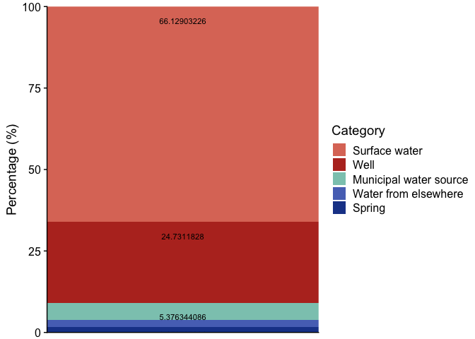<!-- -->

``` r
# Save plot in "plots" directory
ggsave(here("plots", "fig3a_sourcewater.pdf"), width = 5, height = 5)
```

# DATA ANALYSIS

## Figure 4: Physical indicators

### Import and tidy depth & TP & Ca data

``` r
secchi_dat <- read_tsv(here("data", "FOCA_Secchi.txt"))
```

    ## Rows: 163 Columns: 9
    ## ── Column specification ────────────────────────────────────────────────────────
    ## Delimiter: "\t"
    ## chr (4): Lake Name, Township, Site Description, Date
    ## dbl (5): STN, Site ID, Latitude (DMS), Long (DMS), Secchi Depth (metres)
    ## 
    ## ℹ Use `spec()` to retrieve the full column specification for this data.
    ## ℹ Specify the column types or set `show_col_types = FALSE` to quiet this message.

``` r
secchi_dat$Date <- lubridate::mdy(secchi_dat$Date)
secchi_dat <- secchi_dat %>% 
  mutate("Year" = year(Date))

pca <- read_tsv(here("data", "FOCA_PCa.txt"))
```

    ## Rows: 20 Columns: 12
    ## ── Column specification ────────────────────────────────────────────────────────
    ## Delimiter: "\t"
    ## chr (4): Lake Name, Township, Site Description, Date
    ## dbl (8): STN, Site ID, Latitude (DMS), Long (DMS), Total Phosphorus sample 1...
    ## 
    ## ℹ Use `spec()` to retrieve the full column specification for this data.
    ## ℹ Specify the column types or set `show_col_types = FALSE` to quiet this message.

``` r
pca$Date <- lubridate::dmy(pca$Date)
pca <- pca %>% mutate("Year" = year(Date))

# read_tsv(here("data", "FOCA_DOTemp.txt")) %>% 
#   pivot_longer(cols = 2:15, names_to = "metadata", values_to = "value") %>% write_tsv(here("data", "FOCA_newDOTemp.txt"))
#   separate(metadata, into = c("date", "tmp", "tmp2", "statistic"), sep = "_")
```

### Import and tidy DO2 data

``` r
dotemp <- read_tsv(here("data", "FOCA_newDOTemp.txt"))
```

    ## Rows: 714 Columns: 6
    ## ── Column specification ────────────────────────────────────────────────────────
    ## Delimiter: "\t"
    ## chr (4): Date, Lake, Site_name, Statistic
    ## dbl (2): Depth, Value
    ## 
    ## ℹ Use `spec()` to retrieve the full column specification for this data.
    ## ℹ Specify the column types or set `show_col_types = FALSE` to quiet this message.

``` r
# Tidy, divide into summer and fall, designate depth stratification zones
dotemp <- dotemp %>% 
  mutate(Date = mdy(Date),
         Year = year(Date),
         Month = month(Date),
         season = case_when(Month == 6 | Month == 7 ~ "summer",
                                     Month == 9 | Month == 10 ~ "fall")) %>% 
  mutate(Zone = case_when(Depth <= 2 ~ "Surface",
                          Depth <= 10 ~ "Mid",
                          TRUE ~ "Deep")) %>% 
  pivot_wider(names_from = Statistic, values_from = Value) %>% 
  filter(!is.na(DO))

# Calculate zone-based means for summer months only
zone_means <- dotemp %>%
  filter(season == "summer") %>% 
  group_by(Date, Year, Zone) %>%
  summarize(mean_DO = mean(DO, na.rm = TRUE),
            mean_temp = mean(Temp, na.rm = TRUE),
            .groups = "drop")

# Run stats
# Run model only on deep DO2 values
model <- lm(mean_DO ~ Year, data = zone_means %>% filter(Zone == "Deep"))
summary(model) # adj R-squared = -0.4359, pvalue = 0.7933, slope???
```

    ## 
    ## Call:
    ## lm(formula = mean_DO ~ Year, data = zone_means %>% filter(Zone == 
    ##     "Deep"))
    ## 
    ## Residuals:
    ##        1        2        3        4 
    ## -0.05338 -1.24324  2.64662 -1.35000 
    ## 
    ## Coefficients:
    ##              Estimate Std. Error t value Pr(>|t|)
    ## (Intercept)  626.4670  2061.1525   0.304    0.790
    ## Year          -0.3044     1.0186  -0.299    0.793
    ## 
    ## Residual standard error: 2.278 on 2 degrees of freedom
    ## Multiple R-squared:  0.04274,    Adjusted R-squared:  -0.4359 
    ## F-statistic: 0.08929 on 1 and 2 DF,  p-value: 0.7933

``` r
coef(summary(model))
```

    ##                Estimate  Std. Error    t value  Pr(>|t|)
    ## (Intercept) 626.4669724 2061.152499  0.3039401 0.7898798
    ## Year         -0.3043763    1.018607 -0.2988161 0.7932695

``` r
confint(model)
```

    ##                   2.5 %      97.5 %
    ## (Intercept) -8241.95645 9494.890399
    ## Year           -4.68709    4.078338

``` r
# Is it only temp-driven?
model_temp <- lm(mean_DO ~ Year + mean_temp, data = zone_means %>% filter(Zone == "Deep"))
summary(model_temp) # adj R-squared = -1.869, pvalue = 0.9779, slope???
```

    ## 
    ## Call:
    ## lm(formula = mean_DO ~ Year + mean_temp, data = zone_means %>% 
    ##     filter(Zone == "Deep"))
    ## 
    ## Residuals:
    ##          1          2          3          4 
    ##  0.0006132 -1.3152181  2.6285967 -1.3139918 
    ## 
    ## Coefficients:
    ##              Estimate Std. Error t value Pr(>|t|)
    ## (Intercept)  669.6907  3237.5422   0.207    0.870
    ## Year          -0.3289     1.6483  -0.200    0.875
    ## mean_temp      1.3097    42.7770   0.031    0.981
    ## 
    ## Residual standard error: 3.22 on 1 degrees of freedom
    ## Multiple R-squared:  0.04363,    Adjusted R-squared:  -1.869 
    ## F-statistic: 0.02281 on 2 and 1 DF,  p-value: 0.9779

``` r
coef(summary(model_temp))
```

    ##                Estimate  Std. Error     t value  Pr(>|t|)
    ## (Intercept) 669.6907410 3237.542154  0.20685159 0.8701456
    ## Year         -0.3289423    1.648312 -0.19956316 0.8746015
    ## mean_temp     1.3097422   42.776975  0.03061793 0.9805141

``` r
confint(model_temp)
```

    ##                    2.5 %      97.5 %
    ## (Intercept) -40467.18271 41806.56419
    ## Year           -21.27273    20.61485
    ## mean_temp     -542.22326   544.84274

### Phosphorus and calcium

``` r
p_phos <-
  pca %>% 
  ggplot(aes(x = Year, y = `Average Total Phosphorus (µg/L)`)) +
    geom_smooth(method = "lm", se = FALSE, color = "grey45", aes(group = 1)) +
  geom_point(aes(group = Year), size = 3, color = "coral") +
  theme(legend.position = "none",
        strip.text = element_text(size = 16),
        strip.background = element_blank(),
        axis.title.x = element_blank()) +
  scale_x_continuous(breaks = scales::breaks_width(1)) +
  scale_y_continuous(limits = c(0, 10), breaks = 0:10) +
  # ggtitle("Phosphorus levels (2002-2022)") +
  ylab("Total phosphorus (µg/L)") +
    theme(axis.text.x = element_text(angle = 45, hjust = 1)) +
  geom_hline(yintercept = 10, color = "darkred", linetype = "dashed") # coeff = 0.003902, not sig

p_ca <- 
  pca %>% 
  # na.omit() %>% 
  ggplot(aes(x = Year, y = `Calcium (mg/L)`)) +
    geom_smooth(method = "lm", se = FALSE, color = "grey45", aes(group = 1)) +
  geom_point(aes(group = Year), color = "orange", size = 3) +
  theme(legend.position = "none",
        strip.text = element_text(size = 16),
        strip.background = element_blank(),
        axis.title.x = element_blank()) +
  scale_x_continuous(breaks = scales::breaks_width(1)) +
  scale_y_continuous(limits = c(0, 3), breaks = 0:10) +
  # ggtitle("Calcium levels (2010-2022)") +
  geom_hline(yintercept = 1.5, color = "darkred", linetype = "dashed") +
  theme(axis.text.x = element_text(angle = 45, hjust = 1)) +
  ylab("Calcium (mg/L)") # coeff = 9.838e-04, not sig

plot_grid(p_phos, p_ca, nrow = 2)
```

    ## `geom_smooth()` using formula = 'y ~ x'
    ## `geom_smooth()` using formula = 'y ~ x'

    ## Warning: Removed 7 rows containing non-finite outside the scale range
    ## (`stat_smooth()`).

    ## Warning: Removed 7 rows containing missing values or values outside the scale range
    ## (`geom_point()`).

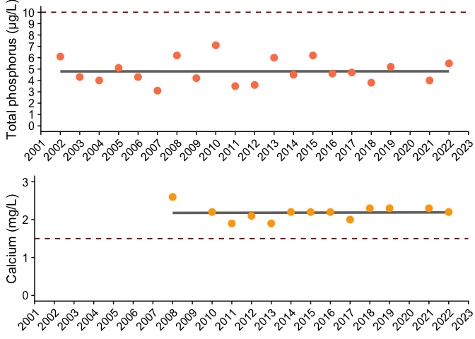<!-- -->

``` r
ggsave(here("plots", "FOCA_PCa.pdf"), width = 5, height = 5)
```

### Water clarity (Secchi depth)

``` r
p_secchi <-
  secchi_dat %>% 
  ggplot(aes(x = Year, y = `Secchi Depth (metres)`)) +
    geom_smooth(method = "lm", se = FALSE, color = "grey45", aes(group = 1)) +
  geom_boxplot(aes(group = Year), color = "cornflowerblue", alpha = 0.5) +
  theme(legend.position = "none",
        strip.text = element_text(size = 16),
        strip.background = element_blank()) +
  scale_x_continuous(breaks = scales::breaks_width(5)) +
  scale_y_continuous(limits = c(0, 11), breaks = 0:11) +
  ggtitle("Water transparency (1991-2022)") +
  ylab("Secchi depth (m)")

# Save plot in "plots" directory
p_secchi
```

    ## `geom_smooth()` using formula = 'y ~ x'

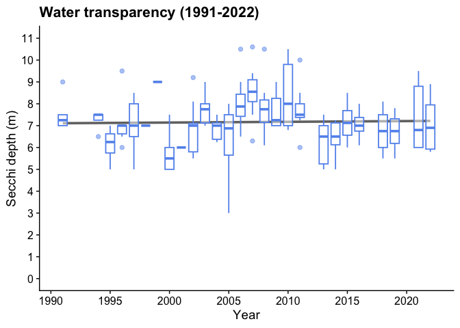<!-- -->

``` r
ggsave(here("plots", "FOCA_secchi.pdf"), width = 8, height = 4)
```

    ## `geom_smooth()` using formula = 'y ~ x'

### Dissolved oxygen and temperature

``` r
ggplot(zone_means, aes(x = Year, y = mean_DO)) +
  geom_smooth(method = "lm", se = TRUE) +
  geom_point(size = 3) +
  theme_bw() +
  facet_grid(~Zone)
```

    ## `geom_smooth()` using formula = 'y ~ x'

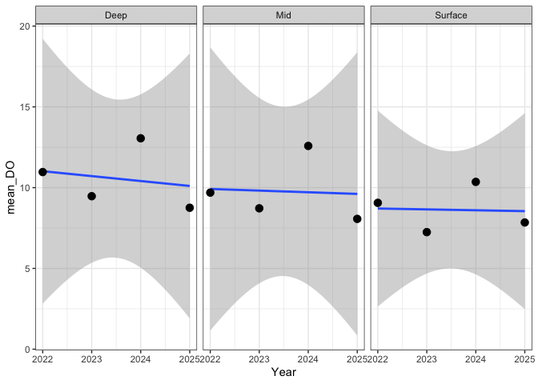<!-- -->

``` r
ggsave(here("plots", "FOCA_DO.pdf"), width = 14, height = 4)
```

    ## `geom_smooth()` using formula = 'y ~ x'

``` r
# Depth zones visualization
zones <- read_tsv(here("data", "FOCA_depth_zones.txt"))
```

    ## Rows: 51 Columns: 3
    ## ── Column specification ────────────────────────────────────────────────────────
    ## Delimiter: "\t"
    ## chr (2): Zone, Year
    ## dbl (1): Depth
    ## 
    ## ℹ Use `spec()` to retrieve the full column specification for this data.
    ## ℹ Specify the column types or set `show_col_types = FALSE` to quiet this message.

``` r
zones %>% 
  ggplot(aes(x = Year, y = Depth, fill = Zone)) +
  geom_bar(position = "stack", stat = "identity")
```

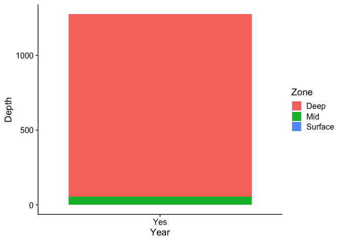<!-- -->

## Figure 6: Biological indicators

Import and process data.

``` r
indices <- read_tsv(here("data", "halls_indices.txt")) %>% 
  pivot_longer(cols = 4:24, names_to = "site_code", values_to = "value") %>% 
  # Average between replicates
  group_by(Year, site_code, Biotic_index) %>% 
  mutate(avg_value = mean(value),
         site_code_norep = site_code)
```

    ## Rows: 19 Columns: 24
    ## ── Column specification ────────────────────────────────────────────────────────
    ## Delimiter: "\t"
    ## chr  (2): Lake, Biotic_index
    ## dbl (22): Year, HALL-01-R1, HALL-04-R1, HALL-05-R1, HALL-06-R1, HALL-06-R2, ...
    ## 
    ## ℹ Use `spec()` to retrieve the full column specification for this data.
    ## ℹ Specify the column types or set `show_col_types = FALSE` to quiet this message.

``` r
# Remove replicates
indices$site_code_norep <- gsub('-R1', '', indices$site_code_norep)
indices$site_code_norep <- gsub('-R2', '', indices$site_code_norep)
indices <- indices %>% 
  ungroup() %>% 
  dplyr::select(-c(site_code, value)) %>% 
  distinct()

# Ranges for tolerances for each metric
rect_data <- read_tsv(here("data", "index_rect_data.txt"))
```

    ## Rows: 42 Columns: 7
    ## ── Column specification ────────────────────────────────────────────────────────
    ## Delimiter: "\t"
    ## chr (3): Lake Name, Biotic_index, Category
    ## dbl (4): xmin, xmax, ymin, ymax
    ## 
    ## ℹ Use `spec()` to retrieve the full column specification for this data.
    ## ℹ Specify the column types or set `show_col_types = FALSE` to quiet this message.

Build plots.

``` r
indices %>% 
  filter(Biotic_index == "Simpsons_Index") %>% 
  ggplot(aes(x = Year, y = avg_value)) +
  geom_rect(data = rect_data %>% filter(Biotic_index == "Simpsons_Index"), inherit.aes = FALSE, 
            aes(xmin = -Inf, xmax = +Inf, ymin = ymin, ymax = ymax, fill = Category), alpha = 0.4) +
  scale_fill_manual(values = c("Poor" = "#d53e4f", "Fair" = "#fee08b", "Good" = "#abdda4", "Excellent" = "#3288bd")) +
  geom_point(aes(group = Year), size = 3, color = "white") +
  geom_point(aes(group = Year), size = 3, pch = 21, color = "black") +
  geom_smooth(method = "lm", se = FALSE, color = "grey45", aes(group = 1)) +
  # facet_wrap(~`Lake Name`, scales = "free") +
  # scale_color_manual(values = lake_col_full) +
  theme(legend.position = "none",
      strip.text = element_text(size = 16),
      strip.background = element_blank()) +
  scale_y_continuous(limits = c(0, 1), expand = c(0, 0)) +
  ggtitle("Diversity (2020-2024)") +
  ylab("Simpson's diversity index")
```

    ## `geom_smooth()` using formula = 'y ~ x'

    ## Warning: Removed 37 rows containing non-finite outside the scale range
    ## (`stat_smooth()`).

    ## Warning: Removed 37 rows containing missing values or values outside the scale range
    ## (`geom_point()`).
    ## Removed 37 rows containing missing values or values outside the scale range
    ## (`geom_point()`).

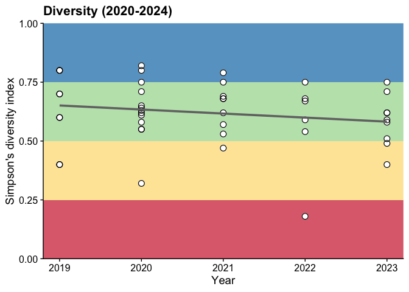<!-- -->

``` r
# Save plot
ggsave(here("plots", "FOCA_indices.pdf"), width = 5, height = 4)
```

    ## `geom_smooth()` using formula = 'y ~ x'

    ## Warning: Removed 37 rows containing non-finite outside the scale range
    ## (`stat_smooth()`).
    ## Removed 37 rows containing missing values or values outside the scale range
    ## (`geom_point()`).
    ## Removed 37 rows containing missing values or values outside the scale range
    ## (`geom_point()`).

Tolerance plot.

``` r
indices %>% 
  filter(Biotic_index == "mHBI") %>% 
  ggplot(aes(x = Year, y = avg_value)) +
  geom_rect(data = rect_data %>% filter(Biotic_index == "mHBI"), inherit.aes = FALSE,
  aes(xmin=-Inf, xmax=+Inf, ymin = ymin, ymax = ymax, fill = Category), alpha = 0.4) +
  scale_fill_manual(values = c("Very poor" = "#9e0142", "Poor" = "#d53e4f", "Fairly poor" = "#fdae61", "Fair" = "#fde18b", "Good" = "#e6f598", "Very good" = "#abdda4", "Excellent" = "#3288bd")) +
  geom_point(aes(group = Year), size = 3, color = "white") +
  geom_point(aes(group = Year), size = 3, pch = 21, color = "black") +
  geom_smooth(method = "lm", se = FALSE, color = "grey45", aes(group = 1)) +
  # facet_wrap(~`Lake Name`, scales = "free") +
  # scale_color_manual(values = lake_col_full) +
  theme(legend.position = "none",
      strip.text = element_text(size = 16),
      strip.background = element_blank()) +
  scale_y_continuous(limits = c(0, 10), expand = c(0, 0)) +
  ggtitle("Pollution tolerance (2020-2024)") +
  ylab("Modified HBI (family level)")
```

    ## `geom_smooth()` using formula = 'y ~ x'

    ## Warning: Removed 37 rows containing non-finite outside the scale range
    ## (`stat_smooth()`).

    ## Warning: Removed 37 rows containing missing values or values outside the scale range
    ## (`geom_point()`).
    ## Removed 37 rows containing missing values or values outside the scale range
    ## (`geom_point()`).

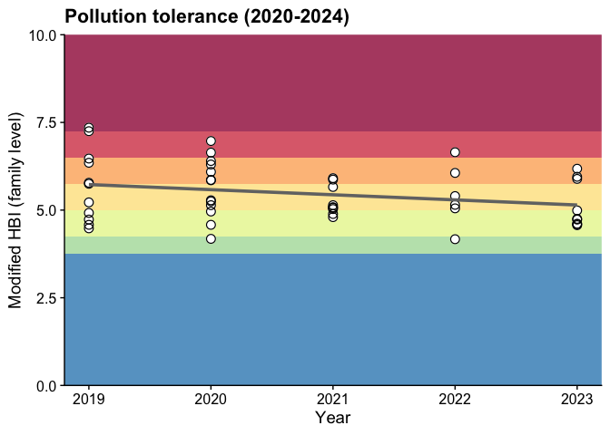<!-- -->

``` r
# Save plot
ggsave(here("plots", "FOCA_mHBI.pdf"), width = 5, height = 4)
```

    ## `geom_smooth()` using formula = 'y ~ x'

    ## Warning: Removed 37 rows containing non-finite outside the scale range
    ## (`stat_smooth()`).
    ## Removed 37 rows containing missing values or values outside the scale range
    ## (`geom_point()`).
    ## Removed 37 rows containing missing values or values outside the scale range
    ## (`geom_point()`).

Percent EOT.

``` r
indices %>% 
  filter(Biotic_index == "Perc_EOT") %>% 
  ggplot(aes(x = Year, y = avg_value)) +
  geom_rect(data = rect_data %>% filter(Biotic_index == "Perc_EOT"), inherit.aes = FALSE,
  aes(xmin=-Inf, xmax=+Inf, ymin = ymin, ymax = ymax, fill = Category), alpha = 0.4) +
  scale_fill_manual(values = c("Fair" = "#fdae61", "Good" = "#abdda4", "Excellent" = "#3288bd")) +
  geom_point(aes(group = Year), size = 3, color = "white") +
  geom_point(aes(group = Year), size = 3, pch = 21, color = "black") +
  geom_smooth(method = "lm", se = FALSE, color = "grey45", aes(group = 1)) +
  # facet_wrap(~`Lake Name`, scales = "free") +
  # scale_color_manual(values = lake_col_full) +
  theme(legend.position = "none",
      strip.text = element_text(size = 16),
      strip.background = element_blank()) +
  ggtitle("Diversity of pollution-intolerant groups (2020-2024)") +
  ylab("Percent EOT") +
  scale_y_continuous(expand = c(0, 0))
```

    ## `geom_smooth()` using formula = 'y ~ x'

    ## Warning: Removed 36 rows containing non-finite outside the scale range
    ## (`stat_smooth()`).

    ## Warning: Removed 36 rows containing missing values or values outside the scale range
    ## (`geom_point()`).
    ## Removed 36 rows containing missing values or values outside the scale range
    ## (`geom_point()`).

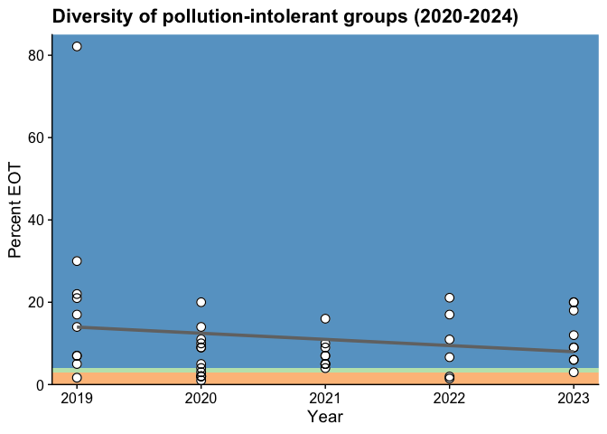<!-- -->

``` r
ggsave(here("plots", "FOCA_eot.pdf"), width = 5, height = 4)
```

    ## `geom_smooth()` using formula = 'y ~ x'

    ## Warning: Removed 36 rows containing non-finite outside the scale range
    ## (`stat_smooth()`).
    ## Removed 36 rows containing missing values or values outside the scale range
    ## (`geom_point()`).
    ## Removed 36 rows containing missing values or values outside the scale range
    ## (`geom_point()`).

Algal growth:

``` r
veg <- read_tsv(here("data", "halls_veg.txt")) %>% 
  pivot_longer(cols = 4:15, names_to = "site_code", values_to = "value") %>% 
  group_by(Year, site_code) %>% 
  mutate(sum_algae = sum(value))
```

    ## Rows: 15 Columns: 15
    ## ── Column specification ────────────────────────────────────────────────────────
    ## Delimiter: "\t"
    ## chr  (2): Lake, Vegetation_type
    ## dbl (13): Year, HALL-01, HALL-04, HALL-05, HALL-06, HALL-08, HALL-09, HALL-1...
    ## 
    ## ℹ Use `spec()` to retrieve the full column specification for this data.
    ## ℹ Specify the column types or set `show_col_types = FALSE` to quiet this message.

``` r
p_algae <- veg %>% 
  ggplot(aes(x = Year, y = value, group = Vegetation_type, fill = Vegetation_type)) +
  geom_bar(stat = "identity", position = "stack") +
  # facet_grid(~`Lake Name`, scales = "free") +
  theme(strip.text = element_text(size = 14, face = "bold"),
        strip.background = element_blank(),
        legend.text = element_text(size = 12),
        legend.title = element_text(size = 16),
        axis.title = element_text(size = 14),
        axis.text.y = element_text(size = 12),
        axis.text.x = element_text(size = 12, angle = 45, hjust = 1),
        legend.position = "bottom") +
  scale_y_continuous(expand = c(0, 0)) +
  scale_x_continuous(breaks = 2019:2024) +
  # scale_fill_manual(values = c("#186484", "#448cbc", "#b4d6e7"),
  #                   name = "Type of algae") +
  scale_fill_manual(values = c("#596b36", "#a9cc68", "#fcf79b"),
                    name = "Type of algae") +
  # ggtitle("Algal growth (2019-2024)") +
  ylab("Abundance of algae")
  # ylab("Algal abundance, summed across sites")

ggsave(here("plots", "FOCA_algae.pdf"), width = 5, height = 4)
```

    ## Warning: Removed 87 rows containing missing values or values outside the scale range
    ## (`geom_bar()`).

## Figure A1: Threats from TSW

Look at lake levels for 2024.

``` r
levels <- read_tsv(here("data", "lake_levels.txt"))
```

    ## Rows: 22253 Columns: 3
    ## ── Column specification ────────────────────────────────────────────────────────
    ## Delimiter: "\t"
    ## chr (2): Lake, Date
    ## dbl (1): Water level (m)
    ## 
    ## ℹ Use `spec()` to retrieve the full column specification for this data.
    ## ℹ Specify the column types or set `show_col_types = FALSE` to quiet this message.

``` r
levels$Date <- lubridate::mdy(levels$Date)
levels <- levels %>% 
  mutate("Year" = year(Date),
         "DOY" = yday(Date))
# There's only a single observation for 2010 for Hawk Lake so we'll remove it
levels <- levels %>% 
  filter(!(Year == 2010 & Lake == "Hawk"))

# Calculate monthly min, max, and average across all years
summary <- levels %>% 
  group_by(Lake, DOY) %>% 
  summarize(Average = mean(`Water level (m)`),
            Maximum = max(`Water level (m)`),
            Minimum = min(`Water level (m)`))
```

    ## `summarise()` has regrouped the output.
    ## ℹ Summaries were computed grouped by Lake and DOY.
    ## ℹ Output is grouped by Lake.
    ## ℹ Use `summarise(.groups = "drop_last")` to silence this message.
    ## ℹ Use `summarise(.by = c(Lake, DOY))` for per-operation grouping
    ##   (`?dplyr::dplyr_by`) instead.

``` r
doy_months <- read_tsv(here("data", "DOY_months.txt"))
```

    ## Rows: 12 Columns: 3
    ## ── Column specification ────────────────────────────────────────────────────────
    ## Delimiter: "\t"
    ## chr (1): Month
    ## dbl (2): Start, End
    ## 
    ## ℹ Use `spec()` to retrieve the full column specification for this data.
    ## ℹ Specify the column types or set `show_col_types = FALSE` to quiet this message.

Build the plot for 2024 for Halls Lake Dam.

``` r
ggplot() +
  # Add month bars
  geom_rect(data = doy_months %>% 
              filter(Month %in% c("Jan", "Mar", "May", "Jul", "Sep", "Nov")), 
            aes(xmin = Start, xmax = End, 
                ymin = 1.25, ymax = 3.1),
            fill = "grey", alpha = 0.5) +
  # Add min and max levels
  geom_ribbon(data = summary %>% 
                filter(Lake == "Halls"),
              aes(x = DOY, ymin = Minimum, ymax = Maximum), 
              fill = "dodgerblue1", alpha = 0.5) +
  # Add average over all years
  geom_line(data = summary %>% 
              filter(Lake == "Halls"),
            aes(x = DOY, y = Average), 
            color = "dodgerblue1", linetype = "dashed", linewidth = 1) +
  # Add 2024 data only
  geom_line(data = levels %>% 
              filter(Year == 2024) %>% 
              filter(Lake == "Halls"), 
            aes(x = DOY, y = `Water level (m)`, group = Lake, color = Lake), 
            linewidth = 1) +
  ylab("Water level (m)") +
  xlab("Day of the Year") +
  theme(panel.grid.major.y = element_line(linewidth = 0.5, linetype = "dashed", color = "grey")) +
  # ggtitle("Lake levels at Halls Lake Dam (2024)") +
  theme(legend.position = "none") +
  scale_y_continuous(expand = c(0, 0)) +
  scale_x_continuous(expand = c(0, 0))
```

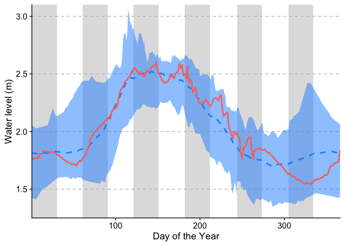<!-- -->

``` r
# Save plot
ggsave(here("plots", "source_water_levels_halls.pdf"), width = 10, height = 6)
```

What time of year do min/max occur?

``` r
min_time_of_year <- 
  levels %>% 
  mutate(Month = month(Date)) %>% 
  group_by(Lake, Year) %>% 
  filter(`Water level (m)` == min(`Water level (m)`)) %>% 
  dplyr::select(Lake, Year, Month) %>% 
  distinct()
max_time_of_year <- 
  levels %>% 
  mutate(Month = month(Date)) %>% 
  group_by(Lake, Year) %>% 
  filter(`Water level (m)` == max(`Water level (m)`)) %>% 
  dplyr::select(Lake, Year, Month) %>% 
  distinct()

min_time_of_year %>% 
  ggplot(aes(x = Month)) +
  geom_bar(stat = "count", aes(fill = Lake)) +
  # scale_fill_manual(values = c("#448cbc", "#58ae50"))
  facet_grid(~Lake) +
  scale_x_continuous(breaks = 1:12)
```

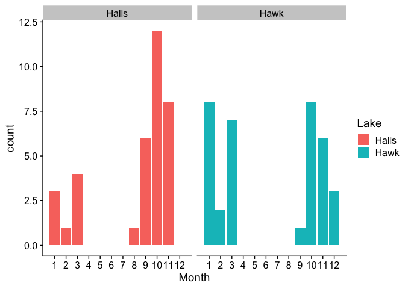<!-- -->

``` r
max_time_of_year %>% 
  ggplot(aes(x = Month)) +
  geom_bar(stat = "count", aes(fill = Lake)) +
  # scale_fill_manual(values = c("#448cbc", "#58ae50"))
  facet_grid(~Lake) +
  scale_x_continuous(breaks = 1:12)
```

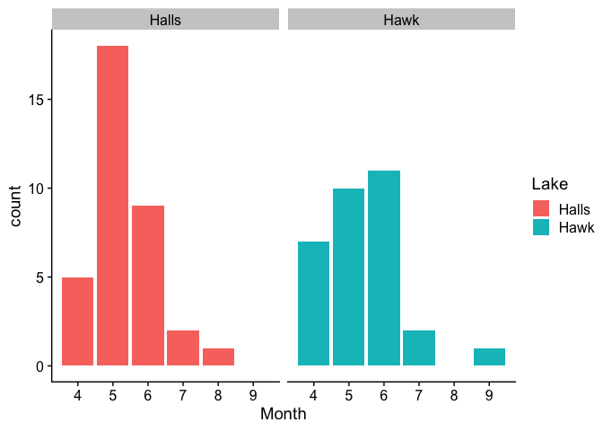<!-- -->

# GRAVEYARD

## Depths of wells

``` r
# Import the data
wd <- read_tsv(here("data", "source_water_welldepth.txt"))
```

    ## Rows: 33 Columns: 2
    ## ── Column specification ────────────────────────────────────────────────────────
    ## Delimiter: "\t"
    ## dbl (2): Respondent ID, Well depth (feet)
    ## 
    ## ℹ Use `spec()` to retrieve the full column specification for this data.
    ## ℹ Specify the column types or set `show_col_types = FALSE` to quiet this message.

Build plot:

``` r
wd %>% 
  ggplot(aes(x = `Well depth (feet)`)) +
  geom_histogram() +
  scale_y_continuous(expand = c(0, 0)) +
  scale_x_continuous(expand = c(0, 0)) +
  coord_flip() +
  ylab("Number of wells")
```

    ## `stat_bin()` using `bins = 30`. Pick better value `binwidth`.

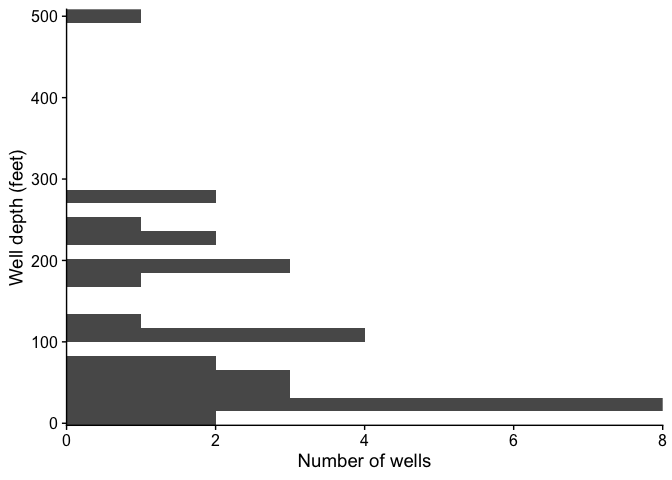<!-- -->

``` r
# Save plot in "plots" directory
ggsave(here("plots", "fig5_welldepth.pdf"), width = 3, height = 5)
```

    ## `stat_bin()` using `bins = 30`. Pick better value `binwidth`.

### Fluctuations

Amount of annual fluctuation is the maximum lake level minus the minimum
lake level. Calculate fluctuations using the levels data for each year:

``` r
fluct <- levels %>% 
  ungroup() %>% 
  group_by(Lake, Year) %>% 
  summarize(minimum = min(`Water level (m)`),
            maximum = max(`Water level (m)`),
            fluctuation = maximum-minimum)
```

    ## `summarise()` has regrouped the output.
    ## ℹ Summaries were computed grouped by Lake and Year.
    ## ℹ Output is grouped by Lake.
    ## ℹ Use `summarise(.groups = "drop_last")` to silence this message.
    ## ℹ Use `summarise(.by = c(Lake, Year))` for per-operation grouping
    ##   (`?dplyr::dplyr_by`) instead.

``` r
# Year with max fluctuation in Halls Lake?
fluct %>% 
  filter(Lake == "Halls") %>% 
  summarize(max(fluctuation))
```

    ## # A tibble: 1 × 2
    ##   Lake  `max(fluctuation)`
    ##   <chr>              <dbl>
    ## 1 Halls               1.39

Plot the data:

``` r
fluct$Year <- as.character(fluct$Year)

# Plot the range of values:
fluct %>% 
  filter(Lake == "Halls") %>% 
  ggplot() +
  # geom_segment(aes(x = Year, xend = Year, y = minimum, yend = maximum, color = Lake), 
  #              linewidth = 10, alpha = 0.75) +
  geom_line(aes(x = Year, y = fluctuation, group = 1), color = "black") +
  geom_point(aes(x = Year, y = fluctuation), pch = 21, size = 4, 
             color = "black", fill = "white") +
  # scale_x_continuous(breaks = 2013:2024) +
  # ylab("Lake level (m)") +
  ylab("Annual water level \nfluctuation (m)") +
  # ggtitle("Halls Lake fluctuations (2013-2024)") +
  scale_color_manual(values = "#448cbc") +
  theme(legend.position = "none",
        strip.background = element_blank(),
        strip.text = element_text(size = 14),
        panel.grid.major.y = element_line(linewidth = 0.5, linetype = "dashed", color = "grey"),
        axis.text.x = element_text(angle = 45, hjust = 1))
```

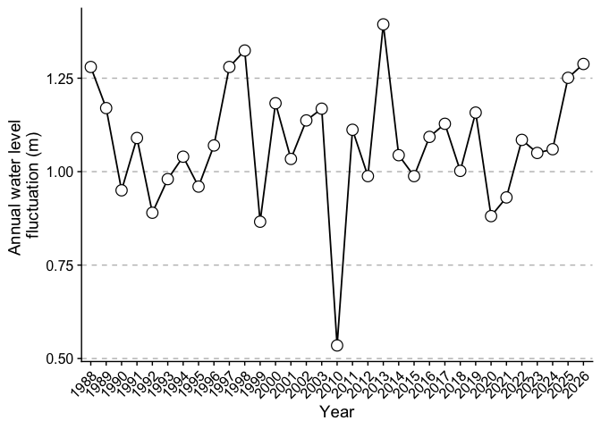<!-- -->

``` r
# Save plot
ggsave(here("plots", "source_water_fluct.pdf"), width = 12, height = 4)
```

## Protections afforded by buffer

``` r
prot <- read_tsv(here("data", "wells_protected.txt"))
```

    ## Rows: 5 Columns: 3
    ## ── Column specification ────────────────────────────────────────────────────────
    ## Delimiter: "\t"
    ## dbl (3): Buffer (m), Wells protected, Prop wells protected at 500m
    ## 
    ## ℹ Use `spec()` to retrieve the full column specification for this data.
    ## ℹ Specify the column types or set `show_col_types = FALSE` to quiet this message.

``` r
prot %>% 
  ggplot(aes(x = `Buffer (m)`, y = `Wells protected`)) +
  geom_point() +
  geom_line() +
  ylab("Number of wells protected")
```

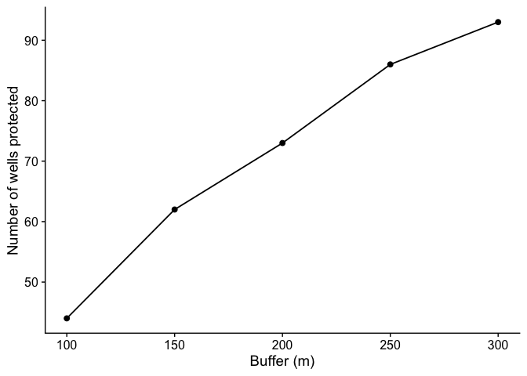<!-- -->

``` r
prot %>% 
  ggplot(aes(x = `Buffer (m)`, y = `Prop wells protected at 500m`)) +
  geom_point() +
  geom_line() +
  ylab("Proportion of wells protected \nrelative to 500m boundary (%)") +
  scale_y_continuous(limits = c(0, 100)) +
  geom_hline(yintercept = 100, linetype = "dashed", color = "limegreen")
```

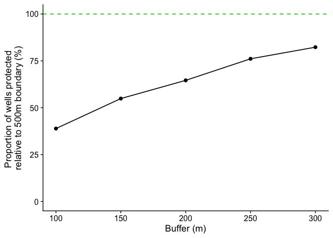<!-- -->
