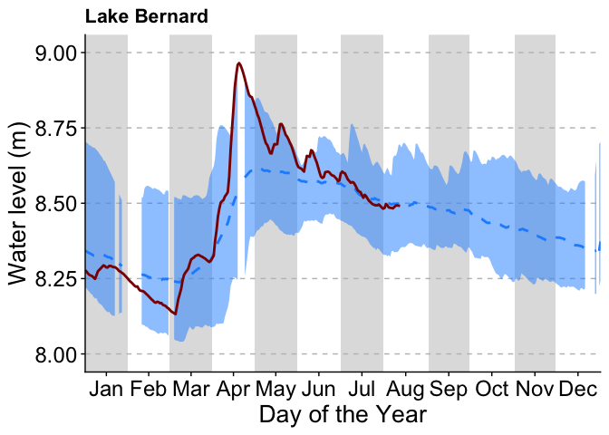

Lake Bernard
================

- [Water levels](#water-levels)
  - [Import and tidy data](#import-and-tidy-data)
  - [Build plot](#build-plot)

## Water levels

Water level data were downloaded using the HYDAT database
[here](https://wateroffice.ec.gc.ca/index_e.html); data from 2005-2025
were downloaded using the “historic” database while data from 2026 were
downloaded using the real-time database tool for the Lake Bernard
station (02EA020 - BERNARD LAKE AT SUNDRIDGE).

### Import and tidy data

``` r
hist <- read_csv(here("data/daily_20260812T1753.csv"))
```

    ## Rows: 7496 Columns: 5
    ## ── Column specification ────────────────────────────────────────────────────────
    ## Delimiter: ","
    ## chr  (2): ID, SYM
    ## dbl  (2): PARAM, Value
    ## date (1): Date
    ## 
    ## ℹ Use `spec()` to retrieve the full column specification for this data.
    ## ℹ Specify the column types or set `show_col_types = FALSE` to quiet this message.

``` r
current <- read_csv(here("data/02EA020_HGD_20260812T1755.csv")) %>% 
  rename(Date = Date_est, Value = `Value_(m)`)
```

    ## Rows: 224 Columns: 3
    ## ── Column specification ────────────────────────────────────────────────────────
    ## Delimiter: ","
    ## dbl  (2): Parameter, Value_(m)
    ## dttm (1): Date_est
    ## 
    ## ℹ Use `spec()` to retrieve the full column specification for this data.
    ## ℹ Specify the column types or set `show_col_types = FALSE` to quiet this message.

``` r
hist$Date <- lubridate::ymd(hist$Date)
current$Date <- lubridate::ymd(current$Date)

# Combine historic and current data
levels <- bind_rows(hist %>% dplyr::select(Date, Value),
                    current %>% dplyr::select(Date, Value)) %>% 
  mutate("Year" = year(Date),
         "DOY" = yday(Date))

# Calculate monthly min, max, and average across all years
summary <- levels %>% 
  group_by(DOY) %>% 
  summarize(Average = mean(Value),
            Maximum = max(Value),
            Minimum = min(Value))

doy_months <- read_tsv(here("data/DOY_months.txt"))
```

    ## Rows: 12 Columns: 3
    ## ── Column specification ────────────────────────────────────────────────────────
    ## Delimiter: "\t"
    ## chr (1): Month
    ## dbl (2): Start, End
    ## 
    ## ℹ Use `spec()` to retrieve the full column specification for this data.
    ## ℹ Specify the column types or set `show_col_types = FALSE` to quiet this message.

### Build plot

``` r
plot_max <- summary %>% na.omit() %>% summarize(max(Maximum)) %>% pull(1)
plot_min <- summary %>% na.omit() %>% summarize(min(Minimum)) %>% pull(1)

ggplot() +
  # Add month bars
  geom_rect(data = doy_months %>% 
              filter(Month %in% c("Jan", "Mar", "May", "Jul", "Sep", "Nov")), 
            aes(xmin = Start, xmax = End, 
                ymin = plot_min-0.1, ymax = plot_max+0.1),
            fill = "grey", alpha = 0.5) +
  # Add min and max levels
  geom_ribbon(data = summary,
              aes(x = DOY, ymin = Minimum, ymax = Maximum), 
              fill = "dodgerblue1", alpha = 0.5) +
  # Add average over all years
  geom_line(data = summary,
            aes(x = DOY, y = Average), 
            color = "dodgerblue1", linetype = "dashed", linewidth = 1) +
  # Add 2026 data only
  geom_line(data = levels %>% 
              filter(Year == 2026), 
            aes(x = DOY, y = Value), 
            linewidth = 1,
            color = "darkred") +
  ylab("Water level (m)") +
  xlab("Day of the Year") +
  theme(panel.grid.major.y = element_line(linewidth = 0.5, linetype = "dashed", color = "grey")) +
  ggtitle("Lake Bernard") +
  theme(legend.position = "bottom",
        axis.title = element_text(size = 20),
        axis.text = element_text(size = 18)) +
  scale_y_continuous(expand = c(0, 0)) +
  scale_x_continuous(breaks = (doy_months$Start + doy_months$End) / 2,
                     labels = doy_months$Month,
                     expand = c(0, 0))
```

    ## Warning: Removed 27 rows containing missing values or values outside the scale range
    ## (`geom_ribbon()`).

<!-- -->

``` r
# Save plot
ggsave(here("plots/LakeBernard_levels.pdf"), width = 10, height = 5)
```

    ## Warning: Removed 27 rows containing missing values or values outside the scale range
    ## (`geom_ribbon()`).
