Lake Survey
================

- [Background](#background)
- [Import data](#import-data)
- [Summary plots](#summary-plots)
  - [Lake Use](#lake-use)
  - [Development](#development)
  - [Nature](#nature)
  - [Legislation](#legislation)
  - [Amenities](#amenities)
  - [Average value across each
    category](#average-value-across-each-category)
- [Testing for predictors](#testing-for-predictors)
  - [Specify response variables (i.e., corresponding
    columns)](#specify-response-variables-ie-corresponding-columns)
  - [Run MANOVAs](#run-manovas)
  - [MANOVA summaries and significant
    predictors](#manova-summaries-and-significant-predictors)
  - [Build plots](#build-plots)
  - [Build tables](#build-tables)
  - [Top 11 issues](#top-11-issues)
    - [Plot data](#plot-data)
  - [Residency pie charts](#residency-pie-charts)

## Background

We first want to generate plots that summarize the survey results in
terms of the different categories.

Survey responses have been grouped into five categories:

1.  Nature

2.  Development

3.  Legislation

4.  Lake use

5.  Amenities

# Import data

``` r
dat <- read_csv(here("data", "lake_plan_survey.csv"))
```

    ## Rows: 213 Columns: 59
    ## ── Column specification ────────────────────────────────────────────────────────
    ## Delimiter: ","
    ## chr  (4): Lake, Age, Duration, Access
    ## dbl (55): Preserve_Natural_Beauty, Preserve_Natural_Shorelines, Preserve_Uni...
    ## 
    ## ℹ Use `spec()` to retrieve the full column specification for this data.
    ## ℹ Specify the column types or set `show_col_types = FALSE` to quiet this message.

# Summary plots

Build sideways stacked bar plots for survey results, divided based on
the category of question.

### Lake Use

``` r
lake_use <- dat %>% dplyr::select(Construction_of_water_ski_courses,
                                  Fishing_and_angling,
                                  Fishing_tournaments_and_derbies,
                                  Bait_fish_release,
                                  Ice_fishing,
                                  Hunting,
                                  Snowmobiling,
                                  ATV_operation,
                                  Camping_facilities,
                                  Number_of_people_using_campsites,
                                  Pollution_from_campsites) %>% 
  mutate(respondent = 1:nrow(dat)) %>% 
  pivot_longer(cols = Construction_of_water_ski_courses:Pollution_from_campsites,
               names_to = "question", values_to = "response")

lake_use <- lake_use %>% 
  na.omit() %>% 
  group_by(question) %>% 
  mutate(category = case_when(response == 5 ~ "strongly_agree",
                              response == 4 ~ "agree",
                              response == 3 ~ "neither",
                              response == 2 ~ "disagree",
                              response == 1 ~ "strongly_disagree"))
summary <- lake_use %>% 
  group_by(question, category) %>% 
  summarize(no_respondents = n())
```

    ## `summarise()` has regrouped the output.
    ## ℹ Summaries were computed grouped by question and category.
    ## ℹ Output is grouped by question.
    ## ℹ Use `summarise(.groups = "drop_last")` to silence this message.
    ## ℹ Use `summarise(.by = c(question, category))` for per-operation grouping
    ##   (`?dplyr::dplyr_by`) instead.

``` r
summary <- summary %>% 
  mutate(total_respondents = sum(no_respondents),
         prop_respondents = no_respondents/total_respondents*100) %>% 
  # group_by(question, category) %>% 
  arrange(prop_respondents)

# Overall percentage of agree/strongly agree
summary %>% 
  ungroup() %>% 
  filter(category %in% c("agree", "strongly_agree")) %>% 
  summarize(agree = sum(no_respondents),
            total = sum(total_respondents),
            percent = agree/total*100)
```

    ## # A tibble: 1 × 3
    ##   agree total percent
    ##   <int> <int>   <dbl>
    ## 1  1356  4168    32.5

``` r
# Percentage of agree/strongly agree by question
summary %>% 
  group_by(question) %>% 
  filter(category %in% c("agree", "strongly_agree")) %>% 
  summarize(agree_stronglyagree = sum(no_respondents),
            total = sum(total_respondents),
            percent = agree_stronglyagree/total*100)
```

    ## # A tibble: 11 × 4
    ##    question                          agree_stronglyagree total percent
    ##    <chr>                                           <int> <int>   <dbl>
    ##  1 ATV_operation                                     123   386    31.9
    ##  2 Bait_fish_release                                 130   368    35.3
    ##  3 Camping_facilities                                142   390    36.4
    ##  4 Construction_of_water_ski_courses                 120   392    30.6
    ##  5 Fishing_and_angling                                86   366    23.5
    ##  6 Fishing_tournaments_and_derbies                   112   386    29.0
    ##  7 Hunting                                           118   372    31.7
    ##  8 Ice_fishing                                       127   360    35.3
    ##  9 Number_of_people_using_campsites                  147   386    38.1
    ## 10 Pollution_from_campsites                          171   396    43.2
    ## 11 Snowmobiling                                       80   366    21.9

``` r
summary$category <- factor(summary$category, levels = c("strongly_disagree", "disagree", "neither", "agree", "strongly_agree"))
summary$question <- factor(summary$question, levels = c("Pollution_from_campsites", "Bait_fish_release", "Number_of_people_using_campsites", "Ice_fishing", "Camping_facilities", "Construction_of_water_ski_courses", "Hunting", "ATV_operation", "Fishing_tournaments_and_derbies", "Fishing_and_angling", "Snowmobiling"))
```

Build plot:

``` r
summary %>% 
  ggplot() +
  geom_bar(stat = "identity", 
           aes(x = question, y = prop_respondents, group = category, fill = category), 
           position = "stack") +
  # scale_fill_manual(values = c("#90dcfc", "#72bede", "#54a0c0", "#186484", "#045070")) +
  scale_fill_manual(values = c("#a95e37", "#d1864b", "#ffd85b", "#448cbc", "#045070")) +
  coord_flip() +
  ylab("Proportion of respondents") +
  # xlab("Land use issue") +
  theme(axis.title.x = element_text(size = 12),
        axis.text = element_text(size = 10),
        legend.position = "bottom",
        axis.title.y = element_blank()) +
  scale_y_continuous(expand = c(0, 0))
```

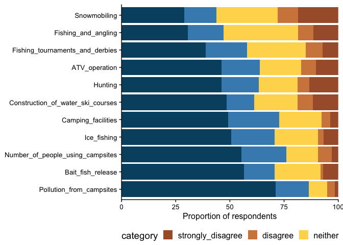<!-- -->

``` r
ggsave(here("plots", "lake_use_results_gradient.pdf"), height = 3, width = 7.6)
```

### Development

``` r
dev_dat <- dat %>% 
  # dplyr::select(Shoreline_infrastructure, Cell_towers, Backlot_development) %>% 
  dplyr::select(Condominiums,   Trailer_parks, Shipping_container_dwellings, `Floating_homes/barges`, Timeshare_dwellings, Hobby_farms, `Non-residential_commercial_development`,   Cell_towers, Backlot_development, Shoreline_infrastructure, Shoreline_minimum_setback, Shoreline_lot_minimum_frontage, Enforcement_for_upkeep_of_waste_systems) %>% 
  mutate(respondent = 1:nrow(dat)) %>% 
  pivot_longer(cols = Condominiums:Enforcement_for_upkeep_of_waste_systems,
               names_to = "question", values_to = "response")
  # pivot_longer(cols = Shoreline_infrastructure:Backlot_development,
  #              names_to = "question", values_to = "response")

dev_dat <- dev_dat %>% 
  na.omit() %>% 
  group_by(question) %>% 
  mutate(category = case_when(response == 5 ~ "strongly_agree",
                              response == 4 ~ "agree",
                              response == 3 ~ "neither",
                              response == 2 ~ "disagree",
                              response == 1 ~ "strongly_disagree"))
summary_dev <- dev_dat %>% 
  group_by(question, category) %>% 
  summarize(no_respondents = n())
```

    ## `summarise()` has regrouped the output.
    ## ℹ Summaries were computed grouped by question and category.
    ## ℹ Output is grouped by question.
    ## ℹ Use `summarise(.groups = "drop_last")` to silence this message.
    ## ℹ Use `summarise(.by = c(question, category))` for per-operation grouping
    ##   (`?dplyr::dplyr_by`) instead.

``` r
summary_dev <- summary_dev %>% 
  mutate(total_respondents = sum(no_respondents),
         prop_respondents = no_respondents/total_respondents*100) %>% 
  # group_by(question, category) %>% 
  arrange(prop_respondents)

summary_dev$category <- factor(summary_dev$category, levels = c("strongly_disagree", "disagree", "neither", "agree", "strongly_agree"))
summary_dev$question <- factor(summary_dev$question,
                               levels = c("Enforcement_for_upkeep_of_waste_systems", "Shoreline_lot_minimum_frontage", "Shoreline_minimum_setback", "Shoreline_infrastructure", "Cell_towers", "Backlot_development", "Timeshare_dwellings", "Shipping_container_dwellings", "Hobby_farms", "Non-residential_commercial_development", "Floating_homes/barges", "Trailer_parks", "Condominiums"))
```

Build plot:

``` r
summary_dev %>% 
  ggplot() +
  geom_bar(stat = "identity", 
           aes(x = question, y = prop_respondents, group = category, fill = category), 
           position = "stack") +
  scale_fill_manual(values = c("#a95e37", "#d1864b", "#ffd85b", "#448cbc", "#186484")) +
  # scale_fill_manual(values = c("#90dcfc", "#72bede", "#54a0c0", "#186484", "#045070")) +
  coord_flip() +
  ylab("Proportion of respondents (%)") +
  # xlab("Land use issue") +
  theme(axis.title.x = element_text(size = 12),
        axis.text = element_text(size = 10),
        legend.position = "bottom",
        axis.title.y = element_blank()) +
  scale_y_continuous(expand = c(0, 0))
```

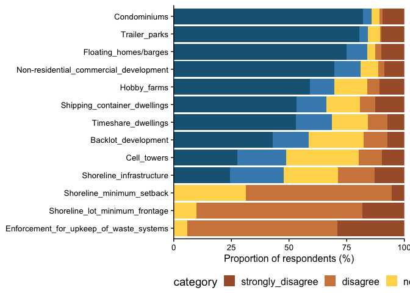<!-- -->

``` r
ggsave(here("plots", "dev_results_gradient.pdf"), height = 3, width = 7.6)
```

### Nature

``` r
nat_dat <- dat %>% 
  dplyr::select(Preserve_Natural_Beauty, Preserve_Natural_Shorelines, 
                Preserve_Unique_Habitats, Protect_Native_Species, 
                Control_Invasive_Species, Improve_Water_Quality,
                Encourage_Dark_Skies, Increase_Water_Clarity,
                Decrease_Bacterial_Levels, Reduce_Algal_Growth,
                Minimize_Water_Fluctuations) %>% 
  mutate(respondent = 1:nrow(dat)) %>% 
  pivot_longer(cols = Preserve_Natural_Beauty:Minimize_Water_Fluctuations,
               names_to = "question", values_to = "response")

nat_dat <- nat_dat %>% 
  na.omit() %>% 
  group_by(question) %>% 
  mutate(category = case_when(response == 5 ~ "strongly_agree",
                              response == 4 ~ "agree",
                              response == 3 ~ "neither",
                              response == 2 ~ "disagree",
                              response == 1 ~ "strongly_disagree"))
summary_nat <- nat_dat %>% 
  group_by(question, category) %>% 
  summarize(no_respondents = n())
```

    ## `summarise()` has regrouped the output.
    ## ℹ Summaries were computed grouped by question and category.
    ## ℹ Output is grouped by question.
    ## ℹ Use `summarise(.groups = "drop_last")` to silence this message.
    ## ℹ Use `summarise(.by = c(question, category))` for per-operation grouping
    ##   (`?dplyr::dplyr_by`) instead.

``` r
summary_nat <- summary_nat %>% 
  mutate(total_respondents = sum(no_respondents),
         prop_respondents = no_respondents/total_respondents*100) %>% 
  # group_by(question, category) %>% 
  arrange(prop_respondents)

summary_nat$category <- factor(summary_nat$category, levels = c("strongly_disagree", "disagree", "neither", "agree", "strongly_agree"))
summary_nat$question <- factor(summary_nat$question,
                               levels = c("Minimize_Water_Fluctuations",
                                          "Encourage_Dark_Skies",
                                          "Increase_Water_Clarity",
                                          "Preserve_Natural_Shorelines",
                                          "Decrease_Bacterial_Levels",
                                          "Protect_Native_Species",
                                          "Reduce_Algal_Growth",
                                          "Preserve_Unique_Habitats",
                                          "Preserve_Natural_Beauty",
                                          "Control_Invasive_Species",
                                          "Improve_Water_Quality"))
```

Build plot:

``` r
summary_nat %>% 
  ggplot() +
  geom_bar(stat = "identity", 
           aes(x = question, y = prop_respondents, group = category, fill = category), 
           position = "stack") +
  scale_fill_manual(values = c("#a95e37", "#d1864b", "#ffd85b", "#448cbc", "#186484")) +
  # scale_fill_manual(values = c("#90dcfc", "#72bede", "#54a0c0", "#186484", "#045070")) +
  coord_flip() +
  ylab("Proportion of respondents (%)") +
  theme(axis.title.x = element_text(size = 12),
        axis.text = element_text(size = 10),
        legend.position = "bottom",
        axis.title.y = element_blank()) +
  scale_y_continuous(expand = c(0, 0))
```

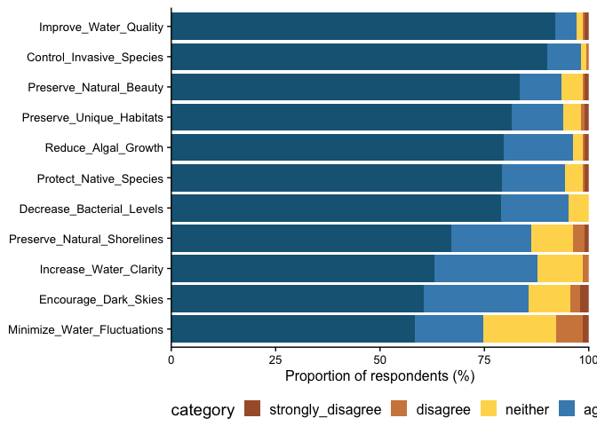<!-- -->

``` r
ggsave(here("plots", "nat_results_gradient.pdf"), height = 3, width = 7.6)
```

### Legislation

``` r
soc_dat <- dat %>% 
  dplyr::select(Lower_speeds_in_open_water,
                Lower_speeds_close_to_the_shoreline,
                Watercraft_wake_height,
                Lower_speeds_for_nesting_season,
                Lower_watercraft_noise_levels,
                Safer_operation_of_watercraft,  
                Invasive_species_checks) %>% 
  mutate(respondent = 1:nrow(dat)) %>% 
  pivot_longer(cols = Lower_speeds_in_open_water:Invasive_species_checks,
               names_to = "question", values_to = "response")

soc_dat <- soc_dat %>% 
  na.omit() %>% 
  group_by(question) %>% 
  mutate(category = case_when(response == 5 ~ "strongly_agree",
                              response == 4 ~ "agree",
                              response == 3 ~ "neither",
                              response == 2 ~ "disagree",
                              response == 1 ~ "strongly_disagree"))
summary_soc <- soc_dat %>% 
  group_by(question, category) %>% 
  summarize(no_respondents = n())
```

    ## `summarise()` has regrouped the output.
    ## ℹ Summaries were computed grouped by question and category.
    ## ℹ Output is grouped by question.
    ## ℹ Use `summarise(.groups = "drop_last")` to silence this message.
    ## ℹ Use `summarise(.by = c(question, category))` for per-operation grouping
    ##   (`?dplyr::dplyr_by`) instead.

``` r
summary_soc <- summary_soc %>% 
  mutate(total_respondents = sum(no_respondents),
         prop_respondents = no_respondents/total_respondents*100) %>% 
  # group_by(question, category) %>% 
  arrange(prop_respondents)

summary_soc$category <- factor(summary_soc$category, levels = c("strongly_disagree", "disagree", "neither", "agree", "strongly_agree"))
summary_soc$question <- factor(summary_soc$question,
                               levels = c("Lower_speeds_in_open_water",
                                          "Lower_watercraft_noise_levels",
                                          "Watercraft_wake_height",
                                          "Safer_operation_of_watercraft",
                                        "Lower_speeds_for_nesting_season",
                                    "Lower_speeds_close_to_the_shoreline",
                                          "Invasive_species_checks"))
```

Build plot:

``` r
summary_soc %>% 
  ggplot() +
  geom_bar(stat = "identity", 
           aes(x = question, y = prop_respondents, group = category, fill = category), 
           position = "stack") +
  scale_fill_manual(values = c("#a95e37", "#d1864b", "#ffd85b", "#448cbc", "#186484")) +
  # scale_fill_manual(values = c("#90dcfc", "#72bede", "#54a0c0", "#186484", "#045070")) +
  coord_flip() +
  ylab("Proportion of respondents (%)") +
  theme(axis.title.x = element_text(size = 12),
        axis.text = element_text(size = 10),
        legend.position = "bottom",
        axis.title.y = element_blank()) +
  scale_y_continuous(expand = c(0, 0))
```

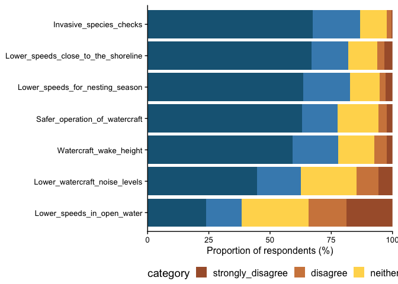<!-- -->

``` r
ggsave(here("plots", "soc_results_gradient.pdf"), height = 2, width = 7.6)
```

### Amenities

``` r
ame_dat <- dat %>% 
  dplyr::select(Frequency_of_O.P.P._marine_patrols,
                Public_boat_launches,
                Availability_of_safe_hiking_trails,
                Availability_of_access_to_managed_snowmobile_trails,
                Availability_of_groomed_cross_country_ski_trails,
                Access_to_safe_ATV_trails,
                Reliable_access_to_high_speed_internet,
                Access_to_reliable_cellular_coverage,
                Reopening_of_Hawk_Lake_landfill,
                Number_of_businesses_offering_gasoline_fueling,
                `Number_and_location_of_parking_facilities_[BHL]`,
                `Number_and_location_of_parking_facilities_[LHL]`,
                Number_of_public_beaches) %>% 
  mutate(respondent = 1:nrow(dat)) %>% 
  pivot_longer(cols = Frequency_of_O.P.P._marine_patrols:Number_of_public_beaches,
               names_to = "question", values_to = "response")

ame_dat <- ame_dat %>% 
  na.omit() %>% 
  group_by(question) %>% 
  mutate(category = case_when(response == 5 ~ "strongly_agree",
                              response == 4 ~ "agree",
                              response == 3 ~ "neither",
                              response == 2 ~ "disagree",
                              response == 1 ~ "strongly_disagree"))
summary_ame <- ame_dat %>% 
  group_by(question, category) %>% 
  summarize(no_respondents = n())
```

    ## `summarise()` has regrouped the output.
    ## ℹ Summaries were computed grouped by question and category.
    ## ℹ Output is grouped by question.
    ## ℹ Use `summarise(.groups = "drop_last")` to silence this message.
    ## ℹ Use `summarise(.by = c(question, category))` for per-operation grouping
    ##   (`?dplyr::dplyr_by`) instead.

``` r
summary_ame <- summary_ame %>% 
  mutate(total_respondents = sum(no_respondents),
         prop_respondents = no_respondents/total_respondents*100) %>% 
  # group_by(question, category) %>% 
  arrange(prop_respondents)

summary_ame$category <- factor(summary_ame$category, levels = c("strongly_disagree", "disagree", "neither", "agree", "strongly_agree"))
summary_ame$question <- factor(summary_ame$question,
                               levels = c("Reliable_access_to_high_speed_internet", "Access_to_reliable_cellular_coverage",
                                          "Availability_of_safe_hiking_trails",
                                          "Number_of_businesses_offering_gasoline_fueling",
                                          "Number_and_location_of_parking_facilities_[BHL]",
                "Number_and_location_of_parking_facilities_[LHL]",
                "Public_boat_launches",
                "Availability_of_groomed_cross_country_ski_trails",
                "Number_of_public_beaches",
                "Availability_of_access_to_managed_snowmobile_trails",
                "Frequency_of_O.P.P._marine_patrols",
                "Access_to_safe_ATV_trails",
                "Reopening_of_Hawk_Lake_landfill"))
```

Build plot:

``` r
summary_ame %>% 
  ggplot() +
  geom_bar(stat = "identity", 
           aes(x = question, y = prop_respondents, group = category, fill = category), 
           position = "stack") +
  scale_fill_manual(values = c("#a95e37", "#d1864b", "#ffd85b", "#448cbc", "#186484")) +
  # scale_fill_manual(values = c("#90dcfc", "#72bede", "#54a0c0", "#186484", "#045070")) +
  coord_flip() +
  ylab("Proportion of respondents (%)") +
  theme(axis.title.x = element_text(size = 12),
        axis.text = element_text(size = 10),
        legend.position = "bottom",
        axis.title.y = element_blank()) +
  scale_y_continuous(expand = c(0, 0))
```

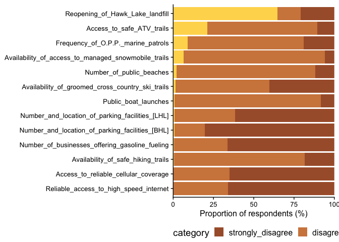<!-- -->

``` r
ggsave(here("plots", "ame_results_gradient.pdf"), height = 3, width = 7.6)
```

### Average value across each category

``` r
# Retrieve question names for each category
leg_vars <- unique(soc_dat$question)
lakeuse_vars <- unique(lake_use$question)
amen_vars <- unique(ame_dat$question)
dev_vars <- unique(dev_dat$question)
nat_vars <- unique(nat_dat$question)
```

Do calculations for averages.

``` r
### Legislation
# Calculate average values for each category from above avgs
leg_overall_mean <- soc_dat %>%
  ungroup() %>% 
  summarise(m = mean(response, na.rm = TRUE)) %>%
  pull(m)
# Calculate average values for each question
leg_question_means <- soc_dat %>%
  group_by(question) %>%
  summarise(m = mean(response, na.rm = TRUE)) %>% 
  mutate(category = "legislation",
         overall_mean = leg_overall_mean)

### Nature
# Calculate average values for each category from above avgs
nat_overall_mean <- nat_dat %>%
  ungroup() %>% 
  summarise(m = mean(response, na.rm = TRUE)) %>%
  pull(m)
# Calculate average values for each question
nat_question_means <- nat_dat %>%
  group_by(question) %>%
  summarise(m = mean(response, na.rm = TRUE)) %>% 
  mutate(category = "nature",
         overall_mean = nat_overall_mean)

### Development
# Calculate average values for each category from above avgs
dev_overall_mean <- dev_dat %>%
  ungroup() %>% 
  summarise(m = mean(response, na.rm = TRUE)) %>%
  pull(m)
# Calculate average values for each question
dev_question_means <- dev_dat %>%
  group_by(question) %>%
  summarise(m = mean(response, na.rm = TRUE)) %>% 
  mutate(category = "development",
         overall_mean = dev_overall_mean)

### Lake use
# Calculate average values for each category from above avgs
lakeuse_overall_mean <- lake_use %>%
  ungroup() %>% 
  summarise(m = mean(response, na.rm = TRUE)) %>%
  pull(m)
# Calculate average values for each question
lakeuse_question_means <- lake_use %>%
  group_by(question) %>%
  summarise(m = mean(response, na.rm = TRUE)) %>% 
  mutate(category = "lake_use",
         overall_mean = lakeuse_overall_mean)

### Amenities
# Calculate average values for each category from above avgs
amen_overall_mean <- ame_dat %>%
  ungroup() %>% 
  summarise(m = mean(response, na.rm = TRUE)) %>%
  pull(m)
# Calculate average values for each question
amen_question_means <- ame_dat %>%
  group_by(question) %>%
  summarise(m = mean(response, na.rm = TRUE)) %>% 
  mutate(category = "amenities",
         overall_mean = amen_overall_mean)

### Bind them all together
# mean_dat <- bind_rows(leg_question_means,
#                       nat_question_means,
#                       dev_question_means,
#                       lakeuse_question_means,
#                       amen_question_means)
# mean_plot_dat <- bind_rows(ame_dat %>% mutate(group = "amenities"),
#                            soc_dat %>% mutate(group = "legislation"),
#                            dev_dat %>% mutate(group = "development"),
#                            nat_dat %>% mutate(group = "nature"),
#                            lake_use %>% mutate(group = "lake_use"))
```

Build plots.

``` r
### Legislation
soc_dat %>% 
  ggplot(aes(x = reorder(question, response), y = response)) +
  geom_boxplot(outlier.alpha = 0.3) +
  geom_point(data = leg_question_means, aes(x = question, y = m),
             color = "cornflowerblue", size = 2) +
  geom_hline(yintercept = unique(leg_question_means$overall_mean), color = "coral") +
  ggtitle("Legislation questions: response scores") +
  ylab("Response score") +
  xlab("Survey question") +
  theme(axis.text.x = element_blank(),
        # axis.text.x = element_text(angle = 45, hjust = 1, size = 6),
        axis.text.y = element_text(size = 10),
        axis.title = element_text(size = 12),
        plot.title = element_text(size = 14))
```

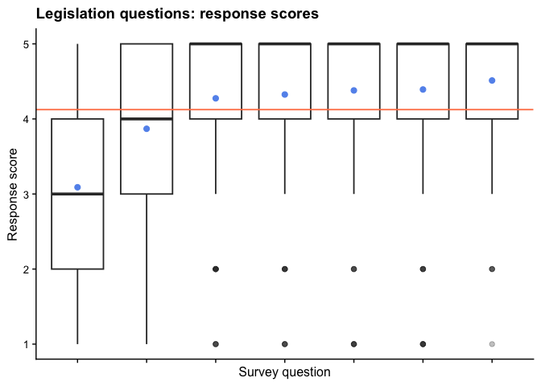<!-- -->

``` r
ggsave(here("plots/leg_means.pdf"), width = 6, height = 4)

### Lake use
lake_use %>% 
  ggplot(aes(x = reorder(question, response), y = response)) +
  geom_boxplot(outlier.alpha = 0.3) +
  geom_point(data = lakeuse_question_means, aes(x = question, y = m),
             color = "cornflowerblue", size = 2) +
  geom_hline(yintercept = unique(lakeuse_question_means$overall_mean), color = "coral") +
  ggtitle("Lake use questions: response scores") +
  ylab("Response score") +
  xlab("Survey question") +
  theme(axis.text.x = element_blank(),
        # axis.text.x = element_text(angle = 45, hjust = 1, size = 6),
        axis.text.y = element_text(size = 10),
        axis.title = element_text(size = 12),
        plot.title = element_text(size = 14))
```

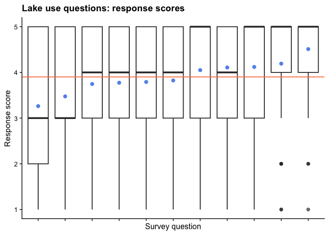<!-- -->

``` r
ggsave(here("plots/lakeuse_means.pdf"), width = 6, height = 4)

### Development
dev_dat %>% 
  ggplot(aes(x = reorder(question, response), y = response)) +
  geom_boxplot(outlier.alpha = 0.3) +
  geom_point(data = dev_question_means, aes(x = question, y = m),
             color = "cornflowerblue", size = 2) +
  geom_hline(yintercept = unique(dev_question_means$overall_mean), color = "coral") +
  ggtitle("Development questions: response scores") +
  ylab("Response score") +
  xlab("Survey question") +
  theme(axis.text.x = element_blank(),
        # axis.text.x = element_text(angle = 45, hjust = 1, size = 6),
        axis.text.y = element_text(size = 10),
        axis.title = element_text(size = 12),
        plot.title = element_text(size = 14))
```

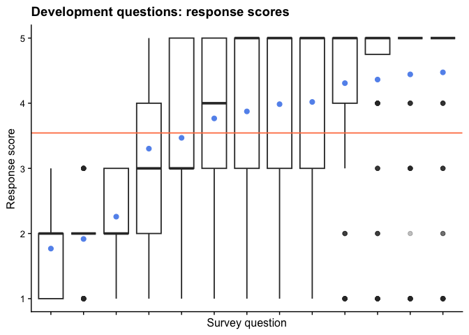<!-- -->

``` r
ggsave(here("plots/dev_means.pdf"), width = 6, height = 4)

### Nature
nat_dat %>% 
  ggplot(aes(x = reorder(question, response), y = response)) +
  geom_boxplot(outlier.alpha = 0.3) +
  geom_point(data = nat_question_means, aes(x = question, y = m),
             color = "cornflowerblue", size = 2) +
  geom_hline(yintercept = unique(nat_question_means$overall_mean), color = "coral") +
  ggtitle("Nature questions: response scores") +
  ylab("Response score") +
  xlab("Survey question") +
  theme(axis.text.x = element_blank(),
        # axis.text.x = element_text(angle = 45, hjust = 1, size = 6),
        axis.text.y = element_text(size = 10),
        axis.title = element_text(size = 12),
        plot.title = element_text(size = 14))
```

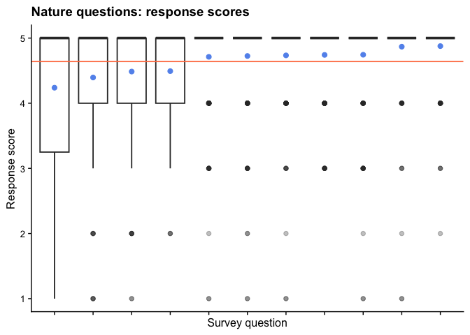<!-- -->

``` r
ggsave(here("plots/nature_means.pdf"), width = 6, height = 4)

### Amenities
ame_dat %>% 
  ggplot(aes(x = reorder(question, response), y = response)) +
  geom_boxplot(outlier.alpha = 0.3) +
  geom_point(data = amen_question_means, aes(x = question, y = m),
             color = "cornflowerblue", size = 2) +
  geom_hline(yintercept = unique(amen_question_means$overall_mean), color = "coral") +
  ggtitle("Amenities questions: response scores") +
  ylab("Response score") +
  xlab("Survey question") +
  theme(axis.text.x = element_blank(),
        # axis.text.x = element_text(angle = 45, hjust = 1, size = 6),
        axis.text.y = element_text(size = 10),
        axis.title = element_text(size = 12),
        plot.title = element_text(size = 14)) +
  scale_y_continuous(limits = c(1, 5))
```

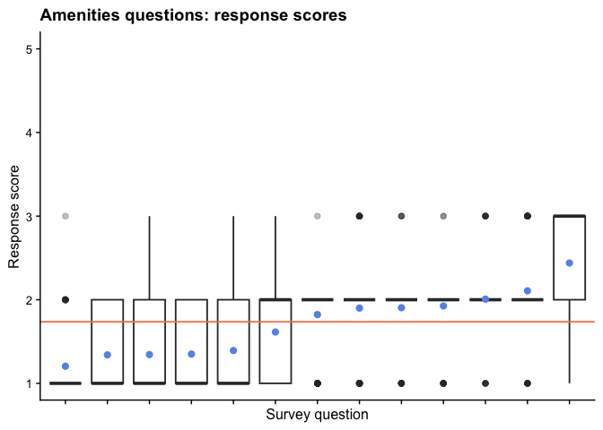<!-- -->

``` r
ggsave(here("plots/amen_means.pdf"), width = 6, height = 4)
```

# Testing for predictors

We want to see if there are any significant predictors for survey
responses. To do so, we assessed survey responses based on four factors:

1.  Age of association member

2.  Length of property ownership

3.  The lake that the member has property on

4.  Type of property access

### Specify response variables (i.e., corresponding columns)

``` r
# Nature-related questions
nature_resp <- cbind(dat$Preserve_Natural_Beauty,
                     dat$Preserve_Natural_Shorelines,
                     dat$Preserve_Unique_Habitats,
                     dat$Protect_Native_Species, 
                     dat$Control_Invasive_Species,
                     dat$Improve_Water_Quality,
                     dat$Encourage_Dark_Skies, 
                     dat$Increase_Water_Clarity, 
                     dat$Decrease_Bacterial_Levels,
                     dat$Reduce_Algal_Growth, 
                     dat$Minimize_Water_Fluctuations)

# Development-related questions
dev_resp <- cbind(dat$Condominiums, 
                  dat$Trailer_parks,
                  dat$Shipping_container_dwellings,
                  dat$`Floating_homes/barges`,
                  dat$Timeshare_dwellings, 
                  dat$Hobby_farms,
                  dat$`Non-residential_commercial_development`, 
                  dat$Cell_towers,
                  dat$Backlot_development,  
                  dat$Shoreline_infrastructure, 
                  dat$Shoreline_minimum_setback,
                  dat$Shoreline_lot_minimum_frontage,   
                  dat$Enforcement_for_upkeep_of_waste_systems)

# Legislation-related questions
leg_resp <- cbind(dat$Lower_speeds_in_open_water,
                  dat$Lower_speeds_close_to_the_shoreline,
                  dat$Watercraft_wake_height,
                  dat$Lower_speeds_for_nesting_season,
                  dat$Lower_watercraft_noise_levels,
                  dat$Safer_operation_of_watercraft,    
                  dat$Invasive_species_checks)

# Lake use-related questions
lakeuse_resp <- cbind(dat$Construction_of_water_ski_courses, 
                      dat$Fishing_and_angling,  
                      dat$Fishing_tournaments_and_derbies,  
                      dat$Bait_fish_release,    
                      dat$Ice_fishing,
                      dat$Hunting,
                      dat$Snowmobiling,
                      dat$ATV_operation,
                      dat$Camping_facilities,
                      dat$Number_of_people_using_campsites,
                      dat$Pollution_from_campsites)

# Amenities-related questions
amen_resp <- cbind(dat$Frequency_of_O.P.P._marine_patrols,
                   dat$Public_boat_launches,
                   dat$Availability_of_safe_hiking_trails,
                   dat$Availability_of_access_to_managed_snowmobile_trails,
                   dat$Availability_of_groomed_cross_country_ski_trails,
                   dat$Access_to_safe_ATV_trails,
                   dat$Reliable_access_to_high_speed_internet,
                   dat$Access_to_reliable_cellular_coverage,
                   dat$Reopening_of_Hawk_Lake_landfill,
                   dat$Number_of_businesses_offering_gasoline_fueling,
                   dat$`Number_and_location_of_parking_facilities_[BHL]`,
                   dat$`Number_and_location_of_parking_facilities_[LHL]`,
                   dat$Number_of_public_beaches)
```

### Run MANOVAs

``` r
# Nature variables
nature_lake_manova <- manova(nature_resp ~ Lake, data = dat)
nature_age_manova <- manova(nature_resp ~ Age, data = dat)
nature_duration_manova <- manova(nature_resp ~ Duration, data = dat)
nature_access_manova <- manova(nature_resp ~ Access, data = dat)

# Development variables
dev_lake_manova <- manova(dev_resp ~ Lake, data = dat)
dev_age_manova <- manova(dev_resp ~ Age, data = dat)
dev_duration_manova <- manova(dev_resp ~ Duration, data = dat)
dev_access_manova <- manova(dev_resp ~ Access, data = dat)

# Legislation variables
leg_lake_manova <- manova(leg_resp ~ Lake, data = dat)
leg_age_manova <- manova(leg_resp ~ Age, data = dat)
leg_duration_manova <- manova(leg_resp ~ Duration, data = dat)
leg_access_manova <- manova(leg_resp ~ Access, data = dat)

# Lake use variables
lakeuse_lake_manova <- manova(lakeuse_resp ~ Lake, data = dat)
lakeuse_age_manova <- manova(lakeuse_resp ~ Age, data = dat)
lakeuse_duration_manova <- manova(lakeuse_resp ~ Duration, data = dat)
lakeuse_access_manova <- manova(lakeuse_resp ~ Access, data = dat)

# Amenities variables
amen_lake_manova <- manova(amen_resp ~ Lake, data = dat)
amen_age_manova <- manova(amen_resp ~ Age, data = dat)
amen_duration_manova <- manova(amen_resp ~ Duration, data = dat)
amen_access_manova <- manova(amen_resp ~ Access, data = dat)
```

### MANOVA summaries and significant predictors

``` r
summary(nature_lake_manova)
```

    ##            Df  Pillai approx F num Df den Df Pr(>F)
    ## Lake        6 0.27147  0.74962     66   1044 0.9313
    ## Residuals 179

``` r
summary(nature_access_manova)
```

    ##            Df  Pillai approx F num Df den Df Pr(>F)
    ## Access      2 0.15562   1.3347     22    348 0.1451
    ## Residuals 183

``` r
summary(nature_age_manova)
```

    ##            Df  Pillai approx F num Df den Df Pr(>F)
    ## Age         2 0.10773  0.90059     22    348 0.5944
    ## Residuals 183

``` r
summary(nature_duration_manova)
```

    ##            Df  Pillai approx F num Df den Df Pr(>F)
    ## Duration    5 0.22842  0.75723     55    870  0.903
    ## Residuals 180

``` r
summary(dev_lake_manova)
```

    ##            Df Pillai approx F num Df den Df Pr(>F)
    ## Lake        6 0.5281   1.1581     78    936 0.1722
    ## Residuals 163

``` r
summary(dev_access_manova) # sig
```

    ##            Df  Pillai approx F num Df den Df  Pr(>F)  
    ## Access      2 0.23413   1.5911     26    312 0.03633 *
    ## Residuals 167                                         
    ## ---
    ## Signif. codes:  0 '***' 0.001 '**' 0.01 '*' 0.05 '.' 0.1 ' ' 1

``` r
summary(dev_age_manova)
```

    ##            Df  Pillai approx F num Df den Df Pr(>F)
    ## Age         2 0.16442   1.0749     26    312 0.3693
    ## Residuals 167

``` r
summary(dev_duration_manova)
```

    ##            Df  Pillai approx F num Df den Df Pr(>F)
    ## Duration    5 0.42233   1.1071     65    780 0.2689
    ## Residuals 164

``` r
summary(leg_lake_manova)
```

    ##            Df  Pillai approx F num Df den Df Pr(>F)
    ## Lake        7 0.24022  0.90874     49   1253 0.6531
    ## Residuals 179

``` r
summary(leg_access_manova)
```

    ##            Df   Pillai approx F num Df den Df Pr(>F)
    ## Access      2 0.088674   1.1864     14    358 0.2835
    ## Residuals 184

``` r
summary(leg_age_manova) # sig
```

    ##            Df  Pillai approx F num Df den Df  Pr(>F)  
    ## Age         2 0.12044   1.6386     14    358 0.06702 .
    ## Residuals 184                                         
    ## ---
    ## Signif. codes:  0 '***' 0.001 '**' 0.01 '*' 0.05 '.' 0.1 ' ' 1

``` r
summary(leg_duration_manova)
```

    ##            Df  Pillai approx F num Df den Df Pr(>F)
    ## Duration    5 0.13152  0.69079     35    895 0.9127
    ## Residuals 181

``` r
summary(lakeuse_lake_manova)
```

    ##            Df  Pillai approx F num Df den Df Pr(>F)
    ## Lake        6 0.45482   1.0588     66    852 0.3556
    ## Residuals 147

``` r
summary(lakeuse_access_manova) # sig
```

    ##            Df  Pillai approx F num Df den Df  Pr(>F)  
    ## Access      2 0.23537   1.7218     22    284 0.02495 *
    ## Residuals 151                                         
    ## ---
    ## Signif. codes:  0 '***' 0.001 '**' 0.01 '*' 0.05 '.' 0.1 ' ' 1

``` r
summary(lakeuse_age_manova) # sig
```

    ##            Df  Pillai approx F num Df den Df  Pr(>F)  
    ## Age         2 0.23207   1.6945     22    284 0.02861 *
    ## Residuals 151                                         
    ## ---
    ## Signif. codes:  0 '***' 0.001 '**' 0.01 '*' 0.05 '.' 0.1 ' ' 1

``` r
summary(lakeuse_duration_manova)
```

    ##            Df  Pillai approx F num Df den Df Pr(>F)
    ## Duration    5 0.33739  0.93411     55    710 0.6118
    ## Residuals 148

``` r
summary(amen_lake_manova) # sig
```

    ##           Df Pillai approx F num Df den Df   Pr(>F)   
    ## Lake       4 1.6541   1.8441     52    136 0.002655 **
    ## Residuals 43                                          
    ## ---
    ## Signif. codes:  0 '***' 0.001 '**' 0.01 '*' 0.05 '.' 0.1 ' ' 1

``` r
summary(amen_access_manova) # sig
```

    ##           Df  Pillai approx F num Df den Df  Pr(>F)  
    ## Access     2 0.76122   1.6071     26     68 0.06155 .
    ## Residuals 45                                         
    ## ---
    ## Signif. codes:  0 '***' 0.001 '**' 0.01 '*' 0.05 '.' 0.1 ' ' 1

``` r
summary(amen_age_manova)
```

    ##           Df  Pillai approx F num Df den Df Pr(>F)
    ## Age        1 0.38631   1.6463     13     34 0.1203
    ## Residuals 46

``` r
summary(amen_duration_manova)
```

    ##           Df  Pillai approx F num Df den Df Pr(>F)
    ## Duration   4 0.77588  0.62938     52    136 0.9709
    ## Residuals 43

Look at which response variables were significant. To determine which
variables are driving the significant effect, we can run separate ANOVAs
for each response variable. We report MANOVA results using Pillai’s
Trace, which is the multivariate effect size/statistic (wherein larger
values indicate stronger separation among groups), and the p-value.

``` r
# Survey results where lake access affects response
summary(dev_access_manova) # sig PT = 0.234, p = 0.036
```

    ##            Df  Pillai approx F num Df den Df  Pr(>F)  
    ## Access      2 0.23413   1.5911     26    312 0.03633 *
    ## Residuals 167                                         
    ## ---
    ## Signif. codes:  0 '***' 0.001 '**' 0.01 '*' 0.05 '.' 0.1 ' ' 1

``` r
summary.aov(dev_access_manova)
```

    ##  Response 1 :
    ##              Df  Sum Sq Mean Sq F value   Pr(>F)   
    ## Access        2  16.105  8.0525  6.4713 0.001964 **
    ## Residuals   167 207.807  1.2444                    
    ## ---
    ## Signif. codes:  0 '***' 0.001 '**' 0.01 '*' 0.05 '.' 0.1 ' ' 1
    ## 
    ##  Response 2 :
    ##              Df Sum Sq Mean Sq F value   Pr(>F)   
    ## Access        2  13.22  6.6102  5.0354 0.007526 **
    ## Residuals   167 219.23  1.3127                    
    ## ---
    ## Signif. codes:  0 '***' 0.001 '**' 0.01 '*' 0.05 '.' 0.1 ' ' 1
    ## 
    ##  Response 3 :
    ##              Df Sum Sq Mean Sq F value Pr(>F)
    ## Access        2   5.13  2.5649  1.3434 0.2638
    ## Residuals   167 318.85  1.9093               
    ## 
    ##  Response 4 :
    ##              Df  Sum Sq Mean Sq F value  Pr(>F)  
    ## Access        2  12.107  6.0537  4.0149 0.01981 *
    ## Residuals   167 251.804  1.5078                  
    ## ---
    ## Signif. codes:  0 '***' 0.001 '**' 0.01 '*' 0.05 '.' 0.1 ' ' 1
    ## 
    ##  Response 5 :
    ##              Df  Sum Sq Mean Sq F value  Pr(>F)  
    ## Access        2  13.615  6.8076  4.3188 0.01483 *
    ## Residuals   167 263.238  1.5763                  
    ## ---
    ## Signif. codes:  0 '***' 0.001 '**' 0.01 '*' 0.05 '.' 0.1 ' ' 1
    ## 
    ##  Response 6 :
    ##              Df  Sum Sq Mean Sq F value  Pr(>F)  
    ## Access        2  14.753  7.3765  4.4568 0.01301 *
    ## Residuals   167 276.400  1.6551                  
    ## ---
    ## Signif. codes:  0 '***' 0.001 '**' 0.01 '*' 0.05 '.' 0.1 ' ' 1
    ## 
    ##  Response 7 :
    ##              Df  Sum Sq Mean Sq F value   Pr(>F)   
    ## Access        2  14.462  7.2309  5.2688 0.006041 **
    ## Residuals   167 229.191  1.3724                    
    ## ---
    ## Signif. codes:  0 '***' 0.001 '**' 0.01 '*' 0.05 '.' 0.1 ' ' 1
    ## 
    ##  Response 8 :
    ##              Df  Sum Sq Mean Sq F value Pr(>F)
    ## Access        2   2.817  1.4084  0.9747 0.3794
    ## Residuals   167 241.307  1.4449               
    ## 
    ##  Response 9 :
    ##              Df  Sum Sq Mean Sq F value  Pr(>F)  
    ## Access        2  10.901  5.4507   3.349 0.03749 *
    ## Residuals   167 271.804  1.6276                  
    ## ---
    ## Signif. codes:  0 '***' 0.001 '**' 0.01 '*' 0.05 '.' 0.1 ' ' 1
    ## 
    ##  Response 10 :
    ##              Df  Sum Sq Mean Sq F value Pr(>F)
    ## Access        2   3.572  1.7859  0.9987 0.3706
    ## Residuals   167 298.640  1.7883               
    ## 
    ##  Response 11 :
    ##              Df Sum Sq Mean Sq F value Pr(>F)
    ## Access        2  1.266 0.63294  2.2859 0.1049
    ## Residuals   167 46.240 0.27689               
    ## 
    ##  Response 12 :
    ##              Df Sum Sq  Mean Sq F value Pr(>F)
    ## Access        2  0.127 0.063725  0.2315 0.7936
    ## Residuals   167 45.967 0.275250               
    ## 
    ##  Response 13 :
    ##              Df Sum Sq Mean Sq F value Pr(>F)
    ## Access        2  0.359 0.17961  0.6872 0.5044
    ## Residuals   167 43.647 0.26136               
    ## 
    ## 43 observations deleted due to missingness

``` r
summary(lakeuse_access_manova) # sig PT = 0.23537, p = 0.02495
```

    ##            Df  Pillai approx F num Df den Df  Pr(>F)  
    ## Access      2 0.23537   1.7218     22    284 0.02495 *
    ## Residuals 151                                         
    ## ---
    ## Signif. codes:  0 '***' 0.001 '**' 0.01 '*' 0.05 '.' 0.1 ' ' 1

``` r
summary.aov(lakeuse_access_manova)
```

    ##  Response 1 :
    ##              Df  Sum Sq Mean Sq F value Pr(>F)
    ## Access        2   0.698 0.34914  0.1713 0.8427
    ## Residuals   151 307.795 2.03838               
    ## 
    ##  Response 2 :
    ##              Df  Sum Sq Mean Sq F value  Pr(>F)  
    ## Access        2  10.806  5.4031  3.3208 0.03878 *
    ## Residuals   151 245.687  1.6271                  
    ## ---
    ## Signif. codes:  0 '***' 0.001 '**' 0.01 '*' 0.05 '.' 0.1 ' ' 1
    ## 
    ##  Response 3 :
    ##              Df  Sum Sq Mean Sq F value Pr(>F)
    ## Access        2   4.657  2.3285  1.4412 0.2399
    ## Residuals   151 243.966  1.6157               
    ## 
    ##  Response 4 :
    ##              Df  Sum Sq Mean Sq F value Pr(>F)
    ## Access        2   3.622  1.8111   1.179 0.3104
    ## Residuals   151 231.962  1.5362               
    ## 
    ##  Response 5 :
    ##              Df  Sum Sq Mean Sq F value Pr(>F)
    ## Access        2   2.485  1.2423  0.8393  0.434
    ## Residuals   151 223.489  1.4801               
    ## 
    ##  Response 6 :
    ##              Df  Sum Sq Mean Sq F value Pr(>F)
    ## Access        2   9.357  4.6784  2.3142 0.1023
    ## Residuals   151 305.266  2.0216               
    ## 
    ##  Response 7 :
    ##              Df  Sum Sq Mean Sq F value    Pr(>F)    
    ## Access        2  26.265 13.1326  7.5361 0.0007592 ***
    ## Residuals   151 263.137  1.7426                      
    ## ---
    ## Signif. codes:  0 '***' 0.001 '**' 0.01 '*' 0.05 '.' 0.1 ' ' 1
    ## 
    ##  Response 8 :
    ##              Df  Sum Sq Mean Sq F value Pr(>F)
    ## Access        2   7.902  3.9510  2.2915 0.1046
    ## Residuals   151 260.358  1.7242               
    ## 
    ##  Response 9 :
    ##              Df  Sum Sq Mean Sq F value Pr(>F)
    ## Access        2   0.881  0.4406  0.3652 0.6947
    ## Residuals   151 182.184  1.2065               
    ## 
    ##  Response 10 :
    ##              Df  Sum Sq Mean Sq F value Pr(>F)
    ## Access        2   1.376 0.68807    0.56 0.5724
    ## Residuals   151 185.533 1.22870               
    ## 
    ##  Response 11 :
    ##              Df  Sum Sq Mean Sq F value Pr(>F)
    ## Access        2   0.444 0.22221   0.262 0.7698
    ## Residuals   151 128.049 0.84801               
    ## 
    ## 59 observations deleted due to missingness

``` r
summary(amen_access_manova) # sig PT = 0.76122, p = 0.06155
```

    ##           Df  Pillai approx F num Df den Df  Pr(>F)  
    ## Access     2 0.76122   1.6071     26     68 0.06155 .
    ## Residuals 45                                         
    ## ---
    ## Signif. codes:  0 '***' 0.001 '**' 0.01 '*' 0.05 '.' 0.1 ' ' 1

``` r
summary.aov(amen_access_manova)
```

    ##  Response 1 :
    ##             Df  Sum Sq Mean Sq F value  Pr(>F)  
    ## Access       2  1.7054 0.85268  3.1209 0.05379 .
    ## Residuals   45 12.2946 0.27321                  
    ## ---
    ## Signif. codes:  0 '***' 0.001 '**' 0.01 '*' 0.05 '.' 0.1 ' ' 1
    ## 
    ##  Response 2 :
    ##             Df Sum Sq Mean Sq F value  Pr(>F)  
    ## Access       2 0.8006 0.40030  3.0708 0.05622 .
    ## Residuals   45 5.8661 0.13036                  
    ## ---
    ## Signif. codes:  0 '***' 0.001 '**' 0.01 '*' 0.05 '.' 0.1 ' ' 1
    ## 
    ##  Response 3 :
    ##             Df Sum Sq Mean Sq F value Pr(>F)
    ## Access       2 0.8353 0.41766  2.1743 0.1255
    ## Residuals   45 8.6438 0.19209               
    ## 
    ##  Response 4 :
    ##             Df Sum Sq  Mean Sq F value Pr(>F)
    ## Access       2 0.1181 0.059028  0.3968 0.6748
    ## Residuals   45 6.6944 0.148765               
    ## 
    ##  Response 5 :
    ##             Df  Sum Sq Mean Sq F value Pr(>F)
    ## Access       2  0.4554 0.22768  0.8008 0.4553
    ## Residuals   45 12.7946 0.28432               
    ## 
    ##  Response 6 :
    ##             Df  Sum Sq Mean Sq F value  Pr(>F)  
    ## Access       2  1.8204 0.91022  2.5447 0.08974 .
    ## Residuals   45 16.0962 0.35769                  
    ## ---
    ## Signif. codes:  0 '***' 0.001 '**' 0.01 '*' 0.05 '.' 0.1 ' ' 1
    ## 
    ##  Response 7 :
    ##             Df  Sum Sq Mean Sq F value Pr(>F)
    ## Access       2  0.6845 0.34226  1.4268 0.2507
    ## Residuals   45 10.7946 0.23988               
    ## 
    ##  Response 8 :
    ##             Df  Sum Sq  Mean Sq F value Pr(>F)
    ## Access       2  0.0942 0.047123  0.1948 0.8237
    ## Residuals   45 10.8849 0.241887               
    ## 
    ##  Response 9 :
    ##             Df  Sum Sq Mean Sq F value Pr(>F)
    ## Access       2  0.4881 0.24405  0.3764 0.6885
    ## Residuals   45 29.1786 0.64841               
    ## 
    ##  Response 10 :
    ##             Df Sum Sq Mean Sq F value  Pr(>F)  
    ## Access       2 1.6687 0.83433  4.3435 0.01885 *
    ## Residuals   45 8.6438 0.19209                  
    ## ---
    ## Signif. codes:  0 '***' 0.001 '**' 0.01 '*' 0.05 '.' 0.1 ' ' 1
    ## 
    ##  Response 11 :
    ##             Df Sum Sq  Mean Sq F value Pr(>F)
    ## Access       2 0.0109 0.005456  0.0248 0.9755
    ## Residuals   45 9.9058 0.220128               
    ## 
    ##  Response 12 :
    ##             Df  Sum Sq  Mean Sq F value Pr(>F)
    ## Access       2  0.0496 0.024802  0.1021 0.9031
    ## Residuals   45 10.9296 0.242879               
    ## 
    ##  Response 13 :
    ##             Df Sum Sq  Mean Sq F value Pr(>F)
    ## Access       2 0.0079 0.003968  0.0247 0.9757
    ## Residuals   45 7.2421 0.160935               
    ## 
    ## 165 observations deleted due to missingness

``` r
# Survey results where age affects response
summary(leg_age_manova) # sig PT = 0.12044, p = 0.06702
```

    ##            Df  Pillai approx F num Df den Df  Pr(>F)  
    ## Age         2 0.12044   1.6386     14    358 0.06702 .
    ## Residuals 184                                         
    ## ---
    ## Signif. codes:  0 '***' 0.001 '**' 0.01 '*' 0.05 '.' 0.1 ' ' 1

``` r
summary.aov(leg_age_manova)
```

    ##  Response 1 :
    ##              Df Sum Sq Mean Sq F value  Pr(>F)  
    ## Age           2  10.21  5.1046  2.6515 0.07324 .
    ## Residuals   184 354.24  1.9252                  
    ## ---
    ## Signif. codes:  0 '***' 0.001 '**' 0.01 '*' 0.05 '.' 0.1 ' ' 1
    ## 
    ##  Response 2 :
    ##              Df  Sum Sq Mean Sq F value Pr(>F)
    ## Age           2   4.128  2.0642  2.0027 0.1379
    ## Residuals   184 189.647  1.0307               
    ## 
    ##  Response 3 :
    ##              Df  Sum Sq Mean Sq F value Pr(>F)
    ## Age           2   4.634 2.31716   2.325 0.1006
    ## Residuals   184 183.376 0.99661               
    ## 
    ##  Response 4 :
    ##              Df  Sum Sq Mean Sq F value Pr(>F)
    ## Age           2   3.607 1.80368  1.9972 0.1386
    ## Residuals   184 166.168 0.90309               
    ## 
    ##  Response 5 :
    ##              Df  Sum Sq Mean Sq F value   Pr(>F)   
    ## Age           2  16.198  8.0992  5.9365 0.003174 **
    ## Residuals   184 251.032  1.3643                    
    ## ---
    ## Signif. codes:  0 '***' 0.001 '**' 0.01 '*' 0.05 '.' 0.1 ' ' 1
    ## 
    ##  Response 6 :
    ##              Df Sum Sq Mean Sq F value Pr(>F)
    ## Age           2   4.49  2.2449  2.1523 0.1191
    ## Residuals   184 191.92  1.0430               
    ## 
    ##  Response 7 :
    ##              Df  Sum Sq Mean Sq F value   Pr(>F)   
    ## Age           2   6.127 3.06335  5.0053 0.007643 **
    ## Residuals   184 112.611 0.61202                    
    ## ---
    ## Signif. codes:  0 '***' 0.001 '**' 0.01 '*' 0.05 '.' 0.1 ' ' 1
    ## 
    ## 26 observations deleted due to missingness

``` r
summary(lakeuse_age_manova) # sig PT = 0.23207, p = 0.02861
```

    ##            Df  Pillai approx F num Df den Df  Pr(>F)  
    ## Age         2 0.23207   1.6945     22    284 0.02861 *
    ## Residuals 151                                         
    ## ---
    ## Signif. codes:  0 '***' 0.001 '**' 0.01 '*' 0.05 '.' 0.1 ' ' 1

``` r
summary.aov(lakeuse_age_manova)
```

    ##  Response 1 :
    ##              Df  Sum Sq Mean Sq F value Pr(>F)
    ## Age           2   6.107  3.0535  1.5248  0.221
    ## Residuals   151 302.386  2.0026               
    ## 
    ##  Response 2 :
    ##              Df  Sum Sq Mean Sq F value Pr(>F)
    ## Age           2   4.666  2.3332   1.399   0.25
    ## Residuals   151 251.827  1.6677               
    ## 
    ##  Response 3 :
    ##              Df  Sum Sq Mean Sq F value Pr(>F)
    ## Age           2   3.222  1.6111  0.9913 0.3735
    ## Residuals   151 245.401  1.6252               
    ## 
    ##  Response 4 :
    ##              Df  Sum Sq Mean Sq F value  Pr(>F)   
    ## Age           2  16.445  8.2223  5.6657 0.00424 **
    ## Residuals   151 219.140  1.4513                   
    ## ---
    ## Signif. codes:  0 '***' 0.001 '**' 0.01 '*' 0.05 '.' 0.1 ' ' 1
    ## 
    ##  Response 5 :
    ##              Df Sum Sq Mean Sq F value    Pr(>F)    
    ## Age           2  22.04 11.0202  8.1598 0.0004315 ***
    ## Residuals   151 203.93  1.3506                      
    ## ---
    ## Signif. codes:  0 '***' 0.001 '**' 0.01 '*' 0.05 '.' 0.1 ' ' 1
    ## 
    ##  Response 6 :
    ##              Df  Sum Sq Mean Sq F value Pr(>F)
    ## Age           2   9.321  4.6606  2.3051 0.1032
    ## Residuals   151 305.302  2.0219               
    ## 
    ##  Response 7 :
    ##              Df Sum Sq Mean Sq F value Pr(>F)
    ## Age           2   2.54  1.2701  0.6685  0.514
    ## Residuals   151 286.86  1.8998               
    ## 
    ##  Response 8 :
    ##              Df  Sum Sq Mean Sq F value  Pr(>F)  
    ## Age           2  10.226  5.1131  2.9922 0.05316 .
    ## Residuals   151 258.034  1.7088                  
    ## ---
    ## Signif. codes:  0 '***' 0.001 '**' 0.01 '*' 0.05 '.' 0.1 ' ' 1
    ## 
    ##  Response 9 :
    ##              Df  Sum Sq Mean Sq F value  Pr(>F)  
    ## Age           2  10.498  5.2492  4.5932 0.01158 *
    ## Residuals   151 172.567  1.1428                  
    ## ---
    ## Signif. codes:  0 '***' 0.001 '**' 0.01 '*' 0.05 '.' 0.1 ' ' 1
    ## 
    ##  Response 10 :
    ##              Df  Sum Sq Mean Sq F value   Pr(>F)   
    ## Age           2  11.335  5.6673  4.8741 0.008886 **
    ## Residuals   151 175.574  1.1627                    
    ## ---
    ## Signif. codes:  0 '***' 0.001 '**' 0.01 '*' 0.05 '.' 0.1 ' ' 1
    ## 
    ##  Response 11 :
    ##              Df  Sum Sq Mean Sq F value Pr(>F)
    ## Age           2   2.115 1.05751  1.2635 0.2856
    ## Residuals   151 126.378 0.83694               
    ## 
    ## 59 observations deleted due to missingness

``` r
# Survey results where specific lake affects response
summary(amen_lake_manova) # sig PT = 1.6541, p = 0.002655
```

    ##           Df Pillai approx F num Df den Df   Pr(>F)   
    ## Lake       4 1.6541   1.8441     52    136 0.002655 **
    ## Residuals 43                                          
    ## ---
    ## Signif. codes:  0 '***' 0.001 '**' 0.01 '*' 0.05 '.' 0.1 ' ' 1

``` r
summary.aov(amen_lake_manova)
```

    ##  Response 1 :
    ##             Df Sum Sq Mean Sq F value   Pr(>F)   
    ## Lake         4 4.4778 1.11944  5.0551 0.001984 **
    ## Residuals   43 9.5222 0.22145                    
    ## ---
    ## Signif. codes:  0 '***' 0.001 '**' 0.01 '*' 0.05 '.' 0.1 ' ' 1
    ## 
    ##  Response 2 :
    ##             Df Sum Sq Mean Sq F value Pr(>F)
    ## Lake         4 1.0778 0.26944  2.0731  0.101
    ## Residuals   43 5.5889 0.12997               
    ## 
    ##  Response 3 :
    ##             Df Sum Sq Mean Sq F value Pr(>F)   
    ## Lake         4 2.6792 0.66979  4.2354 0.0056 **
    ## Residuals   43 6.8000 0.15814                  
    ## ---
    ## Signif. codes:  0 '***' 0.001 '**' 0.01 '*' 0.05 '.' 0.1 ' ' 1
    ## 
    ##  Response 4 :
    ##             Df Sum Sq Mean Sq F value Pr(>F)
    ## Lake         4 0.7236  0.1809  1.2775 0.2937
    ## Residuals   43 6.0889  0.1416               
    ## 
    ##  Response 5 :
    ##             Df Sum Sq Mean Sq F value Pr(>F)
    ## Lake         4   1.55 0.38750  1.4241 0.2423
    ## Residuals   43  11.70 0.27209               
    ## 
    ##  Response 6 :
    ##             Df  Sum Sq Mean Sq F value Pr(>F)
    ## Lake         4  0.3944 0.09861   0.242 0.9129
    ## Residuals   43 17.5222 0.40749               
    ## 
    ##  Response 7 :
    ##             Df  Sum Sq Mean Sq F value Pr(>F)
    ## Lake         4  1.0903 0.27257  1.1282 0.3559
    ## Residuals   43 10.3889 0.24160               
    ## 
    ##  Response 8 :
    ##             Df  Sum Sq Mean Sq F value Pr(>F)
    ## Lake         4  0.9792 0.24479  1.0526 0.3915
    ## Residuals   43 10.0000 0.23256               
    ## 
    ##  Response 9 :
    ##             Df Sum Sq Mean Sq F value Pr(>F)
    ## Lake         4  3.800 0.95000  1.5793 0.1971
    ## Residuals   43 25.867 0.60155               
    ## 
    ##  Response 10 :
    ##             Df Sum Sq Mean Sq F value Pr(>F)
    ## Lake         4 1.5403 0.38507  1.8875   0.13
    ## Residuals   43 8.7722 0.20401               
    ## 
    ##  Response 11 :
    ##             Df Sum Sq Mean Sq F value  Pr(>F)  
    ## Lake         4 1.9167 0.47917  2.5755 0.05091 .
    ## Residuals   43 8.0000 0.18605                  
    ## ---
    ## Signif. codes:  0 '***' 0.001 '**' 0.01 '*' 0.05 '.' 0.1 ' ' 1
    ## 
    ##  Response 12 :
    ##             Df Sum Sq Mean Sq F value Pr(>F)
    ## Lake         4 1.2903 0.32257  1.4316 0.2399
    ## Residuals   43 9.6889 0.22532               
    ## 
    ##  Response 13 :
    ##             Df Sum Sq Mean Sq F value Pr(>F)
    ## Lake         4 0.7778 0.19444  1.2918 0.2882
    ## Residuals   43 6.4722 0.15052               
    ## 
    ## 165 observations deleted due to missingness

``` r
# Re-run MANOVA for only our three lakes + Kennisis River
dat_hhlpoa <- dat %>% filter(Lake %in% c("Big Hawk Lake", "Halls Lake", "Kennisis River", "Little Hawk Lake"))
amen_resp_hhlpoa <- cbind(dat_hhlpoa$Frequency_of_O.P.P._marine_patrols,
                   dat_hhlpoa$Public_boat_launches,
                   dat_hhlpoa$Availability_of_safe_hiking_trails,
                   dat_hhlpoa$Availability_of_access_to_managed_snowmobile_trails,
                   dat_hhlpoa$Availability_of_groomed_cross_country_ski_trails,
                   dat_hhlpoa$Access_to_safe_ATV_trails,
                   dat_hhlpoa$Reliable_access_to_high_speed_internet,
                   dat_hhlpoa$Access_to_reliable_cellular_coverage,
                   dat_hhlpoa$Reopening_of_Hawk_Lake_landfill,
                   dat_hhlpoa$Number_of_businesses_offering_gasoline_fueling,
                   dat_hhlpoa$`Number_and_location_of_parking_facilities_[BHL]`,
                   dat_hhlpoa$`Number_and_location_of_parking_facilities_[LHL]`,
                   dat_hhlpoa$Number_of_public_beaches)
# Run the MANOVA
amen_lake_hhlpoa_manova <- manova(amen_resp_hhlpoa ~ Lake, data = dat_hhlpoa)
summary(amen_lake_hhlpoa_manova) # sig PT = 1.3231, p = 0.003087
```

    ##           Df Pillai approx F num Df den Df   Pr(>F)   
    ## Lake       3 1.3231   2.0029     39     99 0.003087 **
    ## Residuals 43                                          
    ## ---
    ## Signif. codes:  0 '***' 0.001 '**' 0.01 '*' 0.05 '.' 0.1 ' ' 1

### Build plots

#### Age as a predictor

Only build plots for significant predictors. First, let’s look at
categories where age was found to be a significant predictor for survey
response.

``` r
# For age, want to extract lake use and legislation vals
# Calculate group-based mean responses
age_means <- dat %>%
  mutate(
    legislative = rowMeans(
      dplyr::select(., all_of(leg_vars)),
      na.rm = TRUE),
    lake_use = rowMeans(
      dplyr::select(., all_of(lakeuse_vars)),
      na.rm = TRUE))
age_plot_df <- age_means %>%
  dplyr::select(Age, legislative, lake_use) %>%
  pivot_longer(
    cols = c(legislative, lake_use),
    names_to = "category",
    values_to = "score"
  )
age_plot_summary <- age_plot_df %>%
  group_by(Age, category) %>%
  summarise(
    mean = mean(score, na.rm = TRUE),
    sd = sd(score, na.rm = TRUE),
    n = sum(!is.na(score)),
    se = sd / sqrt(n),
    .groups = "drop"
  )
age_plot_summary$Age <- factor(age_plot_summary$Age, levels = c("Under 25 years old", "26 - 55 years old", "56 + years old"))
```

Build the plot for age:

``` r
age_plot_summary %>% 
  ggplot(aes(x = Age, y = mean, color = Age)) +
  geom_errorbar(aes(ymin = mean - se,
                    ymax = mean + se),
                width = 0.35,
                linewidth = 1) +
  geom_point(size = 2) +
  ylab("Respondent agreement") +
  xlab("Age group") +
  scale_color_manual(values = c("#208c74", "#a82c94", "#bd724b")) +
  theme(axis.text.x = element_text(angle = 45, hjust = 1, size = 10),
        legend.position = "none") +
  facet_wrap(~category, scales = "free_y") +
  scale_y_continuous(limits = c(0, 5))
```

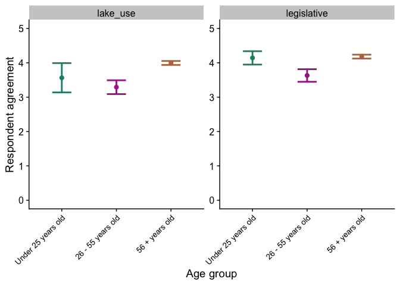<!-- -->

``` r
ggsave(here("plots/age_means_plot.pdf"), width = 6, height = 4)
```

#### Access as a predictor

``` r
# For access, want to extract lake use, development, and amenities vals
# Calculate group-based mean responses
access_means <- dat %>%
  mutate(
    development = rowMeans(
      dplyr::select(., all_of(dev_vars)),
      na.rm = TRUE),
    lake_use = rowMeans(
      dplyr::select(., all_of(lakeuse_vars)),
      na.rm = TRUE),
    amen = rowMeans(
      dplyr::select(., all_of(amen_vars)),
      na.rm = TRUE))
access_plot_df <- access_means %>%
  dplyr::select(Access, development, lake_use, amen) %>%
  pivot_longer(
    cols = c(development, lake_use, amen),
    names_to = "category",
    values_to = "score"
  )
access_plot_summary <- access_plot_df %>%
  group_by(Access, category) %>%
  summarise(
    mean = mean(score, na.rm = TRUE),
    sd = sd(score, na.rm = TRUE),
    n = sum(!is.na(score)),
    se = sd / sqrt(n),
    .groups = "drop"
  )
access_plot_summary$Access <- factor(access_plot_summary$Access, levels = c("Private road", "Public road", "Water"))
```

Build the plot for access:

``` r
access_plot_summary %>% 
  ggplot(aes(x = Access, y = mean, color = Access)) +
  geom_errorbar(aes(ymin = mean - se,
                    ymax = mean + se),
                width = 0.35,
                linewidth = 1) +
  geom_point(size = 2) +
  ylab("Respondent agreement") +
  xlab("Property access type") +
  scale_color_manual(values = c("#f6c34c", "#6b4e20", "#306281")) +
  theme(axis.text.x = element_text(angle = 45, hjust = 1, size = 10),
        legend.position = "none") +
  facet_wrap(~category, scales = "free_y") +
  scale_y_continuous(limits = c(0, 5))
```

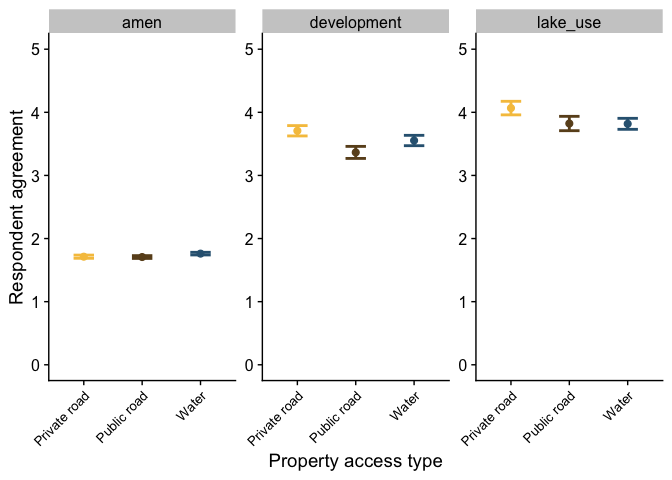<!-- -->

``` r
ggsave(here("plots/access_means_plot.pdf"), width = 9, height = 4)
```

#### Waterbody as a predictor

``` r
# For waterbody, want to extract amenities vals
# Calculate group-based mean responses
waterbody_means <- dat %>%
  mutate(
    amen = rowMeans(
      dplyr::select(., all_of(amen_vars)),
      na.rm = TRUE))
waterbody_plot_df <- waterbody_means %>%
  dplyr::select(Lake, amen) %>%
  pivot_longer(
    cols = c(amen),
    names_to = "category",
    values_to = "score"
  )
waterbody_plot_summary <- waterbody_plot_df %>%
  group_by(Lake, category) %>%
  summarise(
    mean = mean(score, na.rm = TRUE),
    sd = sd(score, na.rm = TRUE),
    n = sum(!is.na(score)),
    se = sd / sqrt(n),
    .groups = "drop"
  )
# waterbody_plot_summary$Lake <- factor(waterbody_plot_summary$Lake, levels = c(TODO))
```

Build the plot for waterbody:

``` r
waterbody_plot_summary %>% 
  filter(Lake %in% c("Big Hawk Lake", "Little Hawk Lake", "Kennisis River", "Halls Lake")) %>% 
  ggplot(aes(x = Lake, y = mean, color = Lake)) +
  geom_errorbar(aes(ymin = mean - se,
                    ymax = mean + se),
                width = 0.35,
                linewidth = 1) +
  geom_point(size = 2) +
  ylab("Respondent agreement") +
  xlab("Waterbody where property is located") +
  scale_color_manual(values = lake_col_full) +
  theme(axis.text.x = element_text(angle = 45, hjust = 1, size = 10),
        legend.position = "none") +
  facet_wrap(~category, scales = "free_y") +
  scale_y_continuous(limits = c(0, 5))
```

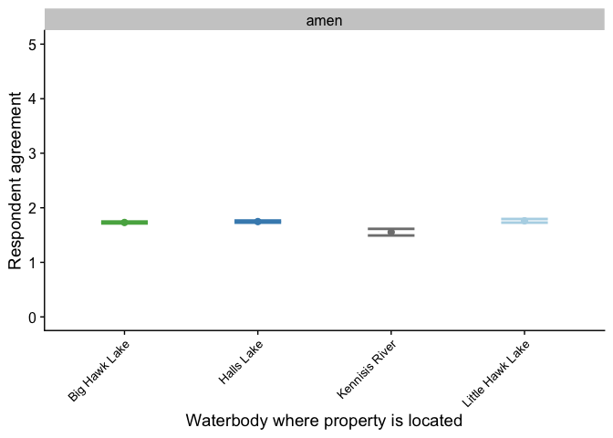<!-- -->

``` r
ggsave(here("plots/waterbody_means_plot.pdf"), width = 3, height = 4)
```

### Build tables

``` r
results <- tibble(
  Response = paste("Response", 1:13),
  F_value = c(6.4713, 5.0354, 1.3434, 4.0149, 4.3188,
              4.4568, 5.2688, 0.9747, 3.349,
              0.9987, 2.2859, 0.2315, 0.6872),
  p_value = c(0.001964, 0.007526, 0.2638, 0.01981,
              0.01483, 0.01301, 0.006041,
              0.3794, 0.03749, 0.3706,
              0.1049, 0.7936, 0.5044)
)

results <- results %>%
  mutate(sig = case_when(
    p_value < 0.001 ~ "***",
    p_value < 0.01  ~ "**",
    p_value < 0.05  ~ "*",
    TRUE ~ "ns"
  ))
results <- results %>%
  arrange(p_value) %>%
  mutate(Response = factor(Response, levels = Response))

tbl <- results %>%
  filter(p_value <= 0.05) %>% 
  gt::gt() %>%
  gtExtras::gt_hulk_col_numeric(p_value, trim = TRUE, reverse = TRUE)
```

## Top 11 issues

Import and process data.

``` r
top_issues <- read_tsv(here("data", "survey_top_issues.txt")) %>% 
  pivot_longer(cols = "Top_11_enviro_issues":"...10", names_to = "tmp", values_to = "answer_code") %>% 
  dplyr::select(-tmp) %>% 
  na.omit() %>% 
  mutate(issue = case_when(answer_code == "1a" ~ "natural_beauty",
                           answer_code == "1b" ~ "natural_shoreline",
                           answer_code == "1c" ~ "unique_habitats",
                           answer_code == "1d" ~ "native_species",
                           answer_code == "1e" ~ "invasive_species",
                           answer_code == "1f" ~ "water_quality",
                           answer_code == "1g" ~ "dark_skies",
                           answer_code == "1h" ~ "causeway",
                           answer_code == "2a" ~ "water_clarity",
                           answer_code == "2b" ~ "bacteria",
                           answer_code == "2c" ~ "algae",
                           answer_code == "2d" ~ "water_levels"))
```

    ## New names:
    ## Rows: 213 Columns: 10
    ## ── Column specification
    ## ──────────────────────────────────────────────────────── Delimiter: "\t" chr
    ## (10): Unique ID, Member, Lake, Time per year, Age, Top_11_enviro_issues,...
    ## ℹ Use `spec()` to retrieve the full column specification for this data. ℹ
    ## Specify the column types or set `show_col_types = FALSE` to quiet this message.
    ## • `` -> `...7`
    ## • `` -> `...8`
    ## • `` -> `...9`
    ## • `` -> `...10`

Top three issues:

``` r
# Overall
top_issues %>% 
  group_by(issue) %>% 
  summarise(n()) %>% 
  top_n(3) %>% 
  arrange(desc(`n()`))
```

    ## Selecting by n()

    ## # A tibble: 3 × 2
    ##   issue          `n()`
    ##   <chr>          <int>
    ## 1 water_quality     90
    ## 2 native_species    76
    ## 3 algae             64

``` r
# By lake/river
top_issues %>% 
  filter(Lake %in% c("Halls Lake", "Little Hawk Lake", "Big Hawk Lake", "Kennisis River")) %>% 
  group_by(Lake, issue) %>% 
  summarise(n()) %>% 
  top_n(3) %>% 
  arrange(desc(`n()`))
```

    ## `summarise()` has regrouped the output.
    ## Selecting by n()
    ## ℹ Summaries were computed grouped by Lake and issue.
    ## ℹ Output is grouped by Lake.
    ## ℹ Use `summarise(.groups = "drop_last")` to silence this message.
    ## ℹ Use `summarise(.by = c(Lake, issue))` for per-operation grouping
    ##   (`?dplyr::dplyr_by`) instead.

    ## # A tibble: 14 × 3
    ## # Groups:   Lake [4]
    ##    Lake             issue          `n()`
    ##    <chr>            <chr>          <int>
    ##  1 Halls Lake       water_quality     33
    ##  2 Big Hawk Lake    water_quality     31
    ##  3 Halls Lake       algae             27
    ##  4 Big Hawk Lake    native_species    26
    ##  5 Halls Lake       native_species    26
    ##  6 Big Hawk Lake    natural_beauty    21
    ##  7 Little Hawk Lake water_quality     18
    ##  8 Little Hawk Lake water_levels      15
    ##  9 Little Hawk Lake algae             14
    ## 10 Little Hawk Lake native_species    14
    ## 11 Kennisis River   native_species    10
    ## 12 Kennisis River   bacteria           9
    ## 13 Kennisis River   natural_beauty     6
    ## 14 Kennisis River   water_quality      6

### Plot data

``` r
top_issues %>% 
  count(issue, sort = TRUE) %>%
  mutate(issue = fct_reorder(issue, desc(n))) %>%
  ggplot(aes(x = issue, y = n)) +
  geom_col(fill = "cornflowerblue") +
  scale_y_continuous(expand = c(0, 0)) +
  theme(axis.text.x = element_text(angle = 45, hjust = 1)) +
  ylab("Number of votes") +
  xlab("Issue")
```

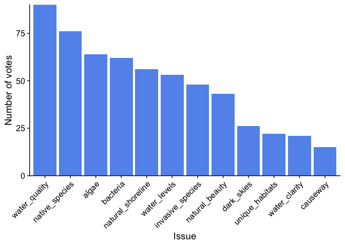<!-- -->

``` r
ggsave(here("plots", "top_issues.pdf"), height = 4, width = 4)
```

Break up results based on the lake:

``` r
top_issues %>% 
  filter(Lake %in% c("Halls Lake", "Little Hawk Lake", "Big Hawk Lake", "Kennisis River")) %>% 
  count(Lake, issue, sort = TRUE) %>%
  mutate(issue = fct_reorder(issue, n, .desc = TRUE)) %>%
  ggplot(aes(x = issue, y = n, fill = Lake)) +
  geom_col() +
  facet_wrap(~Lake, nrow = 2) +
  scale_y_continuous(expand = c(0, 0)) +
  theme(axis.text.x = element_text(angle = 45, hjust = 1)) +
  ylab("Number of votes") +
  xlab("Issue") +
  scale_fill_manual(values = lake_col_full) +
  theme(legend.position = "none")
```

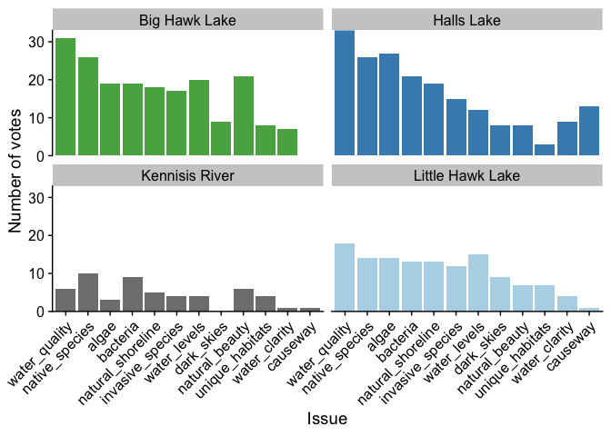<!-- -->

``` r
ggsave(here("plots", "top_issues_bywaterbody.pdf"), height = 8, width = 8)
```

## Residency pie charts

Import data:

``` r
res <- read_tsv(here("data/residency_survey.txt"))
```

    ## Rows: 10 Columns: 5
    ## ── Column specification ────────────────────────────────────────────────────────
    ## Delimiter: "\t"
    ## chr (2): Response, Category
    ## dbl (3): Number, Total, Percentage
    ## 
    ## ℹ Use `spec()` to retrieve the full column specification for this data.
    ## ℹ Specify the column types or set `show_col_types = FALSE` to quiet this message.

``` r
res$Response <- factor(res$Response, 
                          levels = c("7+_mos", "4-6_mos", "2-3_mos", "15-30_d", "1-14d", "0_mos", "Undecided", "No", "Yes", "Already_is"))
```

Build pie charts:

``` r
ggplot(res %>% filter(Category == "Residence_timing"), 
       aes(x = "", y = Percentage, fill = Response)) +
  geom_bar(stat = "identity", width = 1) +
  coord_polar("y", start = 0) +
  # scale_fill_manual(values = MVZ_palette("LifeHistories")) +
  scale_fill_manual(values = MVZ_palette("WesternBirds")) +
  # scale_fill_manual(values = data_cols) +
  theme(axis.title = element_blank(),
        axis.line = element_blank(),
        axis.text = element_blank(),
        axis.ticks = element_blank(),
        legend.position = "bottom")
```

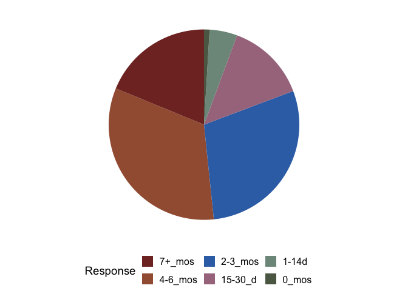<!-- -->

``` r
ggsave(here("plots/residence_timing.pdf"), width = 4.75, height = 5)

ggplot(res %>% filter(Category == "Future_residence"), 
       aes(x = "", y = Percentage, fill = Response)) +
  geom_bar(stat = "identity", width = 1) +
  coord_polar("y", start = 0) +
  # scale_fill_manual(values = MVZ_palette("LifeHistories")) +
  scale_fill_manual(values = MVZ_palette("WesternBirds")) +
  # scale_fill_manual(values = data_cols) +
  theme(axis.title = element_blank(),
        axis.line = element_blank(),
        axis.text = element_blank(),
        axis.ticks = element_blank(),
        legend.position = "bottom")
```

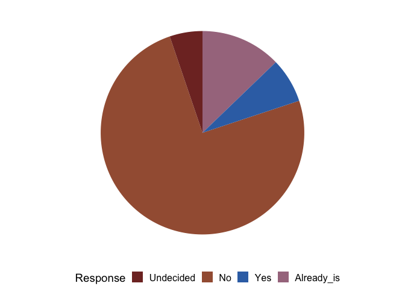<!-- -->

``` r
ggsave(here("plots/fulltime_residence.pdf"), width = 4.75, height = 5)
```
