Lake Trends
================

- [Ice out dates](#ice-out-dates)
- [Lake Health](#lake-health)
  - [Water transparency / clarity](#water-transparency--clarity)
  - [Water quality](#water-quality)
  - [Benthic monitoring](#benthic-monitoring)
  - [Algal growth](#algal-growth)
- [Lake levels](#lake-levels)
  - [Lake levels](#lake-levels-1)
  - [Fluctuations](#fluctuations)
- [Map of Ontario](#map-of-ontario)

## Ice out dates

``` r
# Import data
ice <- read_tsv(here("data", "ice_out.txt"))
```

    ## Rows: 57 Columns: 5
    ## ── Column specification ────────────────────────────────────────────────────────
    ## Delimiter: "\t"
    ## chr (2): Date, YMD
    ## dbl (3): Year, Month, Day
    ## 
    ## ℹ Use `spec()` to retrieve the full column specification for this data.
    ## ℹ Specify the column types or set `show_col_types = FALSE` to quiet this message.

``` r
lake_cols <- lake_colors()

# Adjust dates for plotting
ice$YMD <- lubridate::ymd(ice$YMD)
ice$doy <- yday(ice$YMD)
```

Build plot:

``` r
p_ice <- ice %>% 
  group_by(Year, Month) %>% 
  ggplot(aes(x = Year, y = doy, group = 1)) +
  # geom_point(size = 3, color = lake_cols[["bighawk"]]) +
  # geom_line(linewidth = 1, color = lake_cols[["bighawk"]]) +
  geom_point(size = 2, color = "#b4d6e7") +
  geom_line(linewidth = 1, color = "#b4d6e7") +
  geom_smooth(method = 'lm', se = F, color = "#186484") +
  # ylab("Day of the year") +
  ylab("Ice out date") +
  scale_x_continuous(breaks = scales::breaks_width(5)) +
  # ggtitle("Ice-out dates for Big Hawk Lake (1968-2025)") +
  theme(axis.text.x = element_text(angle = 45, hjust = 1, size = 10),
        axis.text.y = element_text(size = 10),
        axis.title = element_text(size = 12))

# Save plot in "plots" directory
ggsave(here("plots", "ice_out.pdf"), width = 3.5, height = 2.5)
```

    ## `geom_smooth()` using formula = 'y ~ x'

``` r
# For AGM pres
ice %>% 
  group_by(Year, Month) %>% 
  ggplot(aes(x = Year, y = doy, group = 1)) +
  geom_point(size = 4, color = "#b4d6e7") +
  geom_line(linewidth = 2, color = "#b4d6e7") +
  geom_smooth(method = 'lm', se = F, color = "#186484") +
  ylab("Ice out date") +
  scale_x_continuous(breaks = scales::breaks_width(5)) +
  ggtitle("Ice-out dates for Big Hawk Lake (1968-2025)") +
  theme(axis.text.x = element_text(angle = 45, hjust = 1, size = 12),
        axis.text.y = element_text(size = 12),
        axis.title = element_text(size = 14),
        plot.title = element_text(size = 16)) +
    geom_point(data = ice %>% filter(Year == 2012 | Year == 1992), 
             aes(x = Year, y = doy), size = 4, pch = 21, color = "black")
```

    ## `geom_smooth()` using formula = 'y ~ x'

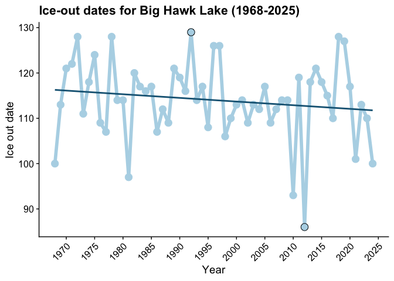<!-- -->

``` r
ggsave(here("plots", "ice_out_pres.pdf"), width = 8, height = 5.5)
```

    ## `geom_smooth()` using formula = 'y ~ x'

Find earliest and latest ice-out dates:

``` r
ice %>% filter(doy == min(doy)) # earliest was on March 26, 2012
```

    ## # A tibble: 1 × 6
    ##    Year Month   Day Date   YMD          doy
    ##   <dbl> <dbl> <dbl> <chr>  <date>     <dbl>
    ## 1  2012     3    26 Mar-26 2012-03-26    86

``` r
ice %>% filter(doy == max(doy)) # latest was on May 8, 1992
```

    ## # A tibble: 1 × 6
    ##    Year Month   Day Date   YMD          doy
    ##   <dbl> <dbl> <dbl> <chr>  <date>     <dbl>
    ## 1  1992     5     8 May-08 1992-05-08   129

Run stats on data:

``` r
lm(doy ~ Year, data = ice) %>% summary() # coefficient -0.08063 (for every 1 year change, the number of days earlier ice-out is happening)
```

    ## 
    ## Call:
    ## lm(formula = doy ~ Year, data = ice)
    ## 
    ## Residuals:
    ##     Min      1Q  Median      3Q     Max 
    ## -26.727  -4.211   0.950   4.918  15.756 
    ## 
    ## Coefficients:
    ##              Estimate Std. Error t value Pr(>|t|)  
    ## (Intercept) 274.96025  138.99748   1.978   0.0529 .
    ## Year         -0.08063    0.06964  -1.158   0.2519  
    ## ---
    ## Signif. codes:  0 '***' 0.001 '**' 0.01 '*' 0.05 '.' 0.1 ' ' 1
    ## 
    ## Residual standard error: 8.649 on 55 degrees of freedom
    ## Multiple R-squared:  0.0238, Adjusted R-squared:  0.006049 
    ## F-statistic: 1.341 on 1 and 55 DF,  p-value: 0.2519

``` r
# -0.08063*10 # every 10 years, ice out happening almost a year earlier
```

## Lake Health

These have been concatenated from various reports over the years, but
most are available on the HHPLOA website
[here](https://hallshawklakes.ca/environment/).

Trends both across entire system and within respective water
bodies/river (e.g., is there a difference between Halls Lake and Big
Hawk?)

### Water transparency / clarity

Data obtained were obtained through the Lake Partner Program and are
publicly available
[here](https://data.ontario.ca/dataset/ontario-lake-partner/resource/3cd1cd13-5d7e-4bbb-b4c0-7d03508b41de).

``` r
# Import the data
secchi_dat <- read_csv(here("data", "LPP_Secchi_2022.csv")) %>% 
  rename("Date" = `Date (DD-MMM-YY)`)
```

    ## Rows: 106226 Columns: 9
    ## ── Column specification ────────────────────────────────────────────────────────
    ## Delimiter: ","
    ## chr (4): Lake Name, TOWNSHIP, Site Description, Date (DD-MMM-YY)
    ## dbl (5): STN, Site ID, Latitude (DMS), Longitude (DMS), Secchi Depth (m)
    ## 
    ## ℹ Use `spec()` to retrieve the full column specification for this data.
    ## ℹ Specify the column types or set `show_col_types = FALSE` to quiet this message.

``` r
secchi_dat$Date <- lubridate::dmy(secchi_dat$Date)
secchi_dat <- secchi_dat %>% mutate("Year" = year(Date))

secchi_dat %>% 
  filter(TOWNSHIP %in% townships) %>% 
  # count(`Lake Name`) # 40 lakes in township
  filter(!`Lake Name` %in% lake_names) %>% 
  summarize(mean(`Secchi Depth (m)`)) # 4.85m (if including ours) or 4.62m if not including ours
```

    ## # A tibble: 1 × 1
    ##   `mean(\`Secchi Depth (m)\`)`
    ##                          <dbl>
    ## 1                         4.62

Look at data for only our three lakes:

``` r
secchi <- secchi_dat %>% 
  filter(TOWNSHIP == "STANHOPE") %>% 
  filter(`Lake Name` %in% lake_names)

secchi %>% summarize(mean(`Secchi Depth (m)`)) # 6.79m
```

    ## # A tibble: 1 × 1
    ##   `mean(\`Secchi Depth (m)\`)`
    ##                          <dbl>
    ## 1                         6.79

``` r
p_secchi <-
  secchi %>% 
  ggplot(aes(x = Year, y = `Secchi Depth (m)`)) +
  geom_boxplot(aes(color = `Lake Name`, group = Year)) +
  geom_smooth(method = "lm", se = FALSE, color = "grey45", aes(group = 1)) +
  facet_wrap(~`Lake Name`, labeller = labs, scales = "free") +
  scale_color_manual(values = lake_cols_raw) +
  theme(legend.position = "none",
        strip.text = element_text(size = 16),
        strip.background = element_blank()) +
  scale_x_continuous(breaks = scales::breaks_width(5)) +
  scale_y_continuous(limits = c(0, 11), breaks = 0:11) +
  ggtitle("Water transparency (1991-2022)") +
  ylab("Secchi depth (m)")

# Save plot in "plots" directory
p_secchi
```

    ## `geom_smooth()` using formula = 'y ~ x'

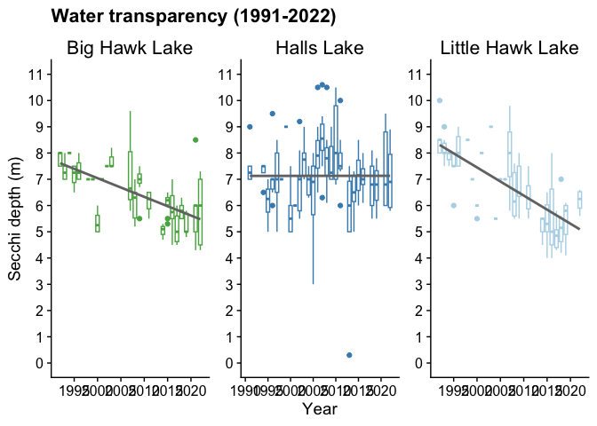<!-- -->

``` r
ggsave(here("plots", "secchi_hhl.pdf"), width = 12, height = 6)
```

    ## `geom_smooth()` using formula = 'y ~ x'

Compare to two other monitored lakes in our township that have the most
data:

``` r
secchi_other <- read_csv(here("data", "LPP_Secchi_2022.csv")) %>% 
  # filter(TOWNSHIP == "STANHOPE") %>% 
  filter(!`Lake Name` %in% lake_names) %>% 
  rename("Date" = `Date (DD-MMM-YY)`)
```

    ## Rows: 106226 Columns: 9
    ## ── Column specification ────────────────────────────────────────────────────────
    ## Delimiter: ","
    ## chr (4): Lake Name, TOWNSHIP, Site Description, Date (DD-MMM-YY)
    ## dbl (5): STN, Site ID, Latitude (DMS), Longitude (DMS), Secchi Depth (m)
    ## 
    ## ℹ Use `spec()` to retrieve the full column specification for this data.
    ## ℹ Specify the column types or set `show_col_types = FALSE` to quiet this message.

``` r
secchi_other$Date <- lubridate::dmy(secchi_other$Date)
secchi_other <- secchi_other %>% mutate("Year" = year(Date))

# Plot raw data
p_secchi_other <-
  secchi_other %>% 
  # Remove outlier point
  filter(`Secchi Depth (m)` < 15) %>% 
  filter(`Lake Name` == "KENNISIS LAKE" | `Lake Name` == "KUSHOG LAKE") %>% 
  ggplot(aes(x = Year, y = `Secchi Depth (m)`)) +
  # geom_point(aes(color = `Lake Name`)) +
  geom_boxplot(aes(color = `Lake Name`, group = Year)) +
  geom_smooth(method = "lm", se = FALSE, color = "grey45", aes(group = 1)) +
  facet_wrap(~`Lake Name`, labeller = as_labeller(c("KENNISIS LAKE" = "Kennisis Lake", 
                                                    "KUSHOG LAKE" = "Kushog Lake")), 
             scales = "free") +
  scale_color_manual(values = c("KUSHOG LAKE" = data_cols_warms[[2]], 
                                "KENNISIS LAKE" = data_cols_warms[[3]])) +
  theme(legend.position = "none",
        strip.text = element_text(size = 16),
        strip.background = element_blank(),
        axis.title.y = element_blank()) +
  scale_x_continuous(breaks = scales::breaks_width(5)) +
  scale_y_continuous(limits = c(0, 11), breaks = 0:11)

plot_grid(p_secchi + theme(axis.text.x = element_text(angle = 45, hjust = 1)), 
          p_secchi_other + theme(axis.text.x = element_text(angle = 45, hjust = 1)), 
          align = "h", axis = "t", nrow = 1, rel_widths = c(3, 2))
```

    ## `geom_smooth()` using formula = 'y ~ x'
    ## `geom_smooth()` using formula = 'y ~ x'

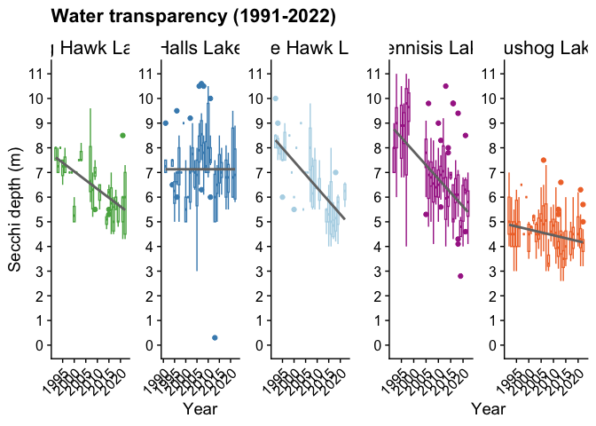<!-- -->

``` r
ggsave(here("plots", "secchi_all.pdf"), width = 14, height = 6)
```

Run stats.

``` r
# Linear model for data points
lm(`Secchi Depth (m)` ~ Year, data = secchi %>% filter(`Lake Name` == "BIG HAWK LAKE")) %>% summary()
```

    ## 
    ## Call:
    ## lm(formula = `Secchi Depth (m)` ~ Year, data = secchi %>% filter(`Lake Name` == 
    ##     "BIG HAWK LAKE"))
    ## 
    ## Residuals:
    ##      Min       1Q   Median       3Q      Max 
    ## -2.04176 -0.54366  0.01023  0.46014  3.05634 
    ## 
    ## Coefficients:
    ##               Estimate Std. Error t value Pr(>|t|)    
    ## (Intercept) 149.356628  18.639772   8.013 1.23e-12 ***
    ## Year         -0.071157   0.009282  -7.667 7.23e-12 ***
    ## ---
    ## Signif. codes:  0 '***' 0.001 '**' 0.01 '*' 0.05 '.' 0.1 ' ' 1
    ## 
    ## Residual standard error: 0.9008 on 111 degrees of freedom
    ## Multiple R-squared:  0.3462, Adjusted R-squared:  0.3403 
    ## F-statistic: 58.78 on 1 and 111 DF,  p-value: 7.226e-12

``` r
lm(`Secchi Depth (m)` ~ Year, data = secchi %>% filter(`Lake Name` == "LITTLE HAWK LAKE")) %>% summary()
```

    ## 
    ## Call:
    ## lm(formula = `Secchi Depth (m)` ~ Year, data = secchi %>% filter(`Lake Name` == 
    ##     "LITTLE HAWK LAKE"))
    ## 
    ## Residuals:
    ##      Min       1Q   Median       3Q      Max 
    ## -1.98652 -0.77146 -0.09371  0.65730  3.09977 
    ## 
    ## Coefficients:
    ##              Estimate Std. Error t value Pr(>|t|)    
    ## (Intercept) 221.83201   22.98476   9.651 2.28e-16 ***
    ## Year         -0.10719    0.01145  -9.363 1.05e-15 ***
    ## ---
    ## Signif. codes:  0 '***' 0.001 '**' 0.01 '*' 0.05 '.' 0.1 ' ' 1
    ## 
    ## Residual standard error: 1.077 on 111 degrees of freedom
    ## Multiple R-squared:  0.4413, Adjusted R-squared:  0.4363 
    ## F-statistic: 87.67 on 1 and 111 DF,  p-value: 1.047e-15

``` r
lm(`Secchi Depth (m)` ~ Year, data = secchi %>% filter(`Lake Name` == "HALLS LAKE")) %>% summary()
```

    ## 
    ## Call:
    ## lm(formula = `Secchi Depth (m)` ~ Year, data = secchi %>% filter(`Lake Name` == 
    ##     "HALLS LAKE"))
    ## 
    ## Residuals:
    ##     Min      1Q  Median      3Q     Max 
    ## -6.8313 -0.8301 -0.1290  0.6695  3.4695 
    ## 
    ## Coefficients:
    ##              Estimate Std. Error t value Pr(>|t|)
    ## (Intercept) 6.863e+00  2.643e+01    0.26    0.795
    ## Year        1.333e-04  1.317e-02    0.01    0.992
    ## 
    ## Residual standard error: 1.378 on 162 degrees of freedom
    ## Multiple R-squared:  6.322e-07,  Adjusted R-squared:  -0.006172 
    ## F-statistic: 0.0001024 on 1 and 162 DF,  p-value: 0.9919

``` r
# lm(`Secchi Depth (m)` ~ Year, data = secchi_dat %>% filter(`Lake Name` == "BOSHKUNG LAKE")) %>% summary()
lm(`Secchi Depth (m)` ~ Year, data = secchi_dat %>% filter(`Lake Name` == "KENNISIS LAKE")) %>% summary()
```

    ## 
    ## Call:
    ## lm(formula = `Secchi Depth (m)` ~ Year, data = secchi_dat %>% 
    ##     filter(`Lake Name` == "KENNISIS LAKE"))
    ## 
    ## Residuals:
    ##     Min      1Q  Median      3Q     Max 
    ## -4.1900 -0.7490 -0.0612  0.7091  4.0974 
    ## 
    ## Coefficients:
    ##               Estimate Std. Error t value Pr(>|t|)    
    ## (Intercept) 231.274850  15.462886   14.96   <2e-16 ***
    ## Year         -0.111710   0.007701  -14.51   <2e-16 ***
    ## ---
    ## Signif. codes:  0 '***' 0.001 '**' 0.01 '*' 0.05 '.' 0.1 ' ' 1
    ## 
    ## Residual standard error: 1.219 on 293 degrees of freedom
    ## Multiple R-squared:  0.418,  Adjusted R-squared:  0.416 
    ## F-statistic: 210.4 on 1 and 293 DF,  p-value: < 2.2e-16

``` r
lm(`Secchi Depth (m)` ~ Year, data = secchi_dat %>% filter(`Lake Name` == "KUSHOG LAKE")) %>% summary()
```

    ## 
    ## Call:
    ## lm(formula = `Secchi Depth (m)` ~ Year, data = secchi_dat %>% 
    ##     filter(`Lake Name` == "KUSHOG LAKE"))
    ## 
    ## Residuals:
    ##     Min      1Q  Median      3Q     Max 
    ## -1.8339 -0.6826  0.0224  0.5015  2.9511 
    ## 
    ## Coefficients:
    ##             Estimate Std. Error t value Pr(>|t|)    
    ## (Intercept) 52.19545    9.07926   5.749 1.69e-08 ***
    ## Year        -0.02375    0.00452  -5.254 2.33e-07 ***
    ## ---
    ## Signif. codes:  0 '***' 0.001 '**' 0.01 '*' 0.05 '.' 0.1 ' ' 1
    ## 
    ## Residual standard error: 0.823 on 436 degrees of freedom
    ## Multiple R-squared:  0.05955,    Adjusted R-squared:  0.0574 
    ## F-statistic: 27.61 on 1 and 436 DF,  p-value: 2.327e-07

Calculate average clarity in each lake for each year.

``` r
sum <- secchi %>% 
  # filter(`Lake Name` == "HALLS LAKE") %>% 
  group_by(Year) %>% 
  summarize(mean_per_year = mean(`Secchi Depth (m)`))

# Average decline in clarity across all three lakes
secchi %>% 
  filter(`Lake Name` == "HALLS LAKE") %>% 
  filter(Year == 1991 | Year == 2022) %>% 
  group_by(Year) %>% 
  summarize(mean_per_year = mean(`Secchi Depth (m)`))
```

    ## # A tibble: 2 × 2
    ##    Year mean_per_year
    ##   <dbl>         <dbl>
    ## 1  1991          7.5 
    ## 2  2022          7.07

### Water quality

There are three metrics of water quality: total phosphorus, calcium, and
dissolved oxygen.

Phosphorus data were obtained through the Lake Partner Program and are
publicly available
[here](https://data.ontario.ca/dataset/ontario-lake-partner/resource/1a36234b-3b97-451c-8965-0050e7f283cf).

#### Phosphorus

``` r
# Import data
phos_dat <- read_csv(here("data", "LPP_Total_Phosphorus_2022.csv")) %>% 
    rename("Date" = `Date (DD-MMM-YY)`)
```

    ## Rows: 39807 Columns: 13
    ## ── Column specification ────────────────────────────────────────────────────────
    ## Delimiter: ","
    ## chr (6): Lake Name, Township, Site Description, Date (DD-MMM-YY), Data Colle...
    ## dbl (7): STN, Site ID, Latitude (DMS), Long (DMS), Total Phosphorus sample 1...
    ## 
    ## ℹ Use `spec()` to retrieve the full column specification for this data.
    ## ℹ Specify the column types or set `show_col_types = FALSE` to quiet this message.

``` r
phos_dat$Date <- lubridate::dmy(phos_dat$Date)
phos_dat <- phos_dat %>% mutate("Year" = year(Date))
phos_dat %>% 
  filter(Township %in% townships) %>% 
  # filter(!`Lake Name` %in% lake_names) %>% 
  summarize(mean(`Average Total Phosphorus (µg/L)`)) # 6.43 (if including ours) or 6.52 if not including ours
```

    ## # A tibble: 1 × 1
    ##   `mean(\`Average Total Phosphorus (µg/L)\`)`
    ##                                         <dbl>
    ## 1                                        6.43

``` r
phos <- phos_dat %>% 
  filter(`Lake Name` %in% lake_names)
# Mean per lake across all years
phos %>% summarize(mean(`Average Total Phosphorus (µg/L)`)) # 5.61
```

    ## # A tibble: 1 × 1
    ##   `mean(\`Average Total Phosphorus (µg/L)\`)`
    ##                                         <dbl>
    ## 1                                        5.61

``` r
# Compare to six other monitored lakes in Stanhope township:
phos_other <- phos_dat %>% 
  filter(Township == "STANHOPE") %>% 
  filter(!`Lake Name` %in% lake_names)
```

Build plots:

``` r
p_phos <-
  phos %>% 
  # Remove outliers (e.g., Big Hawk Lake in 2004)
  filter(`Possible outlier` == "No") %>% 
  ggplot(aes(x = Year, y = `Average Total Phosphorus (µg/L)`)) +
  geom_point(aes(color = `Lake Name`, group = Year), size = 3) +
  # geom_boxplot(aes(color = `Lake Name`, group = Year)) +
  geom_smooth(method = "lm", se = FALSE, color = "grey45", aes(group = 1)) +
  facet_wrap(~`Lake Name`, labeller = labs, scales = "free") +
  scale_color_manual(values = lake_cols_raw) +
  theme(legend.position = "none",
        strip.text = element_text(size = 16),
        strip.background = element_blank(),
        axis.title.x = element_blank()) +
  scale_x_continuous(breaks = scales::breaks_width(5)) +
  scale_y_continuous(limits = c(0, 10), breaks = 0:10) +
  ggtitle("Phosphorus levels (2002-2022)") +
  ylab("Total phosphorus (µg/L)") +
  geom_hline(yintercept = 10, color = "darkred", linetype = "dashed")

p_phos
```

    ## `geom_smooth()` using formula = 'y ~ x'

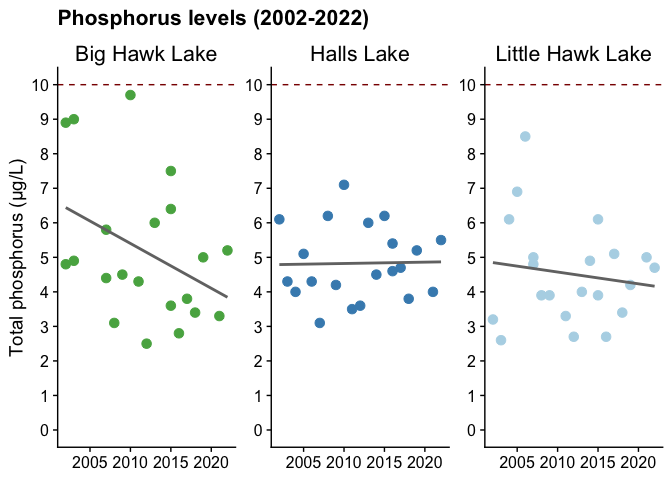<!-- -->

``` r
ggsave(here("plots", "phos_hhl.pdf"), width = 12, height = 6)
```

    ## `geom_smooth()` using formula = 'y ~ x'

``` r
# Plot Kushog and Kennisis Lakes as a comparison
p_phos_kk <-
  phos_dat %>% 
  filter(`Possible outlier` == "No") %>% 
  filter(`Lake Name` == "KUSHOG LAKE" | `Lake Name` == "KENNISIS LAKE") %>% 
  ggplot(aes(x = Year, y = `Average Total Phosphorus (µg/L)`)) +
  geom_point(aes(color = `Lake Name`, group = Year), size = 3) +
  # geom_boxplot(aes(color = `Lake Name`, group = Year)) +
  geom_smooth(method = "lm", se = FALSE, color = "grey45", aes(group = 1)) +
  facet_wrap(~`Lake Name`, labeller = as_labeller(c("KENNISIS LAKE" = "Kennisis Lake", 
                                                    "KUSHOG LAKE" = "Kushog Lake")), 
             scales = "free") +
  scale_color_manual(values = c("KUSHOG LAKE" = "#f07434", "KENNISIS LAKE" = "#a82c94")) +
  theme(legend.position = "none",
        strip.text = element_text(size = 16),
        strip.background = element_blank(),
        axis.title = element_blank()) +
  scale_x_continuous(breaks = scales::breaks_width(5)) +
  scale_y_continuous(limits = c(0, 12), breaks = 0:12) +
  ylab("Total phosphorus (µg/L)") +
  geom_hline(yintercept = 10, color = "darkred", linetype = "dashed")
  
p_tp <- plot_grid(p_phos, p_phos_kk, align = "h", axis = "t", nrow = 1, rel_widths = c(3, 2))
```

    ## `geom_smooth()` using formula = 'y ~ x'
    ## `geom_smooth()` using formula = 'y ~ x'

``` r
# Add common x axis to plot
x.grob <- textGrob("Year", gp = gpar(col = "black", fontsize = 16))
grid.arrange(arrangeGrob(p_tp, bottom = x.grob))
```

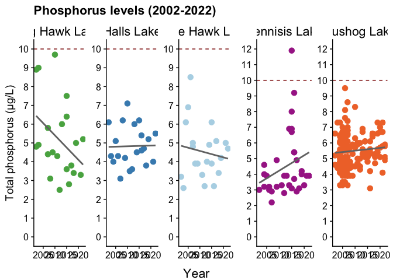<!-- -->

``` r
# Save plot
ggsave(here("plots", "phos_all.pdf"), width = 14, height = 6)
```

Plot only a single other lake:

``` r
# Plot only one other lake as a comparison (Kushog below)
phos_dat %>% 
  filter(`Possible outlier` == "No") %>% 
  filter(`Lake Name` == "KUSHOG LAKE") %>% 
  ggplot(aes(x = Year, y = `Average Total Phosphorus (µg/L)`, group = `Lake Name`)) +
  geom_point(color = "#f07434", size = 3) +
  geom_smooth(method = "lm", se = FALSE, color = "grey45") +
  # geom_boxplot(aes(color = `Lake Name`, group = Year)) +
  scale_y_continuous(limits = c(0, 10), breaks = 0:10) +
  guides(color = guide_legend(position = "inside")) +
  theme(legend.position = "none",
        plot.title = element_text(face = "plain", size = 16, hjust = 0.5),
        axis.title.x = element_blank()) +
  ggtitle("Kushog Lake") +
  geom_hline(yintercept = 10, color = "darkred", linetype = "dashed")
```

    ## `geom_smooth()` using formula = 'y ~ x'

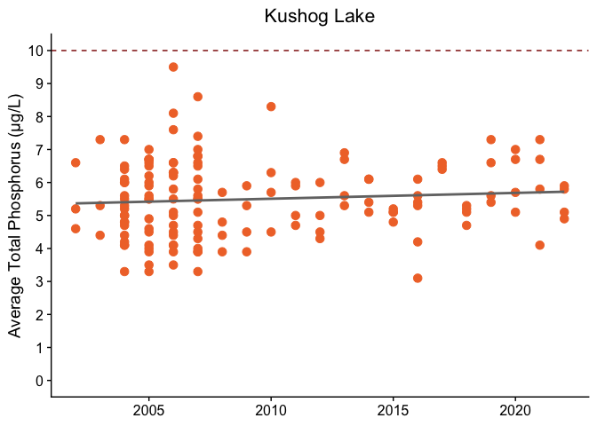<!-- -->

Plot averages per site on each lake (other than our three):

``` r
# Plot summary data, average per site on each lake
phos_other %>%
  filter(`Possible outlier` == "No") %>%
  group_by(`Lake Name`, Year) %>%
  summarize(mean_phos = mean(`Average Total Phosphorus (µg/L)`)) %>%
  ggplot(aes(x = Year, y = mean_phos, group = `Lake Name`)) +
  geom_point(aes(color = `Lake Name`)) +
  geom_line(aes(color = `Lake Name`)) +
  scale_y_continuous(limits = c(0, 11), breaks = 0:11) +
  scale_color_manual(values = data_cols)
```

    ## `summarise()` has grouped output by 'Lake Name'. You can override using the
    ## `.groups` argument.

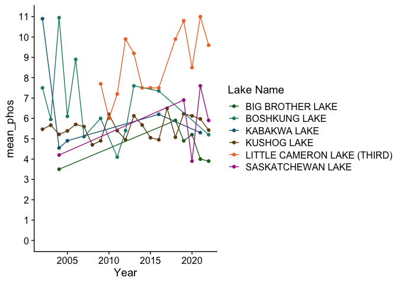<!-- -->

Run stats:

``` r
lm(`Average Total Phosphorus (µg/L)` ~ Year, data = phos %>% 
  filter(`Lake Name` == "BIG HAWK LAKE")) %>%
  summary()
```

    ## 
    ## Call:
    ## lm(formula = `Average Total Phosphorus (µg/L)` ~ Year, data = phos %>% 
    ##     filter(`Lake Name` == "BIG HAWK LAKE"))
    ## 
    ## Residuals:
    ##    Min     1Q Median     3Q    Max 
    ## -5.872 -3.088 -1.213  1.088 24.028 
    ## 
    ## Coefficients:
    ##             Estimate Std. Error t value Pr(>|t|)  
    ## (Intercept) 778.2938   424.0857   1.835   0.0800 .
    ## Year         -0.3834     0.2108  -1.819   0.0826 .
    ## ---
    ## Signif. codes:  0 '***' 0.001 '**' 0.01 '*' 0.05 '.' 0.1 ' ' 1
    ## 
    ## Residual standard error: 6.268 on 22 degrees of freedom
    ## Multiple R-squared:  0.1307, Adjusted R-squared:  0.09118 
    ## F-statistic: 3.308 on 1 and 22 DF,  p-value: 0.0826

``` r
lm(`Average Total Phosphorus (µg/L)` ~ Year, data = phos %>% 
  filter(`Lake Name` == "LITTLE HAWK LAKE")) %>%
  summary()
```

    ## 
    ## Call:
    ## lm(formula = `Average Total Phosphorus (µg/L)` ~ Year, data = phos %>% 
    ##     filter(`Lake Name` == "LITTLE HAWK LAKE"))
    ## 
    ## Residuals:
    ##     Min      1Q  Median      3Q     Max 
    ## -2.5810 -1.1443 -0.2263  0.7363  4.6830 
    ## 
    ## Coefficients:
    ##              Estimate Std. Error t value Pr(>|t|)
    ## (Intercept)  82.62918  130.40131   0.634    0.533
    ## Year         -0.03867    0.06483  -0.596    0.557
    ## 
    ## Residual standard error: 1.854 on 21 degrees of freedom
    ## Multiple R-squared:  0.01666,    Adjusted R-squared:  -0.03017 
    ## F-statistic: 0.3557 on 1 and 21 DF,  p-value: 0.5573

``` r
lm(`Average Total Phosphorus (µg/L)` ~ Year, data = phos %>% 
  filter(`Lake Name` == "HALLS LAKE")) %>%
  summary()
```

    ## 
    ## Call:
    ## lm(formula = `Average Total Phosphorus (µg/L)` ~ Year, data = phos %>% 
    ##     filter(`Lake Name` == "HALLS LAKE"))
    ## 
    ## Residuals:
    ##     Min      1Q  Median      3Q     Max 
    ## -1.7098 -0.7981 -0.2449  0.6317  2.2785 
    ## 
    ## Coefficients:
    ##              Estimate Std. Error t value Pr(>|t|)
    ## (Intercept) -3.021550  81.902861  -0.037    0.971
    ## Year         0.003902   0.040711   0.096    0.925
    ## 
    ## Residual standard error: 1.093 on 19 degrees of freedom
    ## Multiple R-squared:  0.0004833,  Adjusted R-squared:  -0.05212 
    ## F-statistic: 0.009187 on 1 and 19 DF,  p-value: 0.9246

``` r
lm(`Average Total Phosphorus (µg/L)` ~ Year, data = phos_dat %>% 
  filter(`Lake Name` == "KENNISIS LAKE")) %>%
  summary()
```

    ## 
    ## Call:
    ## lm(formula = `Average Total Phosphorus (µg/L)` ~ Year, data = phos_dat %>% 
    ##     filter(`Lake Name` == "KENNISIS LAKE"))
    ## 
    ## Residuals:
    ##     Min      1Q  Median      3Q     Max 
    ## -3.5044 -2.3562 -1.0363  0.8476 19.8580 
    ## 
    ## Coefficients:
    ##              Estimate Std. Error t value Pr(>|t|)
    ## (Intercept) -378.1640   257.8058  -1.467    0.151
    ## Year           0.1906     0.1281   1.488    0.145
    ## 
    ## Residual standard error: 4.128 on 36 degrees of freedom
    ## Multiple R-squared:  0.05794,    Adjusted R-squared:  0.03177 
    ## F-statistic: 2.214 on 1 and 36 DF,  p-value: 0.1455

``` r
lm(`Average Total Phosphorus (µg/L)` ~ Year, data = phos_dat %>% 
  filter(`Lake Name` == "KUSHOG LAKE")) %>%
  summary()
```

    ## 
    ## Call:
    ## lm(formula = `Average Total Phosphorus (µg/L)` ~ Year, data = phos_dat %>% 
    ##     filter(`Lake Name` == "KUSHOG LAKE"))
    ## 
    ## Residuals:
    ##     Min      1Q  Median      3Q     Max 
    ## -2.5536 -0.8359 -0.0649  0.8337  4.0598 
    ## 
    ## Coefficients:
    ##              Estimate Std. Error t value Pr(>|t|)
    ## (Intercept) -37.36433   33.90346  -1.102    0.272
    ## Year          0.02134    0.01687   1.265    0.208
    ## 
    ## Residual standard error: 1.156 on 146 degrees of freedom
    ## Multiple R-squared:  0.01084,    Adjusted R-squared:  0.004061 
    ## F-statistic: 1.599 on 1 and 146 DF,  p-value: 0.208

Do highest values tend to be in particular spots around the lake?

``` r
p_sep_bhawk <-
  phos %>% 
  filter(`Lake Name` == "BIG HAWK LAKE") %>% 
  filter(`Possible outlier` == "No") %>% 
  ggplot(aes(x = Year, y = `Average Total Phosphorus (µg/L)`)) +
  geom_point(aes(color = `Site Description`), size = 3) +
  geom_smooth(method = "lm", se = FALSE, color = "grey45") +
  # scale_y_continuous(limits = c(0, 18), breaks = 0:18) +
  theme(plot.title = element_text(face = "plain", size = 16, hjust = 0.5),
        legend.position.inside = c(0.4, 0.85)) +
  ggtitle("Big Hawk Lake") +
  guides(color = guide_legend(position = "inside")) +
  geom_hline(yintercept = 10, color = "darkred", linetype = "dashed")

p_sep_lhawk <-
  phos %>% 
  filter(`Lake Name` == "LITTLE HAWK LAKE") %>% 
  filter(`Possible outlier` == "No") %>% 
  ggplot(aes(x = Year, y = `Average Total Phosphorus (µg/L)`)) +
  geom_point(aes(color = `Site Description`), size = 3) +
  geom_smooth(method = "lm", se = FALSE, color = "grey45") +
  # scale_y_continuous(limits = c(0, 18), breaks = 0:18) +
  theme(plot.title = element_text(face = "plain", size = 16, hjust = 0.5),
        legend.position.inside = c(0.4, 0.85)) +
  ggtitle("Little Hawk Lake") +
  guides(color = guide_legend(position = "inside")) +
  geom_hline(yintercept = 10, color = "darkred", linetype = "dashed")

p_sep_halls <-
  phos %>% 
  filter(`Lake Name` == "HALLS LAKE") %>% 
  filter(`Possible outlier` == "No") %>% 
  ggplot(aes(x = Year, y = `Average Total Phosphorus (µg/L)`)) +
  geom_point(aes(color = `Site Description`), size = 3) +
  geom_smooth(method = "lm", se = FALSE, color = "grey45") +
  # scale_y_continuous(limits = c(0, 18), breaks = 0:18) +
  theme(plot.title = element_text(face = "plain", size = 16, hjust = 0.5),
        legend.position.inside = c(0.4, 0.85)) +
  ggtitle("Halls Lake") +
  guides(color = guide_legend(position = "inside")) +
  geom_hline(yintercept = 10, color = "darkred", linetype = "dashed")

plot_grid(p_sep_bhawk, p_sep_lhawk, p_sep_halls, nrow = 1)
```

    ## `geom_smooth()` using formula = 'y ~ x'
    ## `geom_smooth()` using formula = 'y ~ x'
    ## `geom_smooth()` using formula = 'y ~ x'

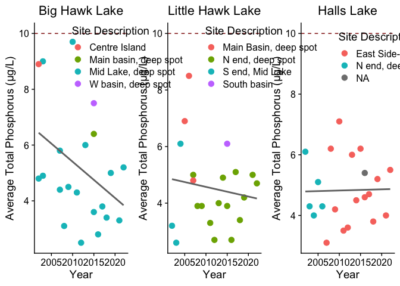<!-- -->

#### Calcium

``` r
# Import data
calc_dat <- read_csv(here("data", "LPP_Calcium_2022.csv")) %>% 
    rename("Date" = `Date (DD-MMM-YY)`)
```

    ## Rows: 15629 Columns: 9
    ## ── Column specification ────────────────────────────────────────────────────────
    ## Delimiter: ","
    ## chr (4): Lake Name, Township, Site Description, Date (DD-MMM-YY)
    ## dbl (5): STN, Site ID, Latitude (DMS), Long (DMS), Calcium (mg/L)
    ## 
    ## ℹ Use `spec()` to retrieve the full column specification for this data.
    ## ℹ Specify the column types or set `show_col_types = FALSE` to quiet this message.

``` r
calc_dat$Date <- lubridate::dmy(calc_dat$Date)
calc_dat <- calc_dat %>% mutate("Year" = year(Date))
calc_dat %>% 
  filter(Township %in% townships) %>% 
  # filter(!`Lake Name` %in% lake_names) %>%
  summarize(mean(`Calcium (mg/L)`)) # 2.61 (if including ours) or 2.70 if not including ours
```

    ## # A tibble: 1 × 1
    ##   `mean(\`Calcium (mg/L)\`)`
    ##                        <dbl>
    ## 1                       2.61

``` r
calc <- calc_dat %>% 
  filter(`Lake Name` %in% lake_names)
calc %>% summarize(mean(`Calcium (mg/L)`)) # 1.92
```

    ## # A tibble: 1 × 1
    ##   `mean(\`Calcium (mg/L)\`)`
    ##                        <dbl>
    ## 1                       1.92

Build plot for Halls and Hawk Lakes.

``` r
p_calc <-
  calc %>% 
  # It looks as though there's an outlier for Big Hawk Lake in 2004?
  ggplot(aes(x = Year, y = `Calcium (mg/L)`)) +
  geom_point(aes(color = `Lake Name`), size = 3) +
  # geom_boxplot(aes(color = `Lake Name`, group = Year)) +
  # geom_smooth(method = "lm", se = FALSE, color = "black", aes(group = 1)) +
  # geom_line(aes(color = `Lake Name`)) +
  geom_smooth(method = "lm", se = FALSE, color = "grey45", aes(group = 1)) +
  facet_wrap(~`Lake Name`, labeller = labs, scales = "free") +
  scale_color_manual(values = lake_cols_raw) +
  theme(legend.position = "none",
        strip.text = element_text(size = 16),
        strip.background = element_blank(),
        axis.title.x = element_blank()) +
  scale_x_continuous(breaks = scales::breaks_width(5)) +
  scale_y_continuous(limits = c(1, 3.1)) +
  ggtitle("Calcium levels (2008-2022)") +
  ylab("Calcium (mg/L)") +
  geom_hline(yintercept = 1.5, color = "darkred", linetype = "dashed")

# Save plot
p_calc
```

    ## `geom_smooth()` using formula = 'y ~ x'

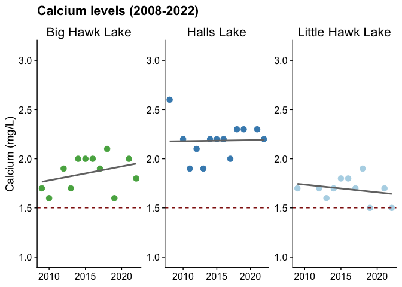<!-- -->

``` r
ggsave(here("plots", "calc_hhl.pdf"), width = 12, height = 6)
```

    ## `geom_smooth()` using formula = 'y ~ x'

Build plot for Kushog and Kennisis Lakes.

``` r
# Compare to other monitored lakes in Stanhope township:
calc_other <- calc_dat %>% 
  filter(Township == "STANHOPE") %>% 
  filter(!`Lake Name` %in% lake_names)

p_calc_kk <-
  calc_dat %>% 
  filter(`Lake Name` == "KUSHOG LAKE" | `Lake Name` == "KENNISIS LAKE") %>% 
  ggplot(aes(x = Year, y = `Calcium (mg/L)`)) +
  geom_point(aes(color = `Lake Name`), size = 3) +
  # geom_boxplot(aes(color = `Lake Name`, group = Year)) +
  # geom_smooth(method = "lm", se = FALSE, color = "black", aes(group = 1)) +
  # geom_line(aes(color = `Lake Name`)) +
  geom_smooth(method = "lm", se = FALSE, color = "grey45", aes(group = 1)) +
  facet_wrap(~`Lake Name`, labeller = as_labeller(c("KENNISIS LAKE" = "Kennisis Lake", "KUSHOG LAKE" = "Kushog Lake")), scales = "free") +
  scale_color_manual(values = c("KUSHOG LAKE" = "#f07434", "KENNISIS LAKE" = "#a82c94")) +
  theme(legend.position = "none",
        strip.text = element_text(size = 16),
        strip.background = element_blank(),
        axis.title = element_blank()) +
  scale_x_continuous(breaks = scales::breaks_width(5)) +
  scale_y_continuous(limits = c(1, 3.1)) +
  ylab("Calcium (mg/L)") +
  geom_hline(yintercept = 1.5, color = "darkred", linetype = "dashed")
```

Panel both plots together and save.

``` r
p_c <- plot_grid(p_calc, p_calc_kk, align = "h", axis = "t", nrow = 1, rel_widths = c(3, 2))
```

    ## `geom_smooth()` using formula = 'y ~ x'
    ## `geom_smooth()` using formula = 'y ~ x'

``` r
grid.arrange(arrangeGrob(p_c, bottom = x.grob))
```

<!-- -->

``` r
# Save plot
ggsave(here("plots", "calc_all.pdf"), width = 14, height = 6)
```

Run stats:

``` r
lm(`Calcium (mg/L)` ~ Year, data = calc %>% 
  filter(`Lake Name` == "BIG HAWK LAKE")) %>%
  summary()
```

    ## 
    ## Call:
    ## lm(formula = `Calcium (mg/L)` ~ Year, data = calc %>% filter(`Lake Name` == 
    ##     "BIG HAWK LAKE"))
    ## 
    ## Residuals:
    ##      Min       1Q   Median       3Q      Max 
    ## -0.30793 -0.12979  0.04207  0.13812  0.20624 
    ## 
    ## Coefficients:
    ##              Estimate Std. Error t value Pr(>|t|)
    ## (Intercept) -26.70357   25.16903  -1.061    0.314
    ## Year          0.01417    0.01249   1.135    0.283
    ## 
    ## Residual standard error: 0.1708 on 10 degrees of freedom
    ## Multiple R-squared:  0.1141, Adjusted R-squared:  0.0255 
    ## F-statistic: 1.288 on 1 and 10 DF,  p-value: 0.2829

``` r
lm(`Calcium (mg/L)` ~ Year, data = calc %>% 
  filter(`Lake Name` == "HALLS LAKE")) %>%
  summary()
```

    ## 
    ## Call:
    ## lm(formula = `Calcium (mg/L)` ~ Year, data = calc %>% filter(`Lake Name` == 
    ##     "HALLS LAKE"))
    ## 
    ## Residuals:
    ##      Min       1Q   Median       3Q      Max 
    ## -0.28257 -0.08159  0.01546  0.10956  0.42235 
    ## 
    ## Coefficients:
    ##              Estimate Std. Error t value Pr(>|t|)
    ## (Intercept) 2.021e-01  2.651e+01   0.008    0.994
    ## Year        9.838e-04  1.315e-02   0.075    0.942
    ## 
    ## Residual standard error: 0.1946 on 11 degrees of freedom
    ## Multiple R-squared:  0.0005083,  Adjusted R-squared:  -0.09035 
    ## F-statistic: 0.005594 on 1 and 11 DF,  p-value: 0.9417

``` r
lm(`Calcium (mg/L)` ~ Year, data = calc %>% 
  filter(`Lake Name` == "LITTLE HAWK LAKE")) %>%
  summary()
```

    ## 
    ## Call:
    ## lm(formula = `Calcium (mg/L)` ~ Year, data = calc %>% filter(`Lake Name` == 
    ##     "LITTLE HAWK LAKE"))
    ## 
    ## Residuals:
    ##       Min        1Q    Median        3Q       Max 
    ## -0.167532 -0.079870 -0.006494  0.074675  0.224675 
    ## 
    ## Coefficients:
    ##              Estimate Std. Error t value Pr(>|t|)
    ## (Intercept) 17.400000  20.242793   0.860    0.412
    ## Year        -0.007792   0.010041  -0.776    0.458
    ## 
    ## Residual standard error: 0.1246 on 9 degrees of freedom
    ## Multiple R-squared:  0.06272,    Adjusted R-squared:  -0.04142 
    ## F-statistic: 0.6022 on 1 and 9 DF,  p-value: 0.4576

``` r
lm(`Calcium (mg/L)` ~ Year, data = calc_dat %>% 
  filter(`Lake Name` == "KENNISIS LAKE")) %>%
  summary()
```

    ## 
    ## Call:
    ## lm(formula = `Calcium (mg/L)` ~ Year, data = calc_dat %>% filter(`Lake Name` == 
    ##     "KENNISIS LAKE"))
    ## 
    ## Residuals:
    ##      Min       1Q   Median       3Q      Max 
    ## -0.30765 -0.14956  0.05366  0.08912  0.28590 
    ## 
    ## Coefficients:
    ##               Estimate Std. Error t value Pr(>|t|)
    ## (Intercept) -11.071300  23.583912  -0.469    0.645
    ## Year          0.006448   0.011699   0.551    0.589
    ## 
    ## Residual standard error: 0.1694 on 17 degrees of freedom
    ## Multiple R-squared:  0.01755,    Adjusted R-squared:  -0.04024 
    ## F-statistic: 0.3037 on 1 and 17 DF,  p-value: 0.5887

``` r
lm(`Calcium (mg/L)` ~ Year, data = calc_dat %>% 
  filter(`Lake Name` == "KUSHOG LAKE")) %>%
  summary()
```

    ## 
    ## Call:
    ## lm(formula = `Calcium (mg/L)` ~ Year, data = calc_dat %>% filter(`Lake Name` == 
    ##     "KUSHOG LAKE"))
    ## 
    ## Residuals:
    ##      Min       1Q   Median       3Q      Max 
    ## -0.66176 -0.24685  0.05843  0.29526  0.49440 
    ## 
    ## Coefficients:
    ##              Estimate Std. Error t value Pr(>|t|)  
    ## (Intercept) -54.06940   22.03044  -2.454   0.0174 *
    ## Year          0.02808    0.01093   2.569   0.0130 *
    ## ---
    ## Signif. codes:  0 '***' 0.001 '**' 0.01 '*' 0.05 '.' 0.1 ' ' 1
    ## 
    ## Residual standard error: 0.3297 on 54 degrees of freedom
    ## Multiple R-squared:  0.1089, Adjusted R-squared:  0.09238 
    ## F-statistic: 6.598 on 1 and 54 DF,  p-value: 0.01301

#### Phosphorus & calcium: same plot

``` r
p_tp_comb <- plot_grid(p_phos + ggtitle("Phosphorus and calcium levels (2002-2022)"), 
                  p_phos_kk, align = "h", axis = "t", nrow = 1, rel_widths = c(3, 2))
```

    ## `geom_smooth()` using formula = 'y ~ x'
    ## `geom_smooth()` using formula = 'y ~ x'

``` r
p_c_comb <- plot_grid(p_calc + scale_x_continuous(limits = c(2002, 2022)) + ggtitle(""), 
                      p_calc_kk + scale_x_continuous(limits = c(2002, 2022)), 
                      align = "h", axis = "t", nrow = 1, rel_widths = c(3, 2))
```

    ## Scale for x is already present.
    ## Adding another scale for x, which will replace the existing scale.
    ## Scale for x is already present.
    ## Adding another scale for x, which will replace the existing scale.
    ## `geom_smooth()` using formula = 'y ~ x'
    ## `geom_smooth()` using formula = 'y ~ x'

``` r
p_comb <- plot_grid(p_tp_comb, p_c_comb, align = "h", axis = "t", nrow = 2)
grid.arrange(arrangeGrob(p_comb, bottom = x.grob))
```

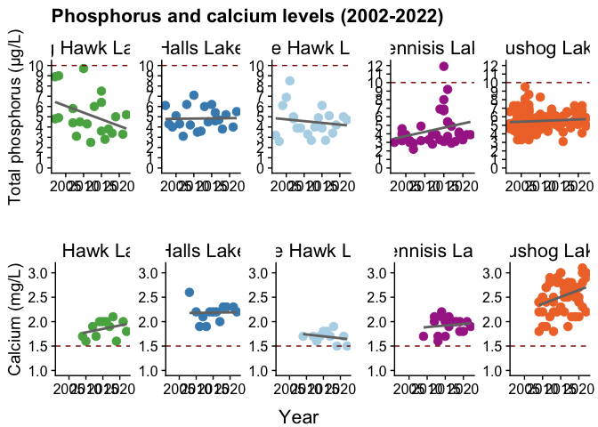<!-- -->

``` r
ggsave(here("plots", "phoscalc_all.pdf"), width = 14, height = 8)
```

#### Dissolved O2

Import and tidy data.

``` r
halls_disso <- read_tsv(here("data", "halls_water_chemistry.txt")) %>% 
  pivot_longer(cols = 4:20, names_to = "site_code", values_to = "value") %>% 
  # Average between replicates
  group_by(Year, site_code, Parameter) %>% 
  mutate(avg_value = mean(value),
         site_code_norep = site_code)
```

    ## Rows: 11 Columns: 20
    ## ── Column specification ────────────────────────────────────────────────────────
    ## Delimiter: "\t"
    ## chr  (2): Lake, Parameter
    ## dbl (18): Year, HALL-01, HALL-04, HALL-05, HALL-06-R1, HALL-06-R2, HALL-08-R...
    ## 
    ## ℹ Use `spec()` to retrieve the full column specification for this data.
    ## ℹ Specify the column types or set `show_col_types = FALSE` to quiet this message.

``` r
hawk_disso <- read_tsv(here("data", "hawk_water_chemistry.txt")) %>% 
  pivot_longer(cols = 4:19, names_to = "site_code", values_to = "value") %>% 
  # Average between replicates
  group_by(Year, site_code, Parameter) %>% 
  mutate(avg_value = mean(value),
         site_code_norep = site_code)
```

    ## Rows: 20 Columns: 19
    ## ── Column specification ────────────────────────────────────────────────────────
    ## Delimiter: "\t"
    ## chr  (2): Lake, Parameter
    ## dbl (17): Year, LHWK-01-R1, LHWK-01-R2, LHWK-02-R1, LHWK-02-R2, LHWK-03-R1, ...
    ## 
    ## ℹ Use `spec()` to retrieve the full column specification for this data.
    ## ℹ Specify the column types or set `show_col_types = FALSE` to quiet this message.

``` r
# Join datasets together
disso <- bind_rows(halls_disso, hawk_disso)

# Remove replicates
disso$site_code_norep <- gsub('-R1', '', disso$site_code_norep)
disso$site_code_norep <- gsub('-R2', '', disso$site_code_norep)
disso <- disso %>% 
  ungroup() %>% 
  dplyr::select(-c(site_code, value)) %>% 
  distinct()

# Add in proper lake names
disso <-
  disso %>% 
  mutate(`Lake Name` = case_when(str_detect(site_code_norep, regex("HALL")) ~ "Halls Lake",
                                 str_detect(site_code_norep, regex("BHWK")) ~ "Big Hawk Lake",
                                 str_detect(site_code_norep, regex("LHWK")) ~ "Little Hawk Lake"))
```

We decided to not included the plotted dissolved oxygen as the data are
so limited. But if you want to, uncomment below and run:

``` r
# disso %>% 
#   filter(Parameter == "Diss_O2") %>% 
#   ggplot(aes(x = Year, y = avg_value)) +
#   geom_point(aes(color = `Lake Name`, group = Year), size = 3) +
#   # geom_boxplot(aes(color = `Lake Name`, group = Year)) +
#   geom_smooth(method = "lm", se = FALSE, color = "grey45", aes(group = 1)) +
#   facet_wrap(~`Lake Name`, scales = "free") +
#   scale_color_manual(values = lake_col_full) +
#   theme(legend.position = "none",
#         strip.text = element_text(size = 16),
#         strip.background = element_blank()) +
#   # scale_x_continuous(breaks = scales::breaks_width(5)) +
#   # scale_y_continuous(limits = c(0, 10), breaks = 0:10) +
#   ggtitle("Dissolved oxygen levels (2019-2024)") +
#   ylab("Dissolved O2 (mg/L)")
# 
# # Save plot
# ggsave(here("plots", "disso_hhl.pdf"), width = 12, height = 8)
```

### Benthic monitoring

Import and tidy data.

``` r
halls_indices <- read_tsv(here("data", "halls_indices.txt")) %>% 
  pivot_longer(cols = 4:24, names_to = "site_code", values_to = "value") %>% 
  # Average between replicates
  group_by(Year, site_code, Biotic_index) %>% 
  mutate(avg_value = mean(value),
         site_code_norep = site_code)
```

    ## Rows: 19 Columns: 24
    ## ── Column specification ────────────────────────────────────────────────────────
    ## Delimiter: "\t"
    ## chr  (2): Lake, Biotic_index
    ## dbl (22): Year, HALL-01-R1, HALL-04-R1, HALL-05-R1, HALL-06-R1, HALL-06-R2, ...
    ## 
    ## ℹ Use `spec()` to retrieve the full column specification for this data.
    ## ℹ Specify the column types or set `show_col_types = FALSE` to quiet this message.

``` r
hawk_indices <- read_tsv(here("data", "hawk_indices.txt")) %>% 
  pivot_longer(cols = 4:19, names_to = "site_code", values_to = "value") %>% 
  # Average between replicates
  group_by(Year, site_code, Biotic_index) %>% 
  mutate(avg_value = mean(value),
         site_code_norep = site_code)
```

    ## Rows: 18 Columns: 19
    ## ── Column specification ────────────────────────────────────────────────────────
    ## Delimiter: "\t"
    ## chr  (2): Lake, Biotic_index
    ## dbl (17): Year, LHWK-01-R1, LHWK-01-R2, LHWK-02-R1, LHWK-02-R2, LHWK-03-R1, ...
    ## 
    ## ℹ Use `spec()` to retrieve the full column specification for this data.
    ## ℹ Specify the column types or set `show_col_types = FALSE` to quiet this message.

``` r
# Join datasets together
indices <- bind_rows(halls_indices, hawk_indices)

# Remove replicates
indices$site_code_norep <- gsub('-R1', '', indices$site_code_norep)
indices$site_code_norep <- gsub('-R2', '', indices$site_code_norep)
indices <- indices %>% 
  ungroup() %>% 
  dplyr::select(-c(site_code, value)) %>% 
  distinct()

# Add in proper lake names
indices <-
  indices %>% 
  mutate(`Lake Name` = case_when(str_detect(site_code_norep, regex("HALL")) ~ "Halls Lake",
                                 str_detect(site_code_norep, regex("BHWK")) ~ "Big Hawk Lake",
                                 str_detect(site_code_norep, regex("LHWK")) ~ "Little Hawk Lake"))

# Ranges for tolerances for each metric
rect_data <- read_tsv(here("data", "index_rect_data.txt"))
```

    ## Rows: 42 Columns: 7
    ## ── Column specification ────────────────────────────────────────────────────────
    ## Delimiter: "\t"
    ## chr (3): Lake Name, Biotic_index, Category
    ## dbl (4): xmin, xmax, ymin, ymax
    ## 
    ## ℹ Use `spec()` to retrieve the full column specification for this data.
    ## ℹ Specify the column types or set `show_col_types = FALSE` to quiet this message.

#### Diversity (Simpson’s D)

``` r
indices %>% 
  filter(Biotic_index == "Simpsons_Index") %>% 
  ggplot(aes(x = Year, y = avg_value)) +
  geom_rect(data = rect_data %>% filter(Biotic_index == "Simpsons_Index"), inherit.aes = FALSE, 
            aes(xmin = -Inf, xmax = +Inf, ymin = ymin, ymax = ymax, fill = Category), alpha = 0.4) +
  scale_fill_manual(values = c("Poor" = "#d53e4f", "Fair" = "#fee08b", "Good" = "#abdda4", "Excellent" = "#3288bd")) +
  geom_point(aes(color = `Lake Name`, group = Year), size = 3) +
  geom_point(aes(group = Year), size = 3, pch = 21, color = "black") +
  geom_smooth(method = "lm", se = FALSE, color = "grey45", aes(group = 1)) +
  facet_wrap(~`Lake Name`, scales = "free") +
  scale_color_manual(values = lake_col_full) +
  theme(legend.position = "none",
      strip.text = element_text(size = 16),
      strip.background = element_blank()) +
  scale_y_continuous(limits = c(0, 1)) +
  ggtitle("Diversity (2020-2024)") +
  ylab("Simpson's diversity index")
```

    ## `geom_smooth()` using formula = 'y ~ x'

    ## Warning: Removed 41 rows containing non-finite outside the scale range
    ## (`stat_smooth()`).

    ## Warning: Removed 41 rows containing missing values or values outside the scale range
    ## (`geom_point()`).
    ## Removed 41 rows containing missing values or values outside the scale range
    ## (`geom_point()`).

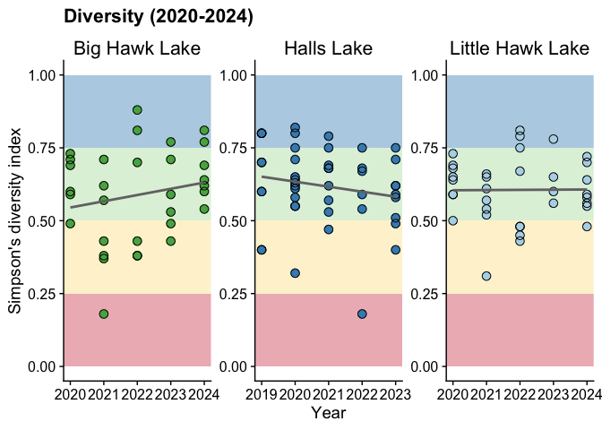<!-- -->

``` r
# Save plot
ggsave(here("plots", "indices_hhl.pdf"), width = 12, height = 8)
```

    ## `geom_smooth()` using formula = 'y ~ x'

    ## Warning: Removed 41 rows containing non-finite outside the scale range
    ## (`stat_smooth()`).
    ## Removed 41 rows containing missing values or values outside the scale range
    ## (`geom_point()`).
    ## Removed 41 rows containing missing values or values outside the scale range
    ## (`geom_point()`).

Run stats:

``` r
lm(avg_value ~ Year, 
   data = indices %>% 
     filter(Biotic_index == "Simpsons_Index") %>% 
     filter(`Lake Name` == "Big Hawk Lake")) %>%
  summary() # coeff 0.02141, non sig
```

    ## 
    ## Call:
    ## lm(formula = avg_value ~ Year, data = indices %>% filter(Biotic_index == 
    ##     "Simpsons_Index") %>% filter(`Lake Name` == "Big Hawk Lake"))
    ## 
    ## Residuals:
    ##      Min       1Q   Median       3Q      Max 
    ## -0.38667 -0.12379  0.00621  0.14015  0.29192 
    ## 
    ## Coefficients:
    ##              Estimate Std. Error t value Pr(>|t|)
    ## (Intercept) -42.71131   40.12121  -1.065    0.296
    ## Year          0.02141    0.01984   1.079    0.289
    ## 
    ## Residual standard error: 0.1599 on 30 degrees of freedom
    ##   (4 observations deleted due to missingness)
    ## Multiple R-squared:  0.03737,    Adjusted R-squared:  0.005286 
    ## F-statistic: 1.165 on 1 and 30 DF,  p-value: 0.2891

``` r
lm(avg_value ~ Year, 
   data = indices %>% 
     filter(Biotic_index == "Simpsons_Index") %>% 
     filter(`Lake Name` == "Halls Lake")) %>%
  summary() # coeff -0.01717, non sig
```

    ## 
    ## Call:
    ## lm(formula = avg_value ~ Year, data = indices %>% filter(Biotic_index == 
    ##     "Simpsons_Index") %>% filter(`Lake Name` == "Halls Lake"))
    ## 
    ## Residuals:
    ##      Min       1Q   Median       3Q      Max 
    ## -0.41956 -0.05815  0.00685  0.07935  0.18609 
    ## 
    ## Coefficients:
    ##             Estimate Std. Error t value Pr(>|t|)
    ## (Intercept) 35.32596   28.75421   1.229    0.226
    ## Year        -0.01717    0.01423  -1.207    0.234
    ## 
    ## Residual standard error: 0.1349 on 44 degrees of freedom
    ##   (37 observations deleted due to missingness)
    ## Multiple R-squared:  0.03205,    Adjusted R-squared:  0.01005 
    ## F-statistic: 1.457 on 1 and 44 DF,  p-value: 0.2339

``` r
lm(avg_value ~ Year, 
   data = indices %>% 
     filter(Biotic_index == "Simpsons_Index") %>% 
     filter(`Lake Name` == "Little Hawk Lake")) %>%
  summary() # coeff 0.0006307, non sig
```

    ## 
    ## Call:
    ## lm(formula = avg_value ~ Year, data = indices %>% filter(Biotic_index == 
    ##     "Simpsons_Index") %>% filter(`Lake Name` == "Little Hawk Lake"))
    ## 
    ## Residuals:
    ##       Min        1Q    Median        3Q       Max 
    ## -0.295138 -0.061084 -0.006399  0.069862  0.204232 
    ## 
    ## Coefficients:
    ##               Estimate Std. Error t value Pr(>|t|)
    ## (Intercept) -0.6695757 26.2276528  -0.026    0.980
    ## Year         0.0006307  0.0129717   0.049    0.962
    ## 
    ## Residual standard error: 0.1121 on 33 degrees of freedom
    ## Multiple R-squared:  7.164e-05,  Adjusted R-squared:  -0.03023 
    ## F-statistic: 0.002364 on 1 and 33 DF,  p-value: 0.9615

#### Tolerance (mHBI)

``` r
indices %>% 
  filter(Biotic_index == "mHBI") %>% 
  ggplot(aes(x = Year, y = avg_value)) +
  geom_rect(data = rect_data %>% filter(Biotic_index == "mHBI"), inherit.aes = FALSE,
  aes(xmin=-Inf, xmax=+Inf, ymin = ymin, ymax = ymax, fill = Category), alpha = 0.4) +
  scale_fill_manual(values = c("Very poor" = "#9e0142", "Poor" = "#d53e4f", "Fairly poor" = "#fdae61", "Fair" = "#fde18b", "Good" = "#e6f598", "Very good" = "#abdda4", "Excellent" = "#3288bd")) +
  geom_point(aes(color = `Lake Name`, group = Year), size = 3) +
  geom_point(aes(group = Year), size = 3, pch = 21, color = "black") +
  geom_smooth(method = "lm", se = FALSE, color = "grey45", aes(group = 1)) +
  facet_wrap(~`Lake Name`, scales = "free") +
  scale_color_manual(values = lake_col_full) +
  theme(legend.position = "none",
      strip.text = element_text(size = 16),
      strip.background = element_blank()) +
  scale_y_continuous(limits = c(0, 10)) +
  ggtitle("Pollution tolerance (2020-2024)") +
  ylab("Modified HBI (family level)")
```

    ## `geom_smooth()` using formula = 'y ~ x'

    ## Warning: Removed 41 rows containing non-finite outside the scale range
    ## (`stat_smooth()`).

    ## Warning: Removed 41 rows containing missing values or values outside the scale range
    ## (`geom_point()`).
    ## Removed 41 rows containing missing values or values outside the scale range
    ## (`geom_point()`).

<!-- -->

``` r
# Save plot
ggsave(here("plots", "mHBI_hhl.pdf"), width = 12, height = 8)
```

    ## `geom_smooth()` using formula = 'y ~ x'

    ## Warning: Removed 41 rows containing non-finite outside the scale range
    ## (`stat_smooth()`).
    ## Removed 41 rows containing missing values or values outside the scale range
    ## (`geom_point()`).
    ## Removed 41 rows containing missing values or values outside the scale range
    ## (`geom_point()`).

Run stats:

``` r
lm(avg_value ~ Year, 
   data = indices %>% 
     filter(Biotic_index == "mHBI") %>% 
     filter(`Lake Name` == "Big Hawk Lake")) %>%
  summary() # coeff -0.1034, non sig
```

    ## 
    ## Call:
    ## lm(formula = avg_value ~ Year, data = indices %>% filter(Biotic_index == 
    ##     "mHBI") %>% filter(`Lake Name` == "Big Hawk Lake"))
    ## 
    ## Residuals:
    ##      Min       1Q   Median       3Q      Max 
    ## -2.03571 -0.52637 -0.07229  0.76692  1.54113 
    ## 
    ## Coefficients:
    ##             Estimate Std. Error t value Pr(>|t|)
    ## (Intercept) 215.1974   243.2659   0.885    0.383
    ## Year         -0.1034     0.1203  -0.860    0.397
    ## 
    ## Residual standard error: 0.9697 on 30 degrees of freedom
    ##   (4 observations deleted due to missingness)
    ## Multiple R-squared:  0.02404,    Adjusted R-squared:  -0.008492 
    ## F-statistic: 0.739 on 1 and 30 DF,  p-value: 0.3968

``` r
lm(avg_value ~ Year, 
   data = indices %>% 
     filter(Biotic_index == "mHBI") %>% 
     filter(`Lake Name` == "Halls Lake")) %>%
  summary() # coeff -0.14579, SIG!
```

    ## 
    ## Call:
    ## lm(formula = avg_value ~ Year, data = indices %>% filter(Biotic_index == 
    ##     "mHBI") %>% filter(`Lake Name` == "Halls Lake"))
    ## 
    ## Residuals:
    ##     Min      1Q  Median      3Q     Max 
    ## -1.4028 -0.5379 -0.1983  0.6454  1.6214 
    ## 
    ## Coefficients:
    ##              Estimate Std. Error t value Pr(>|t|)  
    ## (Intercept) 300.07271  160.70086   1.867   0.0682 .
    ## Year         -0.14579    0.07952  -1.833   0.0732 .
    ## ---
    ## Signif. codes:  0 '***' 0.001 '**' 0.01 '*' 0.05 '.' 0.1 ' ' 1
    ## 
    ## Residual standard error: 0.7811 on 46 degrees of freedom
    ##   (37 observations deleted due to missingness)
    ## Multiple R-squared:  0.06809,    Adjusted R-squared:  0.04783 
    ## F-statistic: 3.361 on 1 and 46 DF,  p-value: 0.07324

``` r
lm(avg_value ~ Year, 
   data = indices %>% 
     filter(Biotic_index == "mHBI") %>% 
     filter(`Lake Name` == "Little Hawk Lake")) %>%
  summary() # coeff -0.1428, non sig
```

    ## 
    ## Call:
    ## lm(formula = avg_value ~ Year, data = indices %>% filter(Biotic_index == 
    ##     "mHBI") %>% filter(`Lake Name` == "Little Hawk Lake"))
    ## 
    ## Residuals:
    ##      Min       1Q   Median       3Q      Max 
    ## -1.89386 -0.44675  0.07614  0.69892  1.42449 
    ## 
    ## Coefficients:
    ##             Estimate Std. Error t value Pr(>|t|)
    ## (Intercept) 294.8796   203.8860   1.446    0.158
    ## Year         -0.1428     0.1008  -1.416    0.166
    ## 
    ## Residual standard error: 0.8718 on 33 degrees of freedom
    ## Multiple R-squared:  0.05728,    Adjusted R-squared:  0.02871 
    ## F-statistic: 2.005 on 1 and 33 DF,  p-value: 0.1662

Get averages for executive summary:

``` r
indices %>% 
  filter(Biotic_index == "mHBI") %>% 
  # filter(`Lake Name` == "Halls Lake") %>%
  # filter(`Lake Name` == "Big Hawk Lake") %>%
  filter(`Lake Name` == "Little Hawk Lake") %>%
  group_by(Year) %>% 
  na.omit() %>% 
  summarize(mean(avg_value))
```

    ## # A tibble: 5 × 2
    ##    Year `mean(avg_value)`
    ##   <dbl>             <dbl>
    ## 1  2020              6.76
    ## 2  2021              5.79
    ## 3  2022              6.23
    ## 4  2023              6.08
    ## 5  2024              5.95

``` r
rect_data %>% filter(Biotic_index == "mHBI")
```

    ## # A tibble: 21 × 7
    ##    `Lake Name`   Biotic_index  xmin  xmax  ymin  ymax Category   
    ##    <chr>         <chr>        <dbl> <dbl> <dbl> <dbl> <chr>      
    ##  1 Halls Lake    mHBI          2019  2023  0     3.75 Very poor  
    ##  2 Halls Lake    mHBI          2019  2023  3.75  4.25 Poor       
    ##  3 Halls Lake    mHBI          2019  2023  4.25  5    Fairly poor
    ##  4 Halls Lake    mHBI          2019  2023  5     5.75 Fair       
    ##  5 Halls Lake    mHBI          2019  2023  5.75  6.5  Good       
    ##  6 Halls Lake    mHBI          2019  2023  6.5   7.25 Very good  
    ##  7 Halls Lake    mHBI          2019  2023  7.25 10    Excellent  
    ##  8 Big Hawk Lake mHBI          2020  2024  0     3.75 Very poor  
    ##  9 Big Hawk Lake mHBI          2020  2024  3.75  4.25 Poor       
    ## 10 Big Hawk Lake mHBI          2020  2024  4.25  5    Fairly poor
    ## # ℹ 11 more rows

Extrapolate mHBI in five years for Halls Lake.

``` r
pred <- read_tsv(here("data", "halls_predicted.txt"))
```

    ## Rows: 7 Columns: 6
    ## ── Column specification ────────────────────────────────────────────────────────
    ## Delimiter: "\t"
    ## chr (4): Lake, Biotic_index, site_code_norep, Lake Name
    ## dbl (1): Year
    ## lgl (1): avg_value
    ## 
    ## ℹ Use `spec()` to retrieve the full column specification for this data.
    ## ℹ Specify the column types or set `show_col_types = FALSE` to quiet this message.

``` r
pred <- bind_rows(indices %>% 
  filter(Biotic_index == "mHBI") %>% 
  filter(`Lake Name` == "Halls Lake"), pred)

predicted <- pred %>%
  mutate(predicted_vals = coalesce(avg_value, predict(lm(avg_value ~ Year),
                                                      across(Year))))

predicted %>% filter(Year == 2030) %>% pull(predicted_vals)
```

    ##       92 
    ## 4.124923

#### Percent EOT

``` r
indices %>% 
  filter(Biotic_index == "Perc_EOT") %>% 
  ggplot(aes(x = Year, y = avg_value)) +
  geom_rect(data = rect_data %>% filter(Biotic_index == "Perc_EOT"), inherit.aes = FALSE,
  aes(xmin=-Inf, xmax=+Inf, ymin = ymin, ymax = ymax, fill = Category), alpha = 0.4) +
  scale_fill_manual(values = c("Fair" = "#fdae61", "Good" = "#abdda4", "Excellent" = "#3288bd")) +
  geom_point(aes(color = `Lake Name`, group = Year), size = 3) +
  geom_point(aes(group = Year), size = 3, pch = 21, color = "black") +
  geom_smooth(method = "lm", se = FALSE, color = "grey45", aes(group = 1)) +
  facet_wrap(~`Lake Name`, scales = "free") +
  scale_color_manual(values = lake_col_full) +
  theme(legend.position = "none",
      strip.text = element_text(size = 16),
      strip.background = element_blank()) +
  ggtitle("Diversity of pollution-intolerant groups (2020-2024)") +
  ylab("Percent EOT")
```

    ## `geom_smooth()` using formula = 'y ~ x'

    ## Warning: Removed 40 rows containing non-finite outside the scale range
    ## (`stat_smooth()`).

    ## Warning: Removed 40 rows containing missing values or values outside the scale range
    ## (`geom_point()`).
    ## Removed 40 rows containing missing values or values outside the scale range
    ## (`geom_point()`).

<!-- -->

``` r
ggsave(here("plots", "eot_hhl.pdf"), width = 12, height = 8)
```

    ## `geom_smooth()` using formula = 'y ~ x'

    ## Warning: Removed 40 rows containing non-finite outside the scale range
    ## (`stat_smooth()`).
    ## Removed 40 rows containing missing values or values outside the scale range
    ## (`geom_point()`).
    ## Removed 40 rows containing missing values or values outside the scale range
    ## (`geom_point()`).

Run stats:

``` r
lm(avg_value ~ Year, 
   data = indices %>% 
     filter(Biotic_index == "Perc_EOT") %>% 
     filter(`Lake Name` == "Big Hawk Lake")) %>%
  summary() # coeff -0.4659, non sig
```

    ## 
    ## Call:
    ## lm(formula = avg_value ~ Year, data = indices %>% filter(Biotic_index == 
    ##     "Perc_EOT") %>% filter(`Lake Name` == "Big Hawk Lake"))
    ## 
    ## Residuals:
    ##     Min      1Q  Median      3Q     Max 
    ## -15.732 -10.800  -6.334   0.883  44.632 
    ## 
    ## Coefficients:
    ##              Estimate Std. Error t value Pr(>|t|)
    ## (Intercept)  956.8455  4353.3541   0.220    0.828
    ## Year          -0.4659     2.1530  -0.216    0.830
    ## 
    ## Residual standard error: 17.35 on 29 degrees of freedom
    ##   (4 observations deleted due to missingness)
    ## Multiple R-squared:  0.001612,   Adjusted R-squared:  -0.03281 
    ## F-statistic: 0.04683 on 1 and 29 DF,  p-value: 0.8302

``` r
lm(avg_value ~ Year, 
   data = indices %>% 
     filter(Biotic_index == "Perc_EOT") %>% 
     filter(`Lake Name` == "Halls Lake")) %>%
  summary() # coeff -1.493, non sig
```

    ## 
    ## Call:
    ## lm(formula = avg_value ~ Year, data = indices %>% filter(Biotic_index == 
    ##     "Perc_EOT") %>% filter(`Lake Name` == "Halls Lake"))
    ## 
    ## Residuals:
    ##     Min      1Q  Median      3Q     Max 
    ## -12.286  -6.960  -2.460   3.533  68.190 
    ## 
    ## Coefficients:
    ##             Estimate Std. Error t value Pr(>|t|)
    ## (Intercept) 3028.070   2629.376   1.152    0.256
    ## Year          -1.493      1.301  -1.147    0.257
    ## 
    ## Residual standard error: 12.57 on 45 degrees of freedom
    ##   (36 observations deleted due to missingness)
    ## Multiple R-squared:  0.02842,    Adjusted R-squared:  0.006832 
    ## F-statistic: 1.316 on 1 and 45 DF,  p-value: 0.2573

``` r
lm(avg_value ~ Year, 
   data = indices %>% 
     filter(Biotic_index == "Perc_EOT") %>% 
     filter(`Lake Name` == "Little Hawk Lake")) %>%
  summary() # coeff -1.8733, sig @ * -> 0.05
```

    ## 
    ## Call:
    ## lm(formula = avg_value ~ Year, data = indices %>% filter(Biotic_index == 
    ##     "Perc_EOT") %>% filter(`Lake Name` == "Little Hawk Lake"))
    ## 
    ## Residuals:
    ##     Min      1Q  Median      3Q     Max 
    ## -10.203  -4.569  -1.098   1.777  24.670 
    ## 
    ## Coefficients:
    ##              Estimate Std. Error t value Pr(>|t|)  
    ## (Intercept) 3798.2142  1844.9700   2.059   0.0477 *
    ## Year          -1.8733     0.9125  -2.053   0.0483 *
    ## ---
    ## Signif. codes:  0 '***' 0.001 '**' 0.01 '*' 0.05 '.' 0.1 ' ' 1
    ## 
    ## Residual standard error: 7.888 on 32 degrees of freedom
    ## Multiple R-squared:  0.1164, Adjusted R-squared:  0.08877 
    ## F-statistic: 4.215 on 1 and 32 DF,  p-value: 0.04832

### Algal growth

Import and tidy data:

``` r
halls_veg <- read_tsv(here("data", "halls_veg.txt")) %>% 
  pivot_longer(cols = 4:15, names_to = "site_code", values_to = "value") %>% 
  group_by(Year, site_code) %>% 
  mutate(sum_algae = sum(value))
```

    ## Rows: 15 Columns: 15
    ## ── Column specification ────────────────────────────────────────────────────────
    ## Delimiter: "\t"
    ## chr  (2): Lake, Vegetation_type
    ## dbl (13): Year, HALL-01, HALL-04, HALL-05, HALL-06, HALL-08, HALL-09, HALL-1...
    ## 
    ## ℹ Use `spec()` to retrieve the full column specification for this data.
    ## ℹ Specify the column types or set `show_col_types = FALSE` to quiet this message.

``` r
hawk_veg <- read_tsv(here("data", "hawk_veg.txt")) %>% 
  pivot_longer(cols = 4:11, names_to = "site_code", values_to = "value") %>% 
  group_by(Year, site_code) %>% 
  mutate(sum_algae = sum(value))
```

    ## Rows: 15 Columns: 11
    ## ── Column specification ────────────────────────────────────────────────────────
    ## Delimiter: "\t"
    ## chr (2): Lake, Vegetation_type
    ## dbl (9): Year, LHWK-01, LHWK-02, LHWK-03, LHWK-04, BHWK-01, BHWK-03, BHWK-04...
    ## 
    ## ℹ Use `spec()` to retrieve the full column specification for this data.
    ## ℹ Specify the column types or set `show_col_types = FALSE` to quiet this message.

``` r
# Join datasets together
veg <- bind_rows(halls_veg, hawk_veg)

# Add in proper lake names
veg <-
  veg %>% 
  mutate(`Lake Name` = case_when(str_detect(site_code, regex("HALL")) ~ "Halls Lake",
                                 str_detect(site_code, regex("BHWK")) ~ "Big Hawk Lake",
                                 str_detect(site_code, regex("LHWK")) ~ "Little Hawk Lake"))
```

Build plots.

``` r
p_algae <- veg %>% 
  ggplot(aes(x = Year, y = value, group = Vegetation_type, fill = Vegetation_type)) +
  geom_bar(stat = "identity", position = "stack") +
  facet_grid(~`Lake Name`, scales = "free") +
  theme(strip.text = element_text(size = 10, face = "bold"),
        strip.background = element_blank(),
        legend.text = element_text(size = 9),
        legend.title = element_text(size = 10),
        axis.title = element_text(size = 10),
        axis.text.y = element_text(size = 9),
        axis.text.x = element_text(size = 9, angle = 45, hjust = 1),
        legend.position = "bottom") +
  scale_y_continuous(expand = c(0, 0)) +
  scale_x_continuous(breaks = 2019:2024) +
  scale_fill_manual(values = c("#186484", "#448cbc", "#b4d6e7"),
                    name = "Type of algae") +
  # scale_fill_manual(values = c("#596b36", "#a9cc68", "#fcf79b"), 
  #                   name = "Type of algae") +
  # ggtitle("Algal growth (2019-2024)") +
  ylab("Abundance of algae")
  # ylab("Algal abundance, summed across sites")

p_algae
```

    ## Warning: Removed 96 rows containing missing values or values outside the scale range
    ## (`geom_bar()`).

<!-- -->

``` r
# Save plot for executive summary
ggsave(here("plots", "algae_hhl.pdf"), width = 3.5, height = 3) # for exec sum
```

    ## Warning: Removed 96 rows containing missing values or values outside the scale range
    ## (`geom_bar()`).

``` r
# For AGM presentation
p_algae +
  theme(strip.text = element_text(size = 14, face = "bold"),
        strip.background = element_blank(),
        legend.text = element_text(size = 12),
        legend.title = element_text(size = 16),
        axis.title = element_text(size = 14),
        axis.text.y = element_text(size = 12),
        axis.text.x = element_text(size = 12, angle = 45, hjust = 1),
        legend.position = "bottom") +
  scale_y_continuous(expand = c(0, 0)) +
  scale_x_continuous(breaks = 2019:2024) +
  scale_fill_manual(values = c("#186484", "#448cbc", "#b4d6e7"),
                    name = "Type of algae") +
  # scale_fill_manual(values = c("#596b36", "#a9cc68", "#fcf79b"), 
  #                   name = "Type of algae") +
  ggtitle("Algal growth (2019-2024)") +
  ylab("Abundance of algae")
```

    ## Scale for y is already present.
    ## Adding another scale for y, which will replace the existing scale.
    ## Scale for x is already present.
    ## Adding another scale for x, which will replace the existing scale.
    ## Scale for fill is already present.
    ## Adding another scale for fill, which will replace the existing scale.

    ## Warning: Removed 96 rows containing missing values or values outside the scale range
    ## (`geom_bar()`).

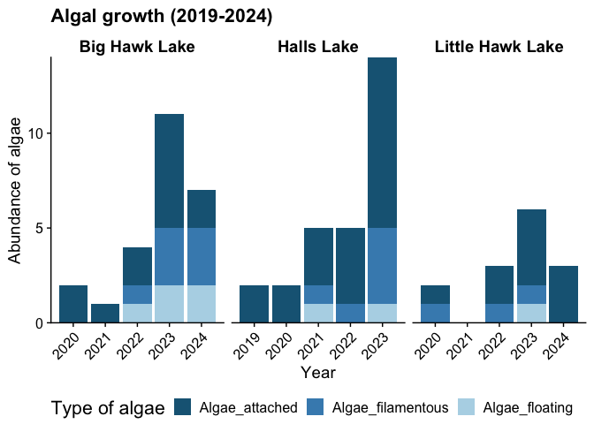<!-- -->

``` r
ggsave(here("plots", "algae_hhl_pres.pdf"), width = 8, height = 5.5) # for pres
```

    ## Warning: Removed 96 rows containing missing values or values outside the scale range
    ## (`geom_bar()`).

Run stats.

``` r
lm(sum_algae ~ Year, 
   data = veg %>% 
     filter(`Lake Name` == "Big Hawk Lake")) %>%
  summary() # coeff 0.48529, SIG @ *** -> 5.23e-08
```

    ## 
    ## Call:
    ## lm(formula = sum_algae ~ Year, data = veg %>% filter(`Lake Name` == 
    ##     "Big Hawk Lake"))
    ## 
    ## Residuals:
    ##     Min      1Q  Median      3Q     Max 
    ## -1.2647 -0.7794 -0.2353  0.7059  1.2500 
    ## 
    ## Coefficients:
    ##               Estimate Std. Error t value Pr(>|t|)    
    ## (Intercept) -980.00000  155.74017  -6.293 5.40e-08 ***
    ## Year           0.48529    0.07702   6.301 5.23e-08 ***
    ## ---
    ## Signif. codes:  0 '***' 0.001 '**' 0.01 '*' 0.05 '.' 0.1 ' ' 1
    ## 
    ## Residual standard error: 0.7981 on 55 degrees of freedom
    ##   (3 observations deleted due to missingness)
    ## Multiple R-squared:  0.4192, Adjusted R-squared:  0.4087 
    ## F-statistic:  39.7 on 1 and 55 DF,  p-value: 5.231e-08

``` r
lm(sum_algae ~ Year, 
   data = veg %>% 
     filter(`Lake Name` == "Halls Lake")) %>%
  summary() # coeff 0.47095, SIG @ *** -> 3.02e-12
```

    ## 
    ## Call:
    ## lm(formula = sum_algae ~ Year, data = veg %>% filter(`Lake Name` == 
    ##     "Halls Lake"))
    ## 
    ## Residuals:
    ##      Min       1Q   Median       3Q      Max 
    ## -1.46532 -0.52343 -0.05248  0.47657  2.06373 
    ## 
    ## Coefficients:
    ##               Estimate Std. Error t value Pr(>|t|)    
    ## (Intercept) -950.78866  118.22773  -8.042 3.13e-12 ***
    ## Year           0.47095    0.05851   8.050 3.02e-12 ***
    ## ---
    ## Signif. codes:  0 '***' 0.001 '**' 0.01 '*' 0.05 '.' 0.1 ' ' 1
    ## 
    ## Residual standard error: 0.8408 on 91 degrees of freedom
    ##   (87 observations deleted due to missingness)
    ## Multiple R-squared:  0.4159, Adjusted R-squared:  0.4095 
    ## F-statistic:  64.8 on 1 and 91 DF,  p-value: 3.022e-12

``` r
lm(sum_algae ~ Year, 
   data = veg %>% 
     filter(`Lake Name` == "Little Hawk Lake")) %>%
  summary() # coeff 0.20000, sig @ * -> 0.0245
```

    ## 
    ## Call:
    ## lm(formula = sum_algae ~ Year, data = veg %>% filter(`Lake Name` == 
    ##     "Little Hawk Lake"))
    ## 
    ## Residuals:
    ##     Min      1Q  Median      3Q     Max 
    ## -1.1778 -0.5778 -0.3778  0.8222  2.0222 
    ## 
    ## Coefficients:
    ##               Estimate Std. Error t value Pr(>|t|)  
    ## (Intercept) -403.62222  174.61078  -2.312   0.0248 *
    ## Year           0.20000    0.08636   2.316   0.0245 *
    ## ---
    ## Signif. codes:  0 '***' 0.001 '**' 0.01 '*' 0.05 '.' 0.1 ' ' 1
    ## 
    ## Residual standard error: 0.946 on 52 degrees of freedom
    ##   (6 observations deleted due to missingness)
    ## Multiple R-squared:  0.09351,    Adjusted R-squared:  0.07607 
    ## F-statistic: 5.364 on 1 and 52 DF,  p-value: 0.02453

## Lake levels

The Trent Severn Waterway monitors lake levels for the HHPLOA lakes at
two gauges: one at Hawk Lake Dam and the other at Buttermilk Falls. Data
for the current year are available visually
[here](https://www.pc.gc.ca/apps/WaterLevels/?siteId=100419&lat=44.71941044950733&lng=-78.7716293334961&z=9&_ga=2.155594553.368853008.1747062876-2016780462.1742352049&_gl=1*1u88omb*_ga*MjAxNjc4MDQ2Mi4xNzQyMzUyMDQ5*_ga_PC690N3X7Z*czE3NDcwNjc0MjYkbzMkZzAkdDE3NDcwNjc0MjYkajAkbDAkaDA.)
and for previous years through the Coalition for Equitable Water Flow
[here](https://www.cewf.ca/archives/water-level-summaries).

Because raw data are not provided at the links above, we obtained the
full dataset (monthly levels from 1988-2025) by contacting Trent-Severn
directly.

### Lake levels

Look at lake levels for 2024.

``` r
levels <- read_tsv(here("data", "lake_levels.txt"))
```

    ## Rows: 21577 Columns: 3
    ## ── Column specification ────────────────────────────────────────────────────────
    ## Delimiter: "\t"
    ## chr (2): Lake, Date
    ## dbl (1): Water level (m)
    ## 
    ## ℹ Use `spec()` to retrieve the full column specification for this data.
    ## ℹ Specify the column types or set `show_col_types = FALSE` to quiet this message.

``` r
levels$Date <- lubridate::mdy(levels$Date)
levels <- levels %>% 
  mutate("Year" = year(Date),
         "DOY" = yday(Date))
# There's only a single observation for 2010 for Hawk Lake so we'll remove it
levels <- levels %>% 
  filter(!(Year == 2010 & Lake == "Hawk"))

# Calculate monthly min, max, and average across all years
summary <- levels %>% 
  group_by(Lake, DOY) %>% 
  summarize(Average = mean(`Water level (m)`),
            Maximum = max(`Water level (m)`),
            Minimum = min(`Water level (m)`))
```

    ## `summarise()` has grouped output by 'Lake'. You can override using the
    ## `.groups` argument.

``` r
doy_months <- read_tsv(here("data", "DOY_months.txt"))
```

    ## Rows: 12 Columns: 3
    ## ── Column specification ────────────────────────────────────────────────────────
    ## Delimiter: "\t"
    ## chr (1): Month
    ## dbl (2): Start, End
    ## 
    ## ℹ Use `spec()` to retrieve the full column specification for this data.
    ## ℹ Specify the column types or set `show_col_types = FALSE` to quiet this message.

Build the plot for 2024 for Hawk Lake Dam.

``` r
ggplot() +
  # Add month bars
  geom_rect(data = doy_months %>% 
              filter(Month %in% c("Jan", "Mar", "May", "Jul", "Sep", "Nov")), 
            aes(xmin = Start, xmax = End, 
                ymin = 1.5, ymax = 5),
            fill = "grey", alpha = 0.5) +
  # Add min and max levels
  geom_ribbon(data = summary %>% 
                filter(Lake == "Hawk"),
              aes(x = DOY, ymin = Minimum, ymax = Maximum), 
              fill = "dodgerblue1", alpha = 0.5) +
  # Add average over all years
  geom_line(data = summary %>% 
              filter(Lake == "Hawk"),
            aes(x = DOY, y = Average), 
            color = "dodgerblue1", linetype = "dashed", linewidth = 1) +
  # Add 2024 data only
  geom_line(data = levels %>% 
              filter(Year == 2024) %>% 
              filter(Lake == "Hawk"), 
            aes(x = DOY, y = `Water level (m)`, group = Lake, color = Lake), 
            linewidth = 1) +
  ylab("Water level (m)") +
  xlab("Day of the Year") +
  theme(panel.grid.major.y = element_line(linewidth = 0.5, linetype = "dashed", color = "grey")) +
  ggtitle("Lake levels at Hawk Lake Dam (2024)") +
  theme(legend.position = "none") +
  scale_y_continuous(expand = c(0, 0)) +
  scale_x_continuous(expand = c(0, 0))
```

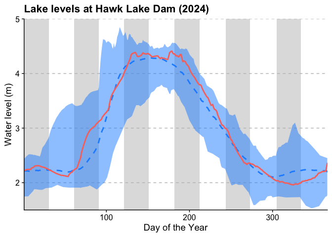<!-- -->

``` r
# Save plot
ggsave(here("plots", "levels_hawk.pdf"), width = 10, height = 6)
```

Build the plot for 2024 for Halls Lake Dam.

``` r
ggplot() +
  # Add month bars
  geom_rect(data = doy_months %>% 
              filter(Month %in% c("Jan", "Mar", "May", "Jul", "Sep", "Nov")), 
            aes(xmin = Start, xmax = End, 
                ymin = 1.25, ymax = 3.1),
            fill = "grey", alpha = 0.5) +
  # Add min and max levels
  geom_ribbon(data = summary %>% 
                filter(Lake == "Halls"),
              aes(x = DOY, ymin = Minimum, ymax = Maximum), 
              fill = "dodgerblue1", alpha = 0.5) +
  # Add average over all years
  geom_line(data = summary %>% 
              filter(Lake == "Halls"),
            aes(x = DOY, y = Average), 
            color = "dodgerblue1", linetype = "dashed", linewidth = 1) +
  # Add 2024 data only
  geom_line(data = levels %>% 
              filter(Year == 2024) %>% 
              filter(Lake == "Halls"), 
            aes(x = DOY, y = `Water level (m)`, group = Lake, color = Lake), 
            linewidth = 1) +
  ylab("Water level (m)") +
  xlab("Day of the Year") +
  theme(panel.grid.major.y = element_line(linewidth = 0.5, linetype = "dashed", color = "grey")) +
  ggtitle("Lake levels at Halls Lake Dam (2024)") +
  theme(legend.position = "none") +
  scale_y_continuous(expand = c(0, 0)) +
  scale_x_continuous(expand = c(0, 0))
```

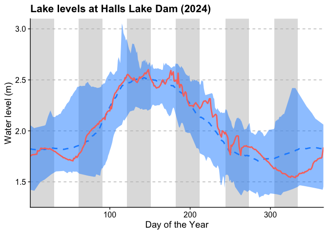<!-- -->

``` r
# Save plot
ggsave(here("plots", "levels_halls.pdf"), width = 10, height = 6)
```

What time of year do min/max occur?

``` r
min_time_of_year <- 
  levels %>% 
  mutate(Month = month(Date)) %>% 
  group_by(Lake, Year) %>% 
  filter(`Water level (m)` == min(`Water level (m)`)) %>% 
  dplyr::select(Lake, Year, Month) %>% 
  distinct()
max_time_of_year <- 
  levels %>% 
  mutate(Month = month(Date)) %>% 
  group_by(Lake, Year) %>% 
  filter(`Water level (m)` == max(`Water level (m)`)) %>% 
  dplyr::select(Lake, Year, Month) %>% 
  distinct()

min_time_of_year %>% 
  ggplot(aes(x = Month)) +
  geom_bar(stat = "count", aes(fill = Lake)) +
  # scale_fill_manual(values = c("#448cbc", "#58ae50"))
  facet_grid(~Lake) +
  scale_x_continuous(breaks = 1:12)
```

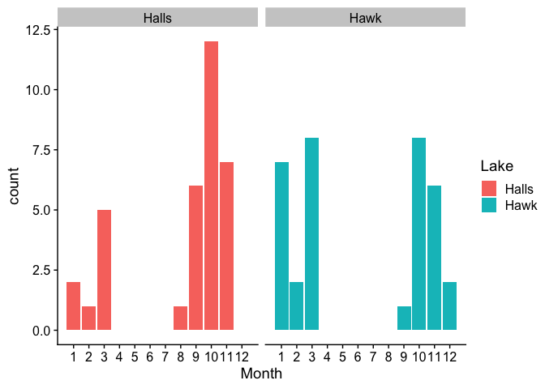<!-- -->

``` r
max_time_of_year %>% 
  ggplot(aes(x = Month)) +
  geom_bar(stat = "count", aes(fill = Lake)) +
  # scale_fill_manual(values = c("#448cbc", "#58ae50"))
  facet_grid(~Lake) +
  scale_x_continuous(breaks = 1:12)
```

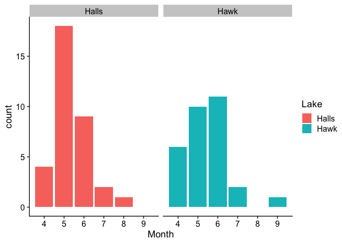<!-- -->

### Fluctuations

Amount of annual fluctuation is the maximum lake level minus the minimum
lake level.

Calculate fluctuations using the levels data for each year:

``` r
fluct <- levels %>% 
  ungroup() %>% 
  group_by(Lake, Year) %>% 
  summarize(minimum = min(`Water level (m)`),
            maximum = max(`Water level (m)`),
            fluctuation = maximum-minimum)
```

    ## `summarise()` has grouped output by 'Lake'. You can override using the
    ## `.groups` argument.

Plot the data:

``` r
fluct$Year <- as.character(fluct$Year)

# Plot the range of values:
fluct %>% 
  ggplot() +
  geom_segment(aes(x = Year, xend = Year, y = minimum, yend = maximum, color = Lake), 
               linewidth = 10, alpha = 0.75) +
  geom_line(aes(x = Year, y = fluctuation, group = 1), color = "black") +
  geom_point(aes(x = Year, y = fluctuation), pch = 21, size = 4, 
             color = "black", fill = "white") +
  # scale_x_continuous(breaks = 2013:2024) +
  ylab("Lake level (m)") +
  ggtitle("Lake level fluctuations (2013-2024)") +
  facet_wrap(~Lake,
             nrow = 2,
             scales = "free_x",
             labeller = as_labeller(c("Hawk" = "Hawk Lake Dam", "Halls" = "Halls Lake"))) +
  scale_color_manual(values = c("Hawk" = "#58ae50", "Halls" = "#448cbc")) +
  theme(legend.position = "none",
        strip.background = element_blank(),
        strip.text = element_text(size = 14),
        panel.grid.major.y = element_line(linewidth = 0.5, linetype = "dashed", color = "grey"),
        axis.text.x = element_text(angle = 45, hjust = 1))
```

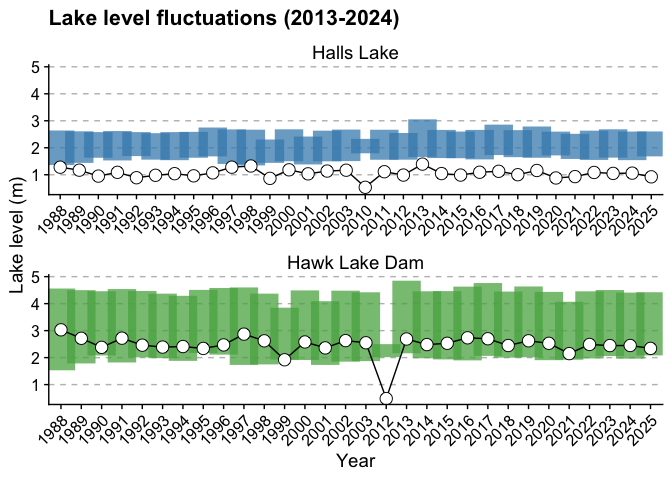<!-- -->

``` r
# Save plot
ggsave(here("plots", "fluct_hhl.pdf"), width = 12, height = 8)
```

Run statistics:

``` r
lm(fluctuation ~ Year, 
   data = fluct %>% 
     filter(Lake == "Hawk")) %>%
  summary() # coeff -0.02117, SIG @ . -> 0.0931
```

    ## 
    ## Call:
    ## lm(formula = fluctuation ~ Year, data = fluct %>% filter(Lake == 
    ##     "Hawk"))
    ## 
    ## Residuals:
    ## ALL 30 residuals are 0: no residual degrees of freedom!
    ## 
    ## Coefficients:
    ##             Estimate Std. Error t value Pr(>|t|)
    ## (Intercept)   3.0300        NaN     NaN      NaN
    ## Year1989     -0.3143        NaN     NaN      NaN
    ## Year1990     -0.6500        NaN     NaN      NaN
    ## Year1991     -0.3100        NaN     NaN      NaN
    ## Year1992     -0.5700        NaN     NaN      NaN
    ## Year1993     -0.6400        NaN     NaN      NaN
    ## Year1994     -0.6200        NaN     NaN      NaN
    ## Year1995     -0.6900        NaN     NaN      NaN
    ## Year1996     -0.5600        NaN     NaN      NaN
    ## Year1997     -0.1600        NaN     NaN      NaN
    ## Year1998     -0.4080        NaN     NaN      NaN
    ## Year1999     -1.1100        NaN     NaN      NaN
    ## Year2000     -0.4500        NaN     NaN      NaN
    ## Year2001     -0.6700        NaN     NaN      NaN
    ## Year2002     -0.4000        NaN     NaN      NaN
    ## Year2003     -0.4800        NaN     NaN      NaN
    ## Year2012     -2.5480        NaN     NaN      NaN
    ## Year2013     -0.3400        NaN     NaN      NaN
    ## Year2014     -0.5480        NaN     NaN      NaN
    ## Year2015     -0.4990        NaN     NaN      NaN
    ## Year2016     -0.2960        NaN     NaN      NaN
    ## Year2017     -0.3310        NaN     NaN      NaN
    ## Year2018     -0.5820        NaN     NaN      NaN
    ## Year2019     -0.4070        NaN     NaN      NaN
    ## Year2020     -0.5000        NaN     NaN      NaN
    ## Year2021     -0.8820        NaN     NaN      NaN
    ## Year2022     -0.5430        NaN     NaN      NaN
    ## Year2023     -0.5840        NaN     NaN      NaN
    ## Year2024     -0.5810        NaN     NaN      NaN
    ## Year2025     -0.6890        NaN     NaN      NaN
    ## 
    ## Residual standard error: NaN on 0 degrees of freedom
    ## Multiple R-squared:      1,  Adjusted R-squared:    NaN 
    ## F-statistic:   NaN on 29 and 0 DF,  p-value: NA

``` r
lm(fluctuation ~ Year, 
   data = fluct %>% 
     filter(Lake == "Halls")) %>%
  summary() # coeff -0.012222, NOT SIG
```

    ## 
    ## Call:
    ## lm(formula = fluctuation ~ Year, data = fluct %>% filter(Lake == 
    ##     "Halls"))
    ## 
    ## Residuals:
    ## ALL 32 residuals are 0: no residual degrees of freedom!
    ## 
    ## Coefficients:
    ##               Estimate Std. Error t value Pr(>|t|)
    ## (Intercept)  1.280e+00        NaN     NaN      NaN
    ## Year1989    -1.100e-01        NaN     NaN      NaN
    ## Year1990    -3.300e-01        NaN     NaN      NaN
    ## Year1991    -1.900e-01        NaN     NaN      NaN
    ## Year1992    -3.900e-01        NaN     NaN      NaN
    ## Year1993    -3.000e-01        NaN     NaN      NaN
    ## Year1994    -2.400e-01        NaN     NaN      NaN
    ## Year1995    -3.200e-01        NaN     NaN      NaN
    ## Year1996    -2.100e-01        NaN     NaN      NaN
    ## Year1997     2.172e-15        NaN     NaN      NaN
    ## Year1998     4.400e-02        NaN     NaN      NaN
    ## Year1999    -4.140e-01        NaN     NaN      NaN
    ## Year2000    -9.700e-02        NaN     NaN      NaN
    ## Year2001    -2.460e-01        NaN     NaN      NaN
    ## Year2002    -1.430e-01        NaN     NaN      NaN
    ## Year2003    -1.116e-01        NaN     NaN      NaN
    ## Year2010    -7.450e-01        NaN     NaN      NaN
    ## Year2011    -1.680e-01        NaN     NaN      NaN
    ## Year2012    -2.920e-01        NaN     NaN      NaN
    ## Year2013     1.140e-01        NaN     NaN      NaN
    ## Year2014    -2.360e-01        NaN     NaN      NaN
    ## Year2015    -2.920e-01        NaN     NaN      NaN
    ## Year2016    -1.870e-01        NaN     NaN      NaN
    ## Year2017    -1.520e-01        NaN     NaN      NaN
    ## Year2018    -2.780e-01        NaN     NaN      NaN
    ## Year2019    -1.220e-01        NaN     NaN      NaN
    ## Year2020    -3.990e-01        NaN     NaN      NaN
    ## Year2021    -3.490e-01        NaN     NaN      NaN
    ## Year2022    -1.950e-01        NaN     NaN      NaN
    ## Year2023    -2.300e-01        NaN     NaN      NaN
    ## Year2024    -2.200e-01        NaN     NaN      NaN
    ## Year2025    -3.570e-01        NaN     NaN      NaN
    ## 
    ## Residual standard error: NaN on 0 degrees of freedom
    ## Multiple R-squared:      1,  Adjusted R-squared:    NaN 
    ## F-statistic:   NaN on 31 and 0 DF,  p-value: NA

``` r
# Average fluctuation over all years
fluct %>% 
  filter(Lake == "Hawk") %>% 
  ungroup() %>% 
  summarize(mean(fluctuation))
```

    ## # A tibble: 1 × 1
    ##   `mean(fluctuation)`
    ##                 <dbl>
    ## 1                2.45

``` r
fluct %>% 
  filter(Lake == "Halls") %>% 
  ungroup() %>% 
  summarize(mean(fluctuation))
```

    ## # A tibble: 1 × 1
    ##   `mean(fluctuation)`
    ##                 <dbl>
    ## 1                1.06

``` r
# Min and max levels
fluct %>% 
  ungroup() %>% 
  group_by(Lake) %>% 
  summarize(min(minimum), max(maximum))
```

    ## # A tibble: 2 × 3
    ##   Lake  `min(minimum)` `max(maximum)`
    ##   <chr>          <dbl>          <dbl>
    ## 1 Halls           1.35           3.05
    ## 2 Hawk            1.53           4.85

## Map of Ontario

The following map was downloaded using Ontario GeoHub and is a cropped
version of the Ontario Land Cover Compilation v2.0, available
[here](https://www.arcgis.com/home/item.html?id=7aa998fdf100434da27a41f1c637382c).

The following is how the map was created; this code is not run.

    # map <- terra::rast(here("data", "OLCC_V2_TIFF", "OLCC_V2_TIFF.tif"))
    # newcrs = "+proj=longlat +datum=WGS84"
    # newmap <- terra::project(map, newcrs)
    # bounds <- terra::ext(-78.861312, -78.299532, 44.650277, 45.259690)
    # subset <- terra::crop(newmap, bounds)
    # # Save cropped object
    # terra::writeRaster(subset, here("data", "ontario_map.tif"))

This is a WIP and so is not run either.

    tsw <- read_tsv(here("data", "TSW_coords.txt"))
    subset <- terra::rast(here("data", "ontario_map.tif"))

    pal = c("#844836", "#b07156", "#b99364", "#dac3a9", "#8fa997") # , "#6baeb0", "#376988"
    palette = grDevices::colorRampPalette(pal)(100)
    palette <- rev(palette)

    ggplot() +
      geom_spatraster(data = subset) +
      # scale_fill_gradientn(colors = palette, na.value = NA) +
      theme_map() +
      geom_path(data = tsw %>% filter(Type == "Dam" | Type == "Lake"),
                 aes(x = Longitude, y = Latitude, group = Headwater, 
                     color = Headwater), linewidth = 0.5) +
      geom_point(data = tsw %>% filter(Type == "Dam" | Type == "Lake"),
                 aes(x = Longitude, y = Latitude, color = Type), size = 2) +
      geom_point(data = tsw %>% filter(Type == "City") %>% filter(Name != "Dorset"),
                 aes(x = Longitude, y = Latitude), color = "white", fill = "black", pch = 21) +
      geom_text(data = tsw %>% filter(Type == "City") %>% filter(Name != "Dorset"),
                 aes(x = Longitude, y = Latitude, label = Name), 
                hjust = -0.1, vjust = 0.75, color = "white", size = 3) +
      # Add 'headwater' lake labels in
      geom_label(data = tsw %>% filter(Name == "Kennisis Lake" | Name == "Percy Lake" | 
                                         Name == "Redstone Lake" | Name == "Sherborne Lake" |
                                         Name == "Little Brother Lake" | Name == "Bob Lake"),
                 aes(x = Longitude, y = Latitude, label = Name, color = Name), 
                 size = 3, hjust = 0.5, vjust = -0.5) +
      # Add our lake names in
      geom_label(data = tsw %>% filter(Name == "Big Hawk Lake" | Name == "Little Hawk Lake" | 
                                         Name == "Halls Lake"),
                 aes(x = Longitude, y = Latitude, label = Name, color = Name), 
                 size = 4, hjust = 0.5, vjust = -0.5)
